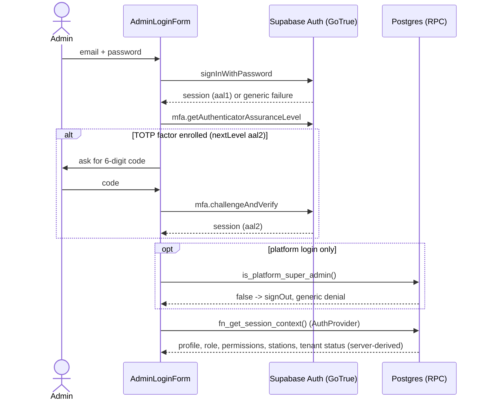
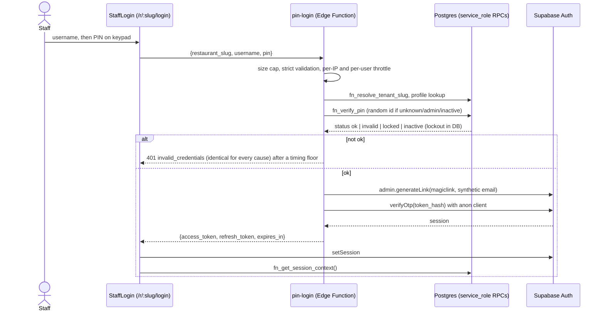

# Authentication flows (Phase 1)

Binding rule: `platform_super_admin` and `tenant_admin` NEVER use a PIN. They sign in with Supabase Auth email + password (TOTP MFA capable).
PIN login is only for non-admin staff (`profiles.auth_method = 'pin'`); the PIN path answers admins exactly like a wrong PIN.

## Admin / platform admin: Supabase Auth

## Staff: PIN via Edge Function

## Threat notes
| threat | control |
|---|---|
| PIN brute force | bcrypt, 5 failures then 15 min lock in `fn_verify_pin` (authoritative); in-memory per-IP and per-user buckets (best effort, per isolate); 4-6 digit PIN |
| User / tenant enumeration | one 401 body for unknown tenant/user, inactive, locked, admin, wrong PIN; same DB work and a response-time floor; slug resolver returns null for unknown and suspended; staff are typed by username, never listed |
| Admin via PIN | profile must be `auth_method='pin'`; DB eligibility check; minted identity must have `fn_user_auth_method='pin'` and a `*.staff.cafeos.invalid` email |
| Service-role exposure | key only in function env; response whitelist of three fields; no logging of PINs/tokens; `src/` is scanned for service-role strings |
| Session minting abuse | single-use magic-link hash stays server-side; no JWT secret in the function; GoTrue refresh rotation applies |
| CORS | exact origins from `ALLOWED_ORIGINS`, no wildcard |
| Client-side bypass | guards are UX only; tenant/role/permissions come from `fn_get_session_context` and RLS, never JWT claims or the URL slug |
| Targeted lockout (DoS) | an attacker can lock a known username (inherent to lockout); mitigate with per-IP limits and admin unlock |
| Password login of PIN staff | staff identities need no password; wire the Auth hook to `fn_user_auth_method` (not yet done) |
