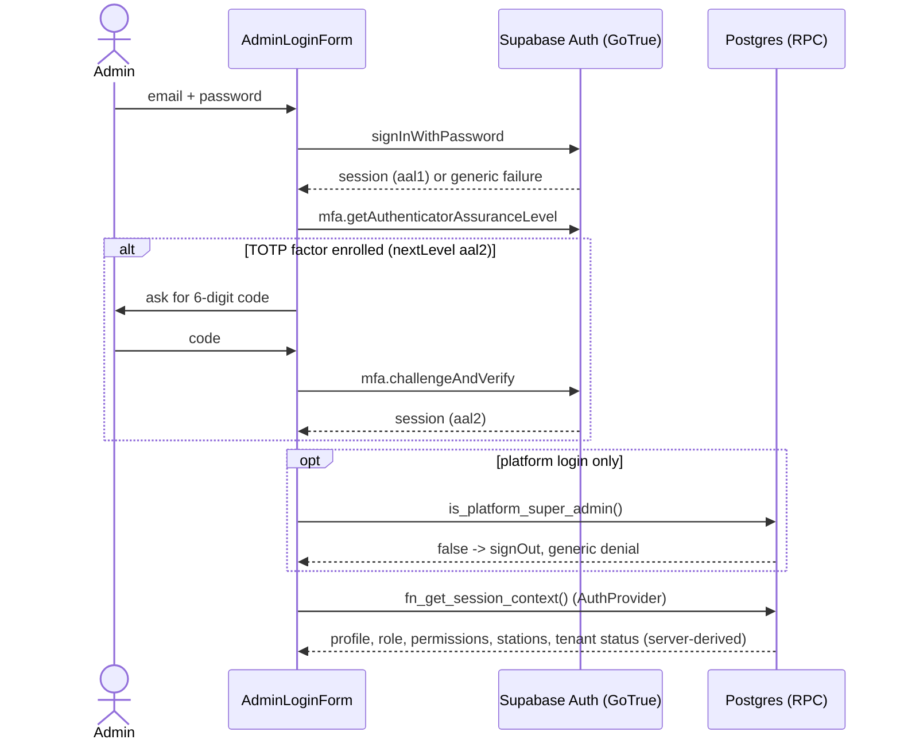
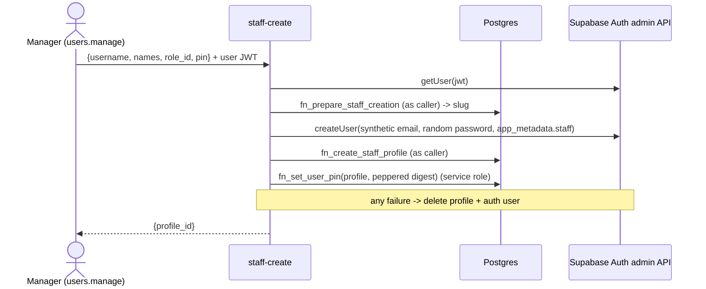
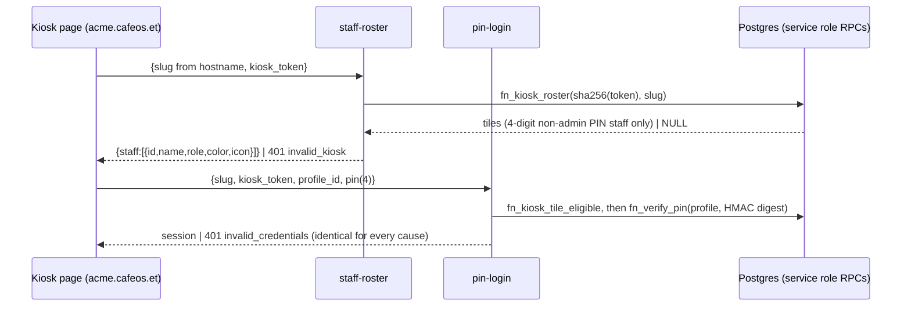

# Authentication flows (Phase 1, extended through Phase 3B)

Binding rule: `platform_super_admin` and `tenant_admin` NEVER use a PIN. They sign in with Supabase Auth email + password (TOTP MFA capable).
PIN login is only for non-admin staff (`profiles.auth_method = 'pin'`); the PIN path answers admins exactly like a wrong PIN.

## Admin / platform admin: Supabase Auth


## Staff: PIN via Edge Function
```mermaid
sequenceDiagram
    actor S as Staff
    participant UI as StaffLogin (/r/:slug/login)
    participant EF as pin-login (Edge Function)
    participant DB as Postgres (service_role RPCs)
    participant GT as Supabase Auth
    S->>UI: username, then PIN on keypad
    UI->>EF: {restaurant_slug, username, pin}
    EF->>EF: size cap, strict validation, per-IP and per-user throttle
    EF->>DB: fn_resolve_tenant_slug, profile lookup
    EF->>EF: digest = HMAC-SHA256(pin, PIN_PEPPER)
    EF->>DB: fn_verify_pin(profile, digest) (random id if unknown/admin/inactive)
    DB-->>EF: status ok | invalid (locked/inactive/unknown/wrong are identical; lockout in DB)
    alt not ok
        EF-->>UI: 401 invalid_credentials (identical for every cause) after a timing floor
    else ok
        EF->>DB: fn_staff_has_active_session(profile)
        alt another session is active
            EF->>DB: fn_staff_login_blocked(profile, kiosk hash?) (notify, must_change_pin, audit)
            EF-->>UI: 401 invalid_credentials (byte-identical, same timing floor)
        end
        EF->>GT: admin.generateLink(magiclink, synthetic email)
        EF->>GT: verifyOtp(token_hash) with anon client
        GT-->>EF: session
        EF-->>UI: {access_token, refresh_token, expires_in}
        UI->>GT: setSession
        UI->>DB: fn_get_session_context()
    end
```

## Threat notes
| threat | control |
|---|---|
| PIN brute force | 4-digit PIN (**6 digits for the role named 'Cashier'**, a documented user-decided exception), weak PINs refused at set time (also for 6 digits); the server never reveals a user's length; peppered digest + bcrypt (offline DB leak is not brute-forceable without `PIN_PEPPER`); `fn_verify_pin` serialises attempts (row lock), escalating non-decaying lock 15 min (3rd failure) / 1 h (6th) / 24 h (9th); locked attempts are not evaluated; per-IP/user buckets best effort |
| User / tenant enumeration | one 401 body for unknown tenant/user, inactive, locked, admin, wrong PIN; same DB work and a response-time floor; slug resolver returns null for unknown and suspended; staff are typed by username, never listed |
| Admin via PIN | profile must be `auth_method='pin'`; DB eligibility check; minted identity must have `fn_user_auth_method='pin'` and a `*.staff.cafeos.invalid` email |
| Service-role exposure | key only in function env; response whitelist of three fields; no logging of PINs/tokens; `src/` is scanned for service-role strings |
| Session minting abuse | single-use magic-link hash stays server-side; no JWT secret in the function; GoTrue refresh rotation applies |
| CORS | exact origins from `ALLOWED_ORIGINS`, no wildcard |
| Client-side bypass | guards are UX only; tenant/role/permissions come from `fn_get_session_context` and RLS, never JWT claims or the URL slug |
| Concurrent / shared PIN use | one active session per PIN staff member (see below); blocked attempt looks like a wrong PIN, notifies the user + tenant admins, forces a PIN change |
| Targeted lockout (DoS) | an attacker can lock a known username (inherent to lockout); mitigate with per-IP limits and admin unlock |
| Password login of PIN staff | Auth hook `password_verification_attempt` -> `fn_auth_password_verification_hook` rejects every `auth_method='pin'` profile (wired in `config.toml`; **not exercised against real GoTrue**, SQL unit-tested only) |
| Demoted admin keeps a password identity | `identity_rotation_pending`: not PIN-eligible, hook rejects its password, until `fn_complete_identity_rotation` (the Edge Function that rewrites the auth user is a follow-up) |

## Staff creation (`staff-create` Edge Function)


## Platform admins
`is_platform_admin()` / `is_platform_super_admin()` (the RLS read helpers) additionally require `aal2` with a verified factor behind it (0030) unless
`app.platform_mfa_required = 'off'` and the user has no verified factor. Production default = required. Local/CI opt out per session; the pgTAP helpers do it per transaction.

**Every platform RPC (Phase 3B, 0030) uses `fn_platform_guard()` instead, which has NO opt-out**: active `platform_super_admin` row, JWT `aal = 'aal2'`, and a
verified `auth.mfa_factors` row the account still owns. Consequence for local development: the demo Super Admin (`admin@cafeos.example.com`) must enrol a TOTP
factor (Supabase Auth MFA) and complete the challenge before the Platform Admin Portal works; the GUC only relaxes the direct table reads. Errors:
`permission_denied` (not an active super admin; every tenant user), `mfa_required` (aal1, or no live factor).

### Adding a Super Admin (ops procedure; no client path exists)
There is deliberately no RPC or Edge Function that lets a signed-in user create a platform admin (a compromised Super Admin session must not be able to mint
more). Two-person ops procedure, recorded in the change log:
1. Create (or invite) the Auth user with a real, CONFIRMED e-mail in the Supabase dashboard (Authentication > Users). It must not be a tenant user.
2. With the service-role key (SQL editor or a one-off script, never a browser): `select public.fn_ops_register_platform_admin('<auth user id>', '<full name>');`
   It refuses an unconfirmed / synthetic e-mail (`owner_email_unconfirmed`), an existing tenant profile or pending tenant invitation (`owner_already_assigned`)
   and writes `admin_audit_log` (`platform_admin.registered`; actor null = service job).
3. The new admin signs in, enrols TOTP (aal2 is mandatory for every platform RPC) and is visible in the portal's Super Admin list
   (`fn_platform_list_admins`). Deactivation is `fn_platform_set_admin_active` (never yourself; the last active super admin is protected by trigger).

### Tenant Admin invitation (Phase 3B, `tenant-admin-invite`)
```mermaid
sequenceDiagram
    participant SA as Super Admin (aal2) / tenant_admin (aal2)
    participant EF as tenant-admin-invite
    participant DB as Postgres
    participant GT as Supabase Auth
    participant IN as Invitee
    SA->>EF: POST {action: invite, restaurant_id (platform only), email, names, username} + JWT
    EF->>DB: fn_prepare_tenant_admin_invitation(...) AS THE CALLER (guard, validation, reservation, audit)
    EF->>GT: auth.admin.inviteUserByEmail(email, redirectTo = INVITE_REDIRECT_URL) (service role)
    EF->>DB: fn_attach_tenant_admin_invitation(invitation, auth user) (service role)
    Note over EF,DB: failure -> fn_abort_tenant_admin_invitation (+ delete the never-confirmed user)
    GT-->>IN: invitation e-mail
    IN->>GT: follows the link (e-mail confirmed, session), sets a password (min 12, policy)
    IN->>DB: fn_get_my_invitation() (where am I invited?)
    IN->>DB: fn_accept_tenant_admin_invitation() -> tenant_admin profile (auth_method password)
    IN->>GT: enrol TOTP (recommended; required for aal2 actions)
```
The first Tenant Admin of a tenant created with `fn_platform_create_tenant` arrives this way. Invitations expire after 7 days (resend renews; at most 5 sends,
60 s apart); an existing Auth account is never re-bound (`email_in_use`), so a platform admin can never also become a tenant admin.

## PIN length by role (documented exception, user decision 2026-10-03)
The role named `Cashier` signs in with a 6-digit PIN; every other PIN role with exactly 4. It is the ONLY name-keyed rule in the system and lives in two twin
spots: `CASHIER_ROLE_NAME` / `pinLengthForRole()` in `supabase/functions/_shared/pin.ts` and `fn_pin_length_for_role_name()` (migration 0021).
- `pin-login` accepts 4 or 6 digits on the wire and only compares the digest: wrong length, wrong PIN, locked, inactive all answer `invalid`.
- `staff-create` looks the role NAME up server-side (`fn_prepare_staff_creation` returns `role_name`; the client never supplies it) and enforces the length
  before any Auth user exists (`invalid_pin_length`); weak-PIN rules apply to 6 digits too (`123456`, `111111`, `121212` ...).
- `fn_set_user_pin(profile, digest, claimed_length)` records `profile_secrets.pin_length` and refuses a claim that differs from the role's (`pin_length_mismatch`).
- `fn_change_user_role` (and renaming a role into/out of Cashier) destroys secrets whose length no longer fits the role: no PIN login until a new PIN is issued
  (`pin_reset_required` in the RPC result).
- Lock after 3 wrong attempts (15 min), 6 (1 h), 9 (24 h) applies to every role.

## Shared floor terminal (registered kiosk) and tenant host
Tenant is resolved from the host `<slug>.cafeos.et` (see tenant-routing.md; `/r/:slug` is the dev fallback). A registered kiosk device
(kiosk-terminals.md) fetches tiles with `staff-roster` and signs staff in through the `pin-login` tile path:

The Cashier (6-digit PIN) and everyone else can use the username + PIN path on any device. Lockout 3/6/9 is shared by both paths.

## One concurrent session per PIN staff member (migration 0023, user decision 2026-10-03)
Applies to `profiles.auth_method = 'pin'` non-admin staff only; tenant_admin, platform admins and password users are never blocked
(`fn_staff_has_active_session` returns false for them).
- **Active session** = a row in `auth.sessions` for the user with `not_after` null or in the future AND
  `coalesce(refreshed_at, updated_at, created_at)` within `fn_active_session_window()` (**2 hours**, deliberately longer than `jwt_expiry` = 1 hour so a
  live browser that refreshes its token always counts, while a closed browser goes stale). Sign-out deletes the GoTrue row and frees the slot immediately.
  `refreshed_at` is `timestamp` without zone (UTC) in GoTrue; the function converts it explicitly. The shim mirrors the real columns.
- **Blocked login = no oracle.** After the PIN verifies and the identity checks pass, `pin-login` asks `fn_staff_has_active_session`. If true it calls
  `fn_staff_login_blocked` (result ignored) and answers `401 {"error":"invalid_credentials"}` through the very same `shapeFailure('invalid_credentials')`
  and the same response-time floor (450 ms + jitter) as a wrong PIN. Username and tile paths behave the same. A DB error in the check answers 503
  (fail closed; never mints). The user message is generic: "Could not sign in. Check your username and PIN, or sign out of any other device first. If it keeps happening, ask your manager."
- **Consequences of a blocked-after-correct-PIN attempt** (the PIN is treated as exposed): (a) one `user_notifications` row of kind
  `security.concurrent_login_blocked` for the user and one for every active tenant_admin of the tenant, deduped to one set per user per 5 minutes (advisory-locked,
  race-tested); (b) `profile_secrets.must_change_pin = true`; (c) audit event `auth.concurrent_login_blocked` (profile id, kiosk name, whether notified; no secret).
- **Forced PIN change, enforced in the database.** While `must_change_pin` is true `has_permission()`, `has_station_access()` and `current_station_ids()` answer
  nothing for that user, so every permission-checked RPC and RLS policy denies. Not affected: identity helpers (the session stays valid), `fn_get_session_context`
  (returns `must_change_pin: true`, `permissions: []`, `station_ids: []`), `fn_mark_notification_read`, and `fn_verify_pin`. tenant_admin is exempt by construction (no secret row can exist
  for admins, the guard trigger refuses it, and the helpers exempt `system_key = 'tenant_admin'` anyway), so no tenant can be locked out of its last admin.
  `fn_reset_pin_lockout` (admin unlock) does NOT clear the flag; only `fn_set_user_pin` does.
- **`pin-change` Edge Function** (the only way out of the state), see `supabase/functions/pin-change/README.md`:
```mermaid
sequenceDiagram
    actor S as Staff (must_change_pin)
    participant EF as pin-change (verify_jwt)
    participant DB as Postgres (service role RPCs)
    participant GT as Supabase Auth
    S->>EF: Authorization: Bearer JWT, {current_pin, new_pin}
    EF->>GT: getUser(jwt) -> user id (never from the body)
    EF->>EF: parse, weak-PIN policy, new != current, throttle
    EF->>DB: profile + role name lookup; length check (4, Cashier 6)
    EF->>DB: fn_verify_pin(profile, HMAC(current)) (shared lockout)
    EF->>DB: fn_complete_forced_pin_change(profile, HMAC(new), length) (flagged => pending_approval + notify tenant_admins)
    EF->>GT: admin.signOut(jwt, 'others') (end every other session)
    EF-->>S: {changed: true, pending_approval, other_sessions_revoked}
```
- **Maker-checker (migration 0024, user decision 2026-10-04).** A forced change does NOT restore access: `fn_complete_forced_pin_change` stores the new PIN, clears
  `must_change_pin`, sets `profile_secrets.pin_change_pending = true` (+ `pin_change_requested_at`), notifies every active tenant_admin of the tenant
  (`security.pin_change_pending_approval`, payload `{profile_id, user_name, at}`, deduped per admin and subject for 5 minutes) and audits `auth.pin_change_requested`.
  The user stays restricted exactly as before (`fn_pin_restricted(user) = must_change_pin or pin_change_pending`, tenant_admin exempt, is the single predicate behind
  `has_permission` / `has_station_access` / `current_station_ids` and the session context). A tenant_admin decides (a `users.manage` delegate role cannot pass the aal2 check, 0026/0027, so the grant is inert here):
  `fn_approve_pin_change(profile)` clears the pending state (audit `auth.pin_change_approved`, subject notified `security.pin_change_approved`), `fn_reject_pin_change(profile)` sets
  `must_change_pin = true` again (audit `auth.pin_change_rejected`, subject notified `security.pin_change_rejected`, a new change is needed). Both need `users.manage` and a real authenticator
  (`fn_require_aal2`, 0026 + 0027 + 0028: `mfa_required` unless the session is aal2 **and** the caller's own profile has `auth_method <> 'pin'` **and** the caller still owns a verified `auth.mfa_factors` row, so a token that outlives a removed authenticator is refused at once; a PIN staff member holds a real GoTrue session and could enrol a TOTP factor through `auth.mfa.enroll` / `challengeAndVerify` and reach aal2 on their own, so the PIN account type, not the JWT, is the authoritative refusal; a missing profile row fails closed; admins without a factor never pass either; only the tenant_admin on an aal2 session decides), take the tenant from the identity, lock the row, are never allowed on yourself, and answer
  `not_found` identically for unknown, foreign-tenant and not-pending ids (replays are `not_found` too). `fn_list_pending_pin_changes()` feeds the approval screen (own tenant only).
  States: `none` -> `required` (blocked login) -> `pending_approval` (pin-change) -> `none` (approve) or `required` (reject). A PIN change while already pending stays pending (no bypass);
  an exposed PIN again while pending (blocked login) returns to `required`; an admin-set PIN (`fn_set_user_pin`) leaves nobody pending; a voluntary change (no flag) needs no approval.
  `fn_get_session_context()` adds `pin_change_status` (`none|required|pending_approval`) and `pin_length` (4; 6 for Cashier via `fn_pin_length_for_role_name`); `must_change_pin` is true only while `required`.
  The pin-change function answers `{changed, pending_approval, other_sessions_revoked}`. A restricted user can still read and mark read their own notifications (recipient-only policy, no `has_permission`).
- **Residual risks:** (0) with a single tenant_admin who is unavailable a pending member waits (an admin can also set a PIN through the staff tools); the approver is not required to be a different person than the subject's manager
  (since 0026/0027 only a tenant_admin on an aal2 session can approve, so one admin may both review and approve); (1) two simultaneous correct-PIN logins can both pass the check before either session exists (check and mint are separate steps; the
  next login is blocked); (2) a staff member who closed the browser without signing out is blocked for up to 2 hours (or until they sign out elsewhere), and then must change their PIN
  (user-decided; their manager is notified); (3) a person who knows the PIN can trigger the forced change of that account (a nuisance, bounded by the per-user throttle);
  (4) `auth.sessions` semantics and `signOut(jwt, 'others')` were verified against the documented GoTrue schema only, not against a running GoTrue;
  (5) aal2 and removed authenticators (0028, finding L1): `fn_require_aal2` re-checks `auth.mfa_factors` on every call, so removing the last verified factor stops PIN approvals and timer writes for every live token of that account immediately (it no longer waits for `jwt_expiry`, 1 h). What remains: a token issued at aal2 stays aal2 while the factor exists, until it expires, and the check proves the account still HAS an authenticator, not that this token used it (a stolen aal2 token works for up to an hour; there is no per-session binding);
  (6) the fresh-code check before removing an authenticator in the SPA is UX only: Supabase Auth decides the unenroll and no database rule depends on the code. Not exercised against real GoTrue (the factor predicate is the one `fn_require_step_up` already uses; pgTAP uses the shim table).

### SPA: forced PIN change, approval and notifications (UI)
All of this is UX; the database (`fn_pin_restricted` behind `has_permission` / station access / RLS) is the ceiling.
- **Routes** (behind `RequireAuth` -> `PinChangeGate` -> `TenantShell`): `/r/:slug/change-pin`, `/r/:slug/pin-pending`, `/r/:slug/settings/pin-approvals`.
  `PinChangeGate` reads `pin_change_status` from `fn_get_session_context` (`pinChangeStatusOf`: missing = `none`, `must_change_pin` alone = `required`;
  an unknown status fails the zod parse, the context shows "Could not load your account" instead of guessing) and redirects with the identity's slug
  (never the URL slug): `required` -> change-pin from every tenant route, `pending_approval` -> pin-pending, `none` -> the two forced routes bounce home.
  A `pending_approval -> required` transition (rejection) passes `{pinChangeRejected: true}` so Change PIN shows a neutral explanation.
- **Header** (`TenantShell`): persistent "Change PIN" button while `required`; "PIN approvals" link when `can('users.manage')` and not restricted.
- **Change PIN** (`ChangePinPage`): three steps (current, new, confirm) on the existing `PinPad` in fixed-length mode with `pin_length` (4, or 6 for the
  Cashier exception, decided server-side; no length is guessed if it is missing). Digits are never rendered (dots + count). Local zod checks only: length,
  new != current, confirm == new; weak-PIN and role length stay server-side. The PINs move to a ref that the mutation clears as it starts (never
  `variables` in the TanStack cache), and component state is wiped before the request is awaited. Every failure restarts at step 1. Copy is neutral and
  never mentions locks or attempts left (`pinChangeMessage`). On 429 the pad stays disabled for `Retry-After` seconds (clamped 1..900, default 30).
  Success shows "Your PIN has been changed" (+ "Sign out on any other device" when `other_sessions_revoked` is false); Continue refreshes the context and
  the gate moves on (pending screen when `pending_approval`). Client: `src/lib/supabase/pin-change.ts` (explicit `Authorization: Bearer <access token>`,
  15 s timeout, zod-checked body, whitelisted error codes).
- **Waiting screen** (`PinPendingPage`): sign out and a user-initiated "Check again". Live transitions come from the notifications listener, which calls
  `refreshContext()` on `security.pin_change_approved` / `security.pin_change_rejected` (and on a `concurrent_login_blocked` about the user). `refreshContext()`
  for the same user is a background reload, so the screen does not unmount behind a loading state.
- **Notifications** (`NotificationsListener`, mounted in the router root for any signed-in tenant user): initial fetch of up to 10 unread own rows
  (`user_notifications`, RLS: recipient only) on mount and on every Realtime (re)subscription, plus a Realtime `INSERT` subscription filtered
  `recipient_id=eq.<uid>` (uid must be a UUID; no polling). Rows are zod-validated and must match the user and be unread; duplicates are shown once. Fixed copy per kind
  (`notification-copy.ts`); payload values (`user_name`, `kiosk_name`) are plain text only (strings, control/bidi characters removed, capped at 60) and React renders them
  as text. Unknown kinds are ignored (no toast, not marked read). Admin copy: "X was blocked from signing in on a second device" (+ terminal name) and
  "X changed their PIN and is waiting for your approval" with a "Review" action to the approvals page (also invalidates the approvals list). A toast marks its row
  read (`fn_mark_notification_read`) when it is closed, auto-closes (timers pause while the tab is hidden) or its action is used. On sign-out the listener
  unsubscribes and removes its toasts (shared terminals).
- **PIN approvals** (`PinApprovalsPage`, `RequirePermission users.manage`): `fn_list_pending_pin_changes`, Approve / Reject with a confirm dialog, success toast +
  list invalidation. Errors map to neutral copy: `mfa_required` -> "Verify with your authenticator to continue." (shown if step-up is cancelled; otherwise the StepUpDialog verifies the code and retries the decision), `not_found` -> "no longer
  waiting" + list refresh, `permission_denied` / `permission_escalation`, `tenant_read_only` / `tenant_suspended`, anything else generic.
- **Inactivity**: `InactivityGuard` keeps managing restricted users (non-admin role), so the forced and waiting screens sign out on inactivity too.
- **Retry-After**: `_shared/cors.ts` sends `Access-Control-Expose-Headers: Retry-After` for allow-listed origins, so the browser reads the 429 wait time (fallback 30 s).
- **Step-up**: the PIN approvals page opens `StepUpDialog` on `mfa_required` and retries the same decision after verification. Cancelling shows the neutral message and decides nothing.
  The Session timers page (same save or reset) and the Terminals page (Register retries the same trimmed name, Revoke the same terminal id) do the same. Among the kiosk admin RPCs only `fn_register_kiosk`
  calls `fn_require_step_up()` (`fn_list_kiosks` and `fn_revoke_kiosk` never do, see kiosk-terminals.md), so the Revoke wiring is defensive and unreachable against the current database. The Terminals page retries exactly once per
  verification: a second `mfa_required` shows the neutral message and waits for the admin to press the button again, so no dialog can re-open and re-run on its own (tested with a dialog that verifies by itself).
  The one-time setup code and the pending name live only in component state; the register mutation uses `gcTime: 0` and `reset()`, so neither stays in the TanStack mutation cache after the request settles.
- **Cache hygiene**: `AuthProvider` clears the TanStack query cache whenever the signed-in user changes or signs out; a failed same-user context refresh keeps the previous ready context.
- Tests: `src/lib/supabase/{pin-change,notifications}.test.ts`, `src/features/pin-change/*.test.tsx`, `src/features/notifications/*.test.ts(x)`,
  `src/app/pin-change-flow.test.tsx` (real route tree, mocked Realtime), `tests/e2e/pin-change.spec.ts` (page.route + mocked Realtime WebSocket).

### SPA: per-tenant session timers (migration 0025)
- **Inactivity**: `InactivityGuard` reads `session_timers` from `fn_get_session_context` (lenient parse: a malformed value never blocks sign-in).
  Warning after `idle_warning_seconds`, sign-out at `signout_seconds` in total, so the "Still there?" dialog is visible for `signout - warn` seconds
  (`inactivityMsFromTimers`: clamped to 5 <= warn < signout, 15 <= signout <= 900; if either field is missing both fall back to 15 / 30). The DEV-only
  Playwright override still wins in dev builds. Other devices pick up a change on their next session-context load (no live push of settings).
- **Terminal**: the PIN-pad idle timer comes from the staff-roster response `{staff, pin_pad_idle_seconds}` (`parsePinPadIdleSeconds`, then
  `pinPadIdleMs`: clamped 15..300 s, 60 s when absent, e.g. an Edge Function deployed before 0025).
- **Settings page** `/r/:slug/settings/session-timers` (`SessionTimersPage`, `RequirePermission settings.session_timers`, header link): react-hook-form +
  zod (`sessionTimersFormSchema`, same bounds as the server, preview only), live explanation of the warning window, Save
  (`fn_update_session_timers`) and "Reset to defaults" with a confirm (`fn_reset_session_timers`, 15 / 30 / 60). `mfa_required` opens `StepUpDialog`
  (TOTP `challengeAndVerify`, aal2) and retries the same action once verified (server gate: `fn_require_aal2`, which also refuses every PIN profile even at aal2 and any account whose verified factor no longer exists; an account without an authenticator sees "An authenticator is required for this action. This account has none set up; ask your administrator." and cannot proceed; a Supabase Auth account is pointed to Settings > Security instead); `invalid_input` marks the field named by the error `detail`
  (`RpcError.detail`, kept only when it is a bare identifier); other codes map to neutral copy. Success: toast, cache update, `refreshContext()`.

### SPA: authenticator self-enrollment (Security page)
- **Route** `/r/:slug/settings/security` (`SecurityPage`, inside RequireAuth -> PinChangeGate -> TenantShell; header link "Security" while `pin_change_status = none`). Shown only to
  sessions that signed in with Supabase Auth: `usesSupabaseAuthSignIn(session)` (`src/lib/domain/authenticator.ts`) is false when `app_metadata.staff === true` (set by the
  `staff-create` Edge Function, service role only) or the email is a synthetic `*.staff.cafeos.invalid` address. No role names are involved. PIN sessions get no link and a neutral notice at the URL.
  UX only: Supabase Auth and `fn_require_aal2` remain the authority.
- **Enroll**: name (Zod, 1-40 chars, no control/bidi characters, default "Authenticator app") -> unfinished factors from an abandoned attempt are removed -> `auth.mfa.enroll({ factorType: 'totp', friendlyName })`
  -> QR + setup key + 6-digit input (`autocomplete="one-time-code"`, digits only, Zod `totpCodeSchema`) -> `auth.mfa.challengeAndVerify` (upgrades the session to aal2)
  -> `auth.refreshSession()` -> `refreshContext()` -> factor list invalidated. Cancel or leaving the page removes the unverified factor, except while a code check is in flight (the verify call then decides the factor's fate).
- **QR rendering**: the returned `qr_code` (SVG) is turned into an encoded `data:image/svg+xml` URL by `qrImageSrc` and shown in a plain ``: scripts never run inside an SVG loaded
  as an image, nothing is injected as markup (no `innerHTML` / `dangerouslySetInnerHTML`), and the CSP already allows `img-src data:` (no directive changed, no new origin). A value that is not an SVG
  document is dropped and only the setup key (text + "Copy key") is shown. The secret and QR live only in component state: never logged, stored or put in the query cache; they are cleared on verify, cancel and unmount.
- **Remove**: confirm dialog warning that PIN approvals and session timers stop working for the account, then a 6-digit code (`challengeAndVerify` with that factor) and `auth.mfa.unenroll`. The "fresh code" is a **UX guard only** (it confirms the person at the keyboard holds the authenticator): Supabase Auth decides whether the unenroll is allowed (an aal2 session suffices) and no database rule depends on it;
  then session refresh, `refreshContext()` and list invalidation. There is no "last factor" block (an admin may re-enrol at once).
- **Errors** are neutral ("That code did not work...", rate limit, generic); Supabase codes are mapped in `authenticator-errors.ts` and never shown, and no assurance-level wording reaches the UI.
- **StepUpDialog** with no authenticator: a Supabase Auth account sees "Set one up in Security settings" with a link to this page; PIN sessions still see "ask your administrator".
- Tests: `src/lib/domain/authenticator.test.ts`, `src/features/settings/SecurityPage.test.tsx` (mocked `supabase.auth.mfa`), `src/features/settings/AuthenticatorEnroll.test.tsx`, `src/features/auth/StepUpDialog.test.tsx`, `tests/e2e/security.spec.ts` (page.route mocks).
- `src/lib/supabase/types.ts` is still the placeholder (no Docker for `supabase gen types`); its `Functions` was hand-extended with the three 0025 RPCs.
