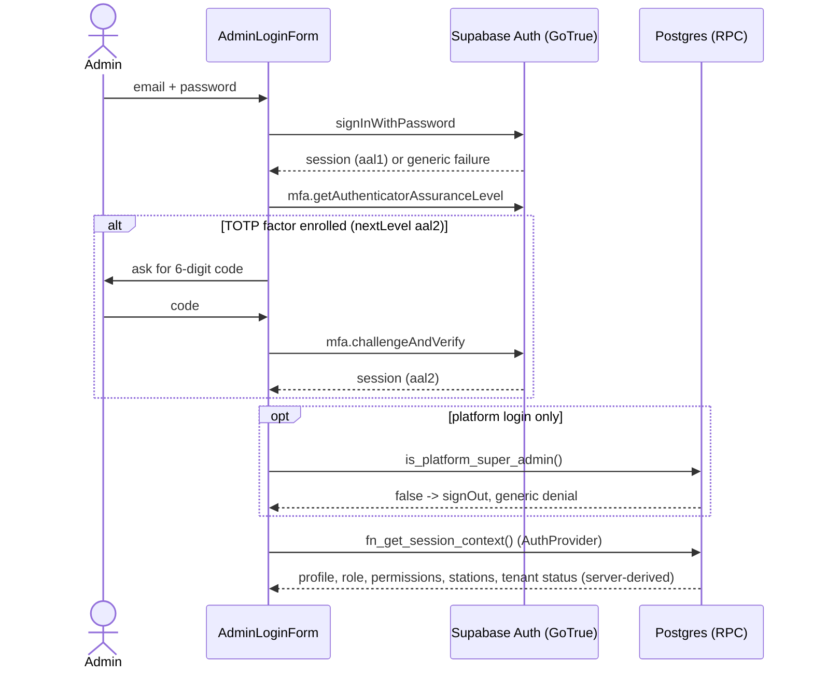
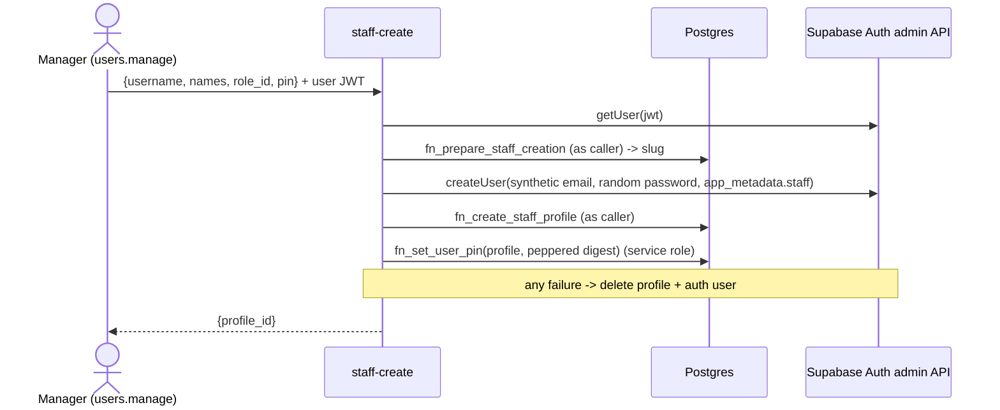
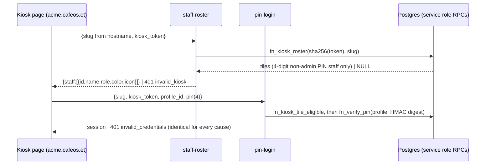

# Authentication flows (Phase 1)

Binding rule: `platform_super_admin` and `tenant_admin` NEVER use a PIN. They sign in with Supabase Auth email + password (TOTP MFA capable).
PIN login is only for non-admin staff (`profiles.auth_method = 'pin'`); the PIN path answers admins exactly like a wrong PIN.

## Admin / platform admin: Supabase Auth


## Staff: PIN via Edge Function
```mermaid
sequenceDiagram
    actor S as Staff
    participant UI as StaffLogin (/r/:slug/login)
    participant EF as pin-login (Edge Function)
    participant DB as Postgres (service_role RPCs)
    participant GT as Supabase Auth
    S->>UI: username, then PIN on keypad
    UI->>EF: {restaurant_slug, username, pin}
    EF->>EF: size cap, strict validation, per-IP and per-user throttle
    EF->>DB: fn_resolve_tenant_slug, profile lookup
    EF->>EF: digest = HMAC-SHA256(pin, PIN_PEPPER)
    EF->>DB: fn_verify_pin(profile, digest) (random id if unknown/admin/inactive)
    DB-->>EF: status ok | invalid (locked/inactive/unknown/wrong are identical; lockout in DB)
    alt not ok
        EF-->>UI: 401 invalid_credentials (identical for every cause) after a timing floor
    else ok
        EF->>DB: fn_staff_has_active_session(profile)
        alt another session is active
            EF->>DB: fn_staff_login_blocked(profile, kiosk hash?) (notify, must_change_pin, audit)
            EF-->>UI: 401 invalid_credentials (byte-identical, same timing floor)
        end
        EF->>GT: admin.generateLink(magiclink, synthetic email)
        EF->>GT: verifyOtp(token_hash) with anon client
        GT-->>EF: session
        EF-->>UI: {access_token, refresh_token, expires_in}
        UI->>GT: setSession
        UI->>DB: fn_get_session_context()
    end
```

## Threat notes
| threat | control |
|---|---|
| PIN brute force | 4-digit PIN (**6 digits for the role named 'Cashier'**, a documented user-decided exception), weak PINs refused at set time (also for 6 digits); the server never reveals a user's length; peppered digest + bcrypt (offline DB leak is not brute-forceable without `PIN_PEPPER`); `fn_verify_pin` serialises attempts (row lock), escalating non-decaying lock 15 min (3rd failure) / 1 h (6th) / 24 h (9th); locked attempts are not evaluated; per-IP/user buckets best effort |
| User / tenant enumeration | one 401 body for unknown tenant/user, inactive, locked, admin, wrong PIN; same DB work and a response-time floor; slug resolver returns null for unknown and suspended; staff are typed by username, never listed |
| Admin via PIN | profile must be `auth_method='pin'`; DB eligibility check; minted identity must have `fn_user_auth_method='pin'` and a `*.staff.cafeos.invalid` email |
| Service-role exposure | key only in function env; response whitelist of three fields; no logging of PINs/tokens; `src/` is scanned for service-role strings |
| Session minting abuse | single-use magic-link hash stays server-side; no JWT secret in the function; GoTrue refresh rotation applies |
| CORS | exact origins from `ALLOWED_ORIGINS`, no wildcard |
| Client-side bypass | guards are UX only; tenant/role/permissions come from `fn_get_session_context` and RLS, never JWT claims or the URL slug |
| Concurrent / shared PIN use | one active session per PIN staff member (see below); blocked attempt looks like a wrong PIN, notifies the user + tenant admins, forces a PIN change |
| Targeted lockout (DoS) | an attacker can lock a known username (inherent to lockout); mitigate with per-IP limits and admin unlock |
| Password login of PIN staff | Auth hook `password_verification_attempt` -> `fn_auth_password_verification_hook` rejects every `auth_method='pin'` profile (wired in `config.toml`; **not exercised against real GoTrue**, SQL unit-tested only) |
| Demoted admin keeps a password identity | `identity_rotation_pending`: not PIN-eligible, hook rejects its password, until `fn_complete_identity_rotation` (the Edge Function that rewrites the auth user is a follow-up) |

## Staff creation (`staff-create` Edge Function)


## Platform admins
`is_platform_admin()` / `is_platform_super_admin()` additionally require `aal2` (TOTP verified this session) unless `app.platform_mfa_required = 'off'` and the
user has no verified factor. Production default = required. Local/CI opt out per session; the pgTAP helpers do it per transaction.

## PIN length by role (documented exception, user decision 2026-10-03)
The role named `Cashier` signs in with a 6-digit PIN; every other PIN role with exactly 4. It is the ONLY name-keyed rule in the system and lives in two twin
spots: `CASHIER_ROLE_NAME` / `pinLengthForRole()` in `supabase/functions/_shared/pin.ts` and `fn_pin_length_for_role_name()` (migration 0021).
- `pin-login` accepts 4 or 6 digits on the wire and only compares the digest: wrong length, wrong PIN, locked, inactive all answer `invalid`.
- `staff-create` looks the role NAME up server-side (`fn_prepare_staff_creation` returns `role_name`; the client never supplies it) and enforces the length
  before any Auth user exists (`invalid_pin_length`); weak-PIN rules apply to 6 digits too (`123456`, `111111`, `121212` ...).
- `fn_set_user_pin(profile, digest, claimed_length)` records `profile_secrets.pin_length` and refuses a claim that differs from the role's (`pin_length_mismatch`).
- `fn_change_user_role` (and renaming a role into/out of Cashier) destroys secrets whose length no longer fits the role: no PIN login until a new PIN is issued
  (`pin_reset_required` in the RPC result).
- Lock after 3 wrong attempts (15 min), 6 (1 h), 9 (24 h) applies to every role.

## Shared floor terminal (registered kiosk) and tenant host
Tenant is resolved from the host `<slug>.cafeos.et` (see tenant-routing.md; `/r/:slug` is the dev fallback). A registered kiosk device
(kiosk-terminals.md) fetches tiles with `staff-roster` and signs staff in through the `pin-login` tile path:

The Cashier (6-digit PIN) and everyone else can use the username + PIN path on any device. Lockout 3/6/9 is shared by both paths.

## One concurrent session per PIN staff member (migration 0023, user decision 2026-10-03)
Applies to `profiles.auth_method = 'pin'` non-admin staff only; tenant_admin, platform admins and password users are never blocked
(`fn_staff_has_active_session` returns false for them).
- **Active session** = a row in `auth.sessions` for the user with `not_after` null or in the future AND
  `coalesce(refreshed_at, updated_at, created_at)` within `fn_active_session_window()` (**2 hours**, deliberately longer than `jwt_expiry` = 1 hour so a
  live browser that refreshes its token always counts, while a closed browser goes stale). Sign-out deletes the GoTrue row and frees the slot immediately.
  `refreshed_at` is `timestamp` without zone (UTC) in GoTrue; the function converts it explicitly. The shim mirrors the real columns.
- **Blocked login = no oracle.** After the PIN verifies and the identity checks pass, `pin-login` asks `fn_staff_has_active_session`. If true it calls
  `fn_staff_login_blocked` (result ignored) and answers `401 {"error":"invalid_credentials"}` through the very same `shapeFailure('invalid_credentials')`
  and the same response-time floor (450 ms + jitter) as a wrong PIN. Username and tile paths behave the same. A DB error in the check answers 503
  (fail closed; never mints). The user message is generic: "Could not sign in. Check your username and PIN, or sign out of any other device first. If it keeps happening, ask your manager."
- **Consequences of a blocked-after-correct-PIN attempt** (the PIN is treated as exposed): (a) one `user_notifications` row of kind
  `security.concurrent_login_blocked` for the user and one for every active tenant_admin of the tenant, deduped to one set per user per 5 minutes (advisory-locked,
  race-tested); (b) `profile_secrets.must_change_pin = true`; (c) audit event `auth.concurrent_login_blocked` (profile id, kiosk name, whether notified; no secret).
- **Forced PIN change, enforced in the database.** While `must_change_pin` is true `has_permission()`, `has_station_access()` and `current_station_ids()` answer
  nothing for that user, so every permission-checked RPC and RLS policy denies. Not affected: identity helpers (the session stays valid), `fn_get_session_context`
  (returns `must_change_pin: true`, `permissions: []`, `station_ids: []`), `fn_mark_notification_read`, and `fn_verify_pin`. tenant_admin is exempt by construction (no secret row can exist
  for admins, the guard trigger refuses it, and the helpers exempt `system_key = 'tenant_admin'` anyway), so no tenant can be locked out of its last admin.
  `fn_reset_pin_lockout` (admin unlock) does NOT clear the flag; only `fn_set_user_pin` does.
- **`pin-change` Edge Function** (the only way out of the state), see `supabase/functions/pin-change/README.md`:
```mermaid
sequenceDiagram
    actor S as Staff (must_change_pin)
    participant EF as pin-change (verify_jwt)
    participant DB as Postgres (service role RPCs)
    participant GT as Supabase Auth
    S->>EF: Authorization: Bearer JWT, {current_pin, new_pin}
    EF->>GT: getUser(jwt) -> user id (never from the body)
    EF->>EF: parse, weak-PIN policy, new != current, throttle
    EF->>DB: profile + role name lookup; length check (4, Cashier 6)
    EF->>DB: fn_verify_pin(profile, HMAC(current)) (shared lockout)
    EF->>DB: fn_complete_forced_pin_change(profile, HMAC(new), length) (flagged => pending_approval + notify tenant_admins)
    EF->>GT: admin.signOut(jwt, 'others') (end every other session)
    EF-->>S: {changed: true, pending_approval, other_sessions_revoked}
```
- **Maker-checker (migration 0024, user decision 2026-10-04).** A forced change does NOT restore access: `fn_complete_forced_pin_change` stores the new PIN, clears
  `must_change_pin`, sets `profile_secrets.pin_change_pending = true` (+ `pin_change_requested_at`), notifies every active tenant_admin of the tenant
  (`security.pin_change_pending_approval`, payload `{profile_id, user_name, at}`, deduped per admin and subject for 5 minutes) and audits `auth.pin_change_requested`.
  The user stays restricted exactly as before (`fn_pin_restricted(user) = must_change_pin or pin_change_pending`, tenant_admin exempt, is the single predicate behind
  `has_permission` / `has_station_access` / `current_station_ids` and the session context). A tenant_admin (or a delegate with `users.manage` who covers the subject's role) decides:
  `fn_approve_pin_change(profile)` clears the pending state (audit `auth.pin_change_approved`, subject notified `security.pin_change_approved`), `fn_reject_pin_change(profile)` sets
  `must_change_pin = true` again (audit `auth.pin_change_rejected`, subject notified `security.pin_change_rejected`, a new change is needed). Both need `users.manage` and step-up
  (`fn_require_step_up`: `mfa_required` for an admin with a verified factor on an aal1 session), take the tenant from the identity, lock the row, are never allowed on yourself, and answer
  `not_found` identically for unknown, foreign-tenant and not-pending ids (replays are `not_found` too). `fn_list_pending_pin_changes()` feeds the approval screen (own tenant only).
  States: `none` -> `required` (blocked login) -> `pending_approval` (pin-change) -> `none` (approve) or `required` (reject). A PIN change while already pending stays pending (no bypass);
  an exposed PIN again while pending (blocked login) returns to `required`; an admin-set PIN (`fn_set_user_pin`) leaves nobody pending; a voluntary change (no flag) needs no approval.
  `fn_get_session_context()` adds `pin_change_status` (`none|required|pending_approval`) and `pin_length` (4; 6 for Cashier via `fn_pin_length_for_role_name`); `must_change_pin` is true only while `required`.
  The pin-change function answers `{changed, pending_approval, other_sessions_revoked}`. A restricted user can still read and mark read their own notifications (recipient-only policy, no `has_permission`).
- **Residual risks:** (0) with a single tenant_admin who is unavailable a pending member waits (an admin can also set a PIN through the staff tools); the approver is not required to be a different person than the one whose
  rights cover the subject (any covering `users.manage` holder may approve); (1) two simultaneous correct-PIN logins can both pass the check before either session exists (check and mint are separate steps; the
  next login is blocked); (2) a staff member who closed the browser without signing out is blocked for up to 2 hours (or until they sign out elsewhere), and then must change their PIN
  (user-decided; their manager is notified); (3) a person who knows the PIN can trigger the forced change of that account (a nuisance, bounded by the per-user throttle);
  (4) `auth.sessions` semantics and `signOut(jwt, 'others')` were verified against the documented GoTrue schema only, not against a running GoTrue.

### SPA: forced PIN change, approval and notifications (UI)
All of this is UX; the database (`fn_pin_restricted` behind `has_permission` / station access / RLS) is the ceiling.
- **Routes** (behind `RequireAuth` -> `PinChangeGate` -> `TenantShell`): `/r/:slug/change-pin`, `/r/:slug/pin-pending`, `/r/:slug/settings/pin-approvals`.
  `PinChangeGate` reads `pin_change_status` from `fn_get_session_context` (`pinChangeStatusOf`: missing = `none`, `must_change_pin` alone = `required`;
  an unknown status fails the zod parse, the context shows "Could not load your account" instead of guessing) and redirects with the identity's slug
  (never the URL slug): `required` -> change-pin from every tenant route, `pending_approval` -> pin-pending, `none` -> the two forced routes bounce home.
  A `pending_approval -> required` transition (rejection) passes `{pinChangeRejected: true}` so Change PIN shows a neutral explanation.
- **Header** (`TenantShell`): persistent "Change PIN" button while `required`; "PIN approvals" link when `can('users.manage')` and not restricted.
- **Change PIN** (`ChangePinPage`): three steps (current, new, confirm) on the existing `PinPad` in fixed-length mode with `pin_length` (4, or 6 for the
  Cashier exception, decided server-side; no length is guessed if it is missing). Digits are never rendered (dots + count). Local zod checks only: length,
  new != current, confirm == new; weak-PIN and role length stay server-side. The PINs move to a ref that the mutation clears as it starts (never
  `variables` in the TanStack cache), and component state is wiped before the request is awaited. Every failure restarts at step 1. Copy is neutral and
  never mentions locks or attempts left (`pinChangeMessage`). On 429 the pad stays disabled for `Retry-After` seconds (clamped 1..900, default 30).
  Success shows "Your PIN has been changed" (+ "Sign out on any other device" when `other_sessions_revoked` is false); Continue refreshes the context and
  the gate moves on (pending screen when `pending_approval`). Client: `src/lib/supabase/pin-change.ts` (explicit `Authorization: Bearer <access token>`,
  15 s timeout, zod-checked body, whitelisted error codes).
- **Waiting screen** (`PinPendingPage`): sign out and a user-initiated "Check again". Live transitions come from the notifications listener, which calls
  `refreshContext()` on `security.pin_change_approved` / `security.pin_change_rejected` (and on a `concurrent_login_blocked` about the user). `refreshContext()`
  for the same user is a background reload, so the screen does not unmount behind a loading state.
- **Notifications** (`NotificationsListener`, mounted in the router root for any signed-in tenant user): initial fetch of up to 10 unread own rows
  (`user_notifications`, RLS: recipient only) on mount and on every Realtime (re)subscription, plus a Realtime `INSERT` subscription filtered
  `recipient_id=eq.<uid>` (uid must be a UUID; no polling). Rows are zod-validated and must match the user and be unread; duplicates are shown once. Fixed copy per kind
  (`notification-copy.ts`); payload values (`user_name`, `kiosk_name`) are plain text only (strings, control/bidi characters removed, capped at 60) and React renders them
  as text. Unknown kinds are ignored (no toast, not marked read). Admin copy: "X was blocked from signing in on a second device" (+ terminal name) and
  "X changed their PIN and is waiting for your approval" with a "Review" action to the approvals page (also invalidates the approvals list). A toast marks its row
  read (`fn_mark_notification_read`) when it is closed, auto-closes (timers pause while the tab is hidden) or its action is used. On sign-out the listener
  unsubscribes and removes its toasts (shared terminals).
- **PIN approvals** (`PinApprovalsPage`, `RequirePermission users.manage`): `fn_list_pending_pin_changes`, Approve / Reject with a confirm dialog, success toast +
  list invalidation. Errors map to neutral copy: `mfa_required` -> "Verify with your authenticator to continue." (no in-page step-up yet), `not_found` -> "no longer
  waiting" + list refresh, `permission_denied` / `permission_escalation`, `tenant_read_only` / `tenant_suspended`, anything else generic.
- **Inactivity**: `InactivityGuard` keeps managing restricted users (non-admin role), so the forced and waiting screens sign out on inactivity too.
- **Known gap**: the browser can read `Retry-After` cross-origin only if the function sends `Access-Control-Expose-Headers: Retry-After`; `_shared/cors.ts`
  does not yet, so production falls back to the 30 s default (safe, just less precise).
- Tests: `src/lib/supabase/{pin-change,notifications}.test.ts`, `src/features/pin-change/*.test.tsx`, `src/features/notifications/*.test.ts(x)`,
  `src/app/pin-change-flow.test.tsx` (real route tree, mocked Realtime), `tests/e2e/pin-change.spec.ts` (page.route + mocked Realtime WebSocket).

### SPA: per-tenant session timers (migration 0025)
- **Inactivity**: `InactivityGuard` reads `session_timers` from `fn_get_session_context` (lenient parse: a malformed value never blocks sign-in).
  Warning after `idle_warning_seconds`, sign-out at `signout_seconds` in total, so the "Still there?" dialog is visible for `signout - warn` seconds
  (`inactivityMsFromTimers`: clamped to 5 <= warn < signout, 15 <= signout <= 900; if either field is missing both fall back to 15 / 30). The DEV-only
  Playwright override still wins in dev builds. Other devices pick up a change on their next session-context load (no live push of settings).
- **Terminal**: the PIN-pad idle timer comes from the staff-roster response `{staff, pin_pad_idle_seconds}` (`parsePinPadIdleSeconds`, then
  `pinPadIdleMs`: clamped 15..300 s, 60 s when absent, e.g. an Edge Function deployed before 0025).
- **Settings page** `/r/:slug/settings/session-timers` (`SessionTimersPage`, `RequirePermission settings.session_timers`, header link): react-hook-form +
  zod (`sessionTimersFormSchema`, same bounds as the server, preview only), live explanation of the warning window, Save
  (`fn_update_session_timers`) and "Reset to defaults" with a confirm (`fn_reset_session_timers`, 15 / 30 / 60). `mfa_required` opens `StepUpDialog`
  (TOTP `challengeAndVerify`, aal2) and retries the same action once verified; `invalid_input` marks the field named by the error `detail`
  (`RpcError.detail`, kept only when it is a bare identifier); other codes map to neutral copy. Success: toast, cache update, `refreshContext()`.
- `src/lib/supabase/types.ts` is still the placeholder (no Docker for `supabase gen types`); its `Functions` was hand-extended with the three 0025 RPCs.
