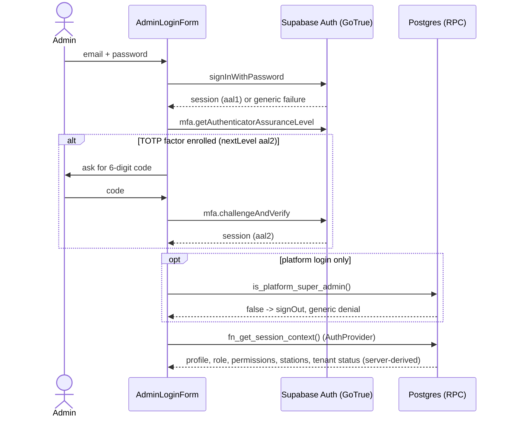
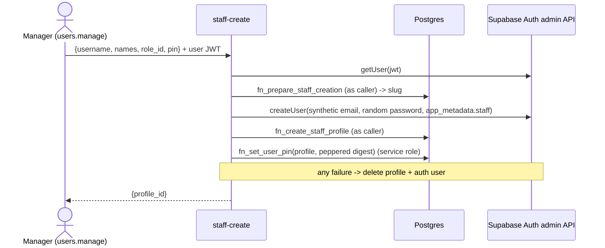

# Authentication flows (Phase 1)

Binding rule: `platform_super_admin` and `tenant_admin` NEVER use a PIN. They sign in with Supabase Auth email + password (TOTP MFA capable).
PIN login is only for non-admin staff (`profiles.auth_method = 'pin'`); the PIN path answers admins exactly like a wrong PIN.

## Admin / platform admin: Supabase Auth


## Staff: PIN via Edge Function
```mermaid
sequenceDiagram
    actor S as Staff
    participant UI as StaffLogin (/r/:slug/login)
    participant EF as pin-login (Edge Function)
    participant DB as Postgres (service_role RPCs)
    participant GT as Supabase Auth
    S->>UI: username, then PIN on keypad
    UI->>EF: {restaurant_slug, username, pin}
    EF->>EF: size cap, strict validation, per-IP and per-user throttle
    EF->>DB: fn_resolve_tenant_slug, profile lookup
    EF->>EF: digest = HMAC-SHA256(pin, PIN_PEPPER)
    EF->>DB: fn_verify_pin(profile, digest) (random id if unknown/admin/inactive)
    DB-->>EF: status ok | invalid (locked/inactive/unknown/wrong are identical; lockout in DB)
    alt not ok
        EF-->>UI: 401 invalid_credentials (identical for every cause) after a timing floor
    else ok
        EF->>GT: admin.generateLink(magiclink, synthetic email)
        EF->>GT: verifyOtp(token_hash) with anon client
        GT-->>EF: session
        EF-->>UI: {access_token, refresh_token, expires_in}
        UI->>GT: setSession
        UI->>DB: fn_get_session_context()
    end
```

## Threat notes
| threat | control |
|---|---|
| PIN brute force | 4-6 digit PIN, weak PINs refused at set time; peppered digest + bcrypt (offline DB leak is not brute-forceable without `PIN_PEPPER`); `fn_verify_pin` serialises attempts (row lock), escalating non-decaying lock 15 min / 1 h / 24 h; locked attempts are not evaluated; per-IP/user buckets best effort |
| User / tenant enumeration | one 401 body for unknown tenant/user, inactive, locked, admin, wrong PIN; same DB work and a response-time floor; slug resolver returns null for unknown and suspended; staff are typed by username, never listed |
| Admin via PIN | profile must be `auth_method='pin'`; DB eligibility check; minted identity must have `fn_user_auth_method='pin'` and a `*.staff.cafeos.invalid` email |
| Service-role exposure | key only in function env; response whitelist of three fields; no logging of PINs/tokens; `src/` is scanned for service-role strings |
| Session minting abuse | single-use magic-link hash stays server-side; no JWT secret in the function; GoTrue refresh rotation applies |
| CORS | exact origins from `ALLOWED_ORIGINS`, no wildcard |
| Client-side bypass | guards are UX only; tenant/role/permissions come from `fn_get_session_context` and RLS, never JWT claims or the URL slug |
| Targeted lockout (DoS) | an attacker can lock a known username (inherent to lockout); mitigate with per-IP limits and admin unlock |
| Password login of PIN staff | Auth hook `password_verification_attempt` -> `fn_auth_password_verification_hook` rejects every `auth_method='pin'` profile (wired in `config.toml`; **not exercised against real GoTrue**, SQL unit-tested only) |
| Demoted admin keeps a password identity | `identity_rotation_pending`: not PIN-eligible, hook rejects its password, until `fn_complete_identity_rotation` (the Edge Function that rewrites the auth user is a follow-up) |

## Staff creation (`staff-create` Edge Function)


## Platform admins
`is_platform_admin()` / `is_platform_super_admin()` additionally require `aal2` (TOTP verified this session) unless `app.platform_mfa_required = 'off'` and the
user has no verified factor. Production default = required. Local/CI opt out per session; the pgTAP helpers do it per transaction.
