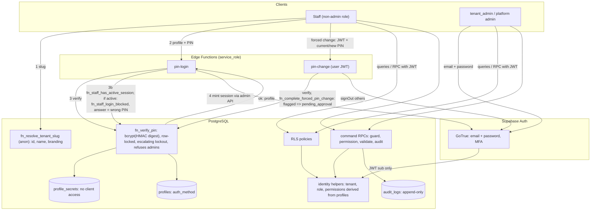
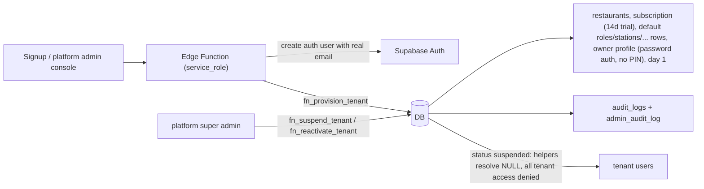

# Data-flow diagrams

## Level 0
```mermaid
flowchart LR
    subgraph TB1["Trust boundary: untrusted clients"]
        staff["Staff devices (waiter, cashier, KDS)"]
        admin["Tenant admin / owner"]
        guest["QR customer"]
        pa["Platform admin"]
    end
    subgraph TB2["Trust boundary: Supabase project"]
        api["PostgREST / Realtime / Auth (JWT verified)"]
        edge["Edge Functions (service_role confined): pin-login, pin-change, staff-create, staff-roster, staff-pin-reset, tenant-admin-invite, billing webhook"]
        db[("PostgreSQL: RLS + security-definer RPCs + triggers")]
    end
    staff -->|JWT, intents only| api
    admin -->|email + password (+MFA)| api
    pa -->|email + password (+MFA)| api
    guest -->|QR token via RPC| api
    staff -->|profile + PIN| edge  %% edge hashes PIN with PIN_PEPPER; DB only gets the digest
    api -->|role: authenticated / anon| db
    edge -->|role: service_role, never in browser| db
```

## Level 1: authentication and authorization

Single session: the blocked-login path writes `user_notifications` (recipient: the user and every tenant_admin) which reach the SPA through Realtime (RLS: own rows) and sets
`must_change_pin`, which makes `has_permission` deny everything for that user until `pin-change` succeeds, after which the account is `pin_change_pending` (still denied) until a tenant_admin approves through `fn_approve_pin_change` / `fn_reject_pin_change` (JWT, `users.manage`, step-up; notifications to the admins and later the subject travel the same Realtime path). Trust boundary: `fn_staff_*` are service_role only; the browser never learns why a login was refused.

Rules: PIN verification is attempted only for profiles whose `auth_method='pin'` and whose role is not the system `tenant_admin`; for admins
and platform admins `fn_verify_pin` returns the same `invalid` result as for an unknown account. The JWT contributes only `sub`; tenant, role and
permissions are re-derived from `profiles` on every statement.

## Level 1: tenant provisioning and suspension
Phase 3B: the Platform Admin Portal provisions with `fn_platform_create_tenant` (no owner) and invites the first Tenant Admin (see below);
`fn_provision_tenant` (owner already in Auth, confirmed e-mail) remains for service flows (seed / CI). Suspension, reactivation, cancellation,
plan and billing-status changes are aal2 platform RPCs.


## Level 1: Platform Admin Portal (Phase 3B, `/platform/*`)
```mermaid
flowchart LR
    SA["Super Admin (email + password + TOTP, aal2)"] -->|JWT| RPC["fn_platform_* RPCs: fn_platform_guard (active super admin, aal2, verified factor)"]
    RPC -->|metadata, subscription, plan limits| PT[("restaurants, subscriptions, plans, platform_invoices")]
    RPC -->|AGGREGATES only (fn_tenant_usage: counts, byte sums)| OPS[("tenant operational tables + storage.objects")]
    RPC -->|health: version, sizes, counters, last backup| HB[("pg catalogs, platform_backup_runs")]
    RPC -->|every write| AAL[("admin_audit_log (+ tenant audit_logs event)")]
    SA -->|invite / resend / revoke| TAI["tenant-admin-invite (Edge Function)"]
    TAI -->|1 fn_prepare_tenant_admin_invitation AS CALLER| RPC
    TAI -->|2 inviteUserByEmail (service role)| GT["Supabase Auth (sends the e-mail)"]
    TAI -->|3 fn_attach_tenant_admin_invitation (service role)| INV[("tenant_admin_invitations")]
    OPSJOB["ops backup job (service role)"] -->|insert / finish run| HB
    SA -.->|no RLS path, no profile| X["tenant operational rows: 0 rows, tenant RPCs: permission_denied"]
```
Trust boundaries: the SPA never holds the service role; the Edge Function forwards the caller's JWT for step 1 so the DATABASE decides who may invite; the
invitee later signs in from the e-mail link (confirmed address) and calls `fn_accept_tenant_admin_invitation()` with its own session, which creates its
`tenant_admin` profile. Usage counters cross the platform/tenant boundary only as numbers.

## Level 1: Tenant Portal administration (Phase 3B, `/r/<slug>/*`)
```mermaid
flowchart LR
    TA["tenant_admin (or delegate with the permission)"] -->|JWT, intents only| RPC["fn_create_role / fn_update_role / fn_set_role_active / fn_delete_role / fn_set_role_station_access / fn_update_role_permissions"]
    TA -->|users| URPC["fn_list_users / fn_update_user / fn_set_user_active / fn_change_user_role / fn_reset_pin_lockout"]
    TA -->|new staff| SC["staff-create (Edge Function)"]
    TA -->|new PIN| SPR["staff-pin-reset (Edge Function): fn_prepare_pin_reset AS CALLER, then fn_set_user_pin (service role, peppered digest)"]
    TA -->|co-admin by e-mail (aal2)| TAI["tenant-admin-invite"]
    TA -->|profile / business settings (aal2) / branding| SRPC["fn_update_restaurant_profile / fn_update_business_settings / fn_update_restaurant_branding"]
    TA -->|logo upload: tenant-branding/restaurants/&lt;own id&gt;/branding/&lt;file&gt;| STO[("Storage: tenant-branding (private)")]
    SRPC -->|logo object must exist under own prefix| STO
    RPC & URPC & SRPC -->|tenant from identity, permission, step-up, validate, audit| DB[("Postgres")]
    TA -.->|platform RPCs| NO["permission_denied"]
```

## Level 1: tenant shell read path (Phase 2)
```mermaid
flowchart LR
    SPA["SPA tenant shell"] -->|fn_get_session_context (JWT)| CTX["profile, restaurant + branding, permissions, station_ids"]
    CTX -->|strict hex -> CSS vars| TH["TenantThemeProvider"]
    CTX -->|permission codes| NAV["MODULE_NAV -> sidebar / drawer / route guards"]
    SPA -->|select stations (RLS: own tenant)| ST[("stations")]
    ST -->|active rows, filtered by station_ids| NAV
    ST -.->|Realtime change -> invalidate| SPA
    RSA[("role_station_access")] -.->|Realtime change -> reload context| SPA
```
Nothing in this path writes; the client never sends a `restaurant_id`. Guards decide only what to render.

## Level 1: menu and inventory (Phase 3, frontend `src/features/{menu,inventory}`)
```mermaid
flowchart LR
    SPA["Menu / Inventory screens"] -->|select menu_items, categories, stations, recipe_lines, ingredients, restaurants.stock_stepup_threshold (RLS: own tenant)| DB[("Postgres")]
    SPA -->|1. upload file -> menu-images/restaurants/&lt;own id&gt;/menu/&lt;uuid&gt;.png/jpg/webp (Storage policy: own prefix, menu.manage)| STO[("Storage: menu-images (private)")]
    SPA -->|2. fn_create_menu_item / fn_update_menu_item (image_path, ids, price)| RPC["security definer RPCs (0029)"]
    SPA -->|fn_set_menu_item_active, fn_set_recipe| RPC
    SPA -->|fn_create/update/set_ingredient_active| RPC
    SPA -->|fn_receive_stock / fn_adjust_stock / fn_reverse_stock_movement + idempotency key per intent| RPC
    SPA -->|fn_list_stock_movements (keyset created_at,id)| RPC
    SPA -->|fn_set_stock_stepup_threshold (aal2)| RPC
    RPC -->|fn_menu_check_image: path + object exists| STO
    RPC -->|ledger row + running total + audit| DB
    STO -->|createSignedUrl (1 h) -> img src| SPA
    DB -.->|Realtime menu_items / recipe_lines / categories / ingredients / stock_movements / stations -> invalidate queries| SPA
    RPC -.->|mfa_required -> StepUpDialog (TOTP, aal2) -> same request, same key| SPA
```
The client sends ids, quantities, prices as typed decimals and an idempotency key (one `crypto.randomUUID()` per opened stock dialog,
reused only for a retry of that intent). It never sends a `restaurant_id`, on-hand stock or a total; structured `P0001` codes are mapped to
fixed copy in `src/lib/supabase/menu-inventory-errors.ts`. A failed create/update deletes the just-uploaded object; a replaced or removed photo
is deleted after the update succeeds (the Storage delete policy refuses an object still referenced).

## Level 1: operational write path (Phases 4+)
Clients send intents (ids, quantities) to `fn_*` RPCs; the RPC derives tenant and user, checks permission and open day, prices server-side,
writes orders/stock/payments atomically, appends audit rows, and Realtime delivers RLS-filtered changes to authorized devices.

## Level 1: cashier and payments (Phase 6)
```mermaid
flowchart LR
    CASH["Cashier SPA /r/<slug>/cashier"] -->|select unpaid orders of the open day (RLS orders_select)| ORD[("orders / order_items")]
    CASH -->|select active payment_methods rows (RLS)| PM[("payment_methods")]
    CASH -->|fn_confirm_payment(order id, method id, reference, tendered, key)| RPC["definer RPC: tenant from JWT, payments.create, open day, idempotency"]
    RPC -->|amount = orders.total, RCT-nnnn, snapshots| PAY[("payments (immutable)")]
    RPC -->|payment_status = paid| ORD
    RPC -->|payment.confirmed| AUD[("audit_logs")]
    CASH -->|fn_reverse_payment + step-up| REV["compensating reversal row; order unpaid"]
    REV --> PAY
    PAY -.->|Realtime INSERT (RLS)| CASH
    RPC -->|receipt JSON| RCPT["ReceiptView (React text) -> print"]
```

