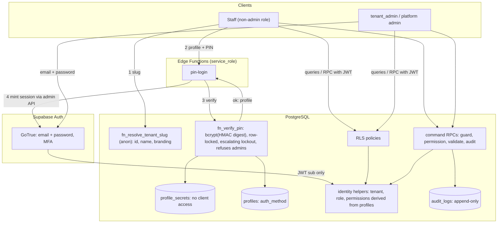
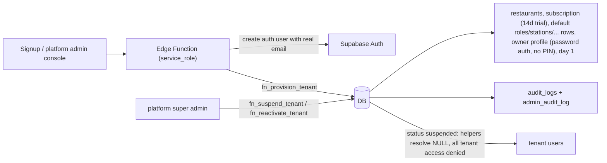

# Data-flow diagrams

## Level 0
```mermaid
flowchart LR
    subgraph TB1["Trust boundary: untrusted clients"]
        staff["Staff devices (waiter, cashier, KDS)"]
        admin["Tenant admin / owner"]
        guest["QR customer"]
        pa["Platform admin"]
    end
    subgraph TB2["Trust boundary: Supabase project"]
        api["PostgREST / Realtime / Auth (JWT verified)"]
        edge["Edge Functions (service_role): pin-login, provisioning, billing webhook"]
        db[("PostgreSQL: RLS + security-definer RPCs + triggers")]
    end
    staff -->|JWT, intents only| api
    admin -->|email + password (+MFA)| api
    pa -->|email + password (+MFA)| api
    guest -->|QR token via RPC| api
    staff -->|profile + PIN| edge  %% edge hashes PIN with PIN_PEPPER; DB only gets the digest
    api -->|role: authenticated / anon| db
    edge -->|role: service_role, never in browser| db
```

## Level 1: authentication and authorization

Rules: PIN verification is attempted only for profiles whose `auth_method='pin'` and whose role is not the system `tenant_admin`; for admins
and platform admins `fn_verify_pin` returns the same `invalid` result as for an unknown account. The JWT contributes only `sub`; tenant, role and
permissions are re-derived from `profiles` on every statement.

## Level 1: tenant provisioning and suspension


## Level 1: operational write path (Phases 4+)
Clients send intents (ids, quantities) to `fn_*` RPCs; the RPC derives tenant and user, checks permission and open day, prices server-side,
writes orders/stock/payments atomically, appends audit rows, and Realtime delivers RLS-filtered changes to authorized devices.
