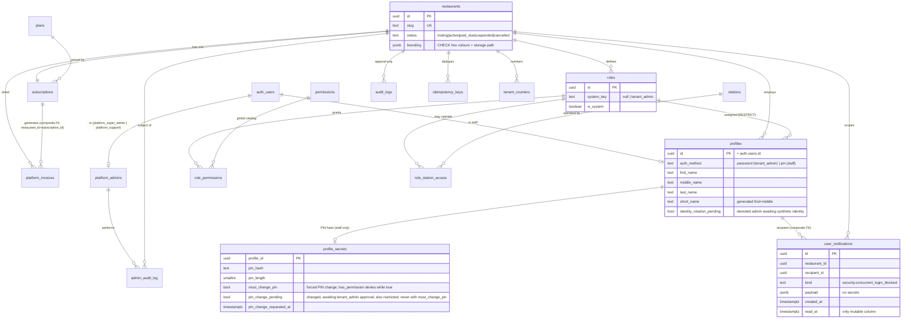
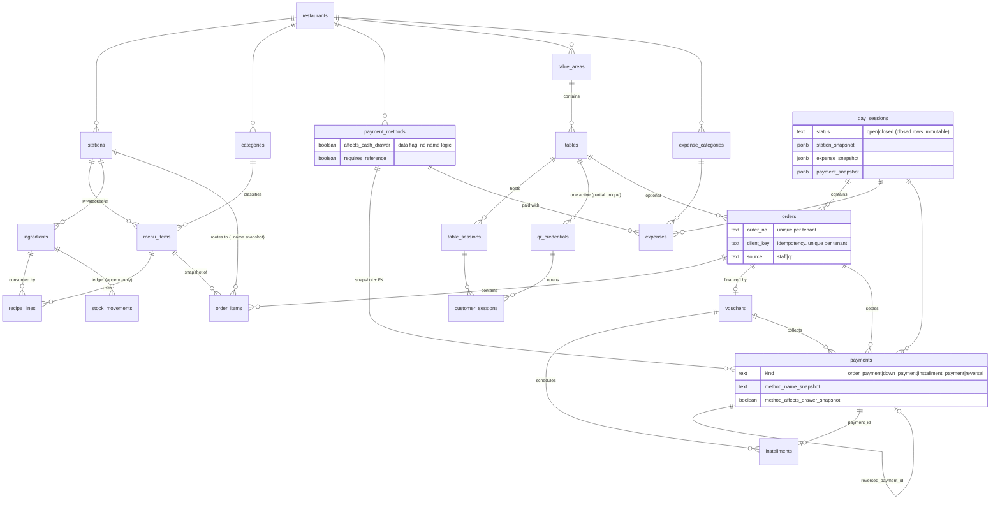

# CafeOS entity-relationship diagram (Phase 1 schema)

Source of truth: `supabase/migrations/*.sql`. Every tenant table carries `restaurant_id`; child tables reference
parents through **composite foreign keys** `(restaurant_id, parent_id)` so a cross-tenant reference is impossible
at the schema level. All business FKs are `ON DELETE RESTRICT` (soft-deactivate with `is_active`).

## Platform and identity

## Six dynamic domains and operations

Every table in the six-domain group has: `id, restaurant_id, name, normalized_name (generated), description, color, icon,
sort_order, is_active, created_at, updated_at` and `unique (restaurant_id, normalized_name)`; roles add `is_system, system_key`.
No PostgreSQL enums exist in `public`; workflow states are `text` + CHECK.

Note: `auth_users` is Supabase's `auth.users`.

Additions in migrations 0011-0018: `orders.station_ids uuid[]` (trigger-maintained from order_items, used by RLS), `expenses.category_name_snapshot`,
`profiles.identity_rotation_pending`, `subscriptions` unique `(restaurant_id, id)` (target of the composite invoice FK), `idempotency_keys` unique
`(restaurant_id, key, command)`, `expenses.expense_date` derived (no default), indexes on `stock_movements.day_session_id`, `orders.table_session_id`,
`orders.customer_session_id`, `table_sessions.day_session_id`, `installments.payment_id`, `vouchers.down_payment_method_id`. FK-index rule and its reviewed
exceptions (tenant-root and actor FKs): `21_validation_invariants`.

Migration 0023: `profile_secrets.must_change_pin boolean`, table `user_notifications` (unique `(restaurant_id, id)`, composite FK `(restaurant_id, recipient_id)` to `profiles`, RESTRICT),
read-only reference to `auth.sessions` (GoTrue) by the service-only `fn_staff_has_active_session`.

Migration 0024: `profile_secrets.pin_change_pending boolean not null default false`, `pin_change_requested_at timestamptz`, CHECK `not (must_change_pin and pin_change_pending)`; new `user_notifications.kind` values `security.pin_change_pending_approval|approved|rejected`. No new table.
