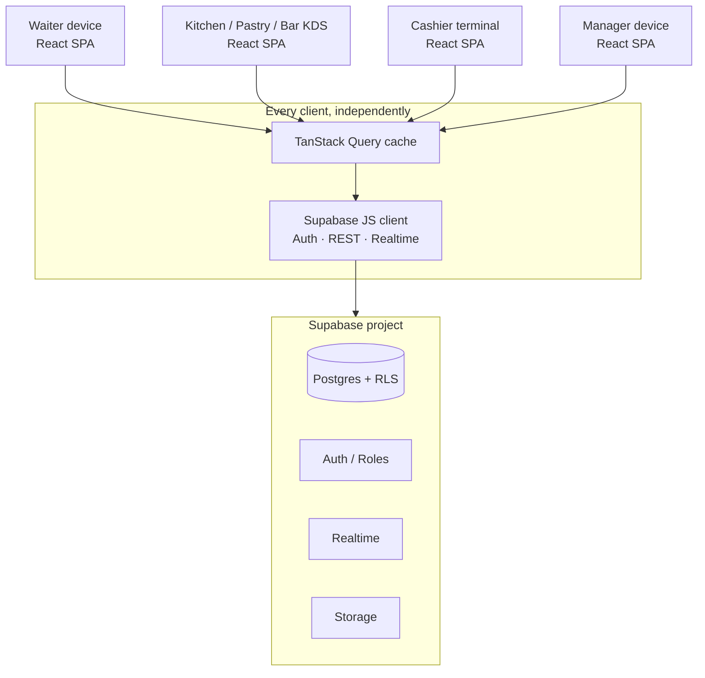
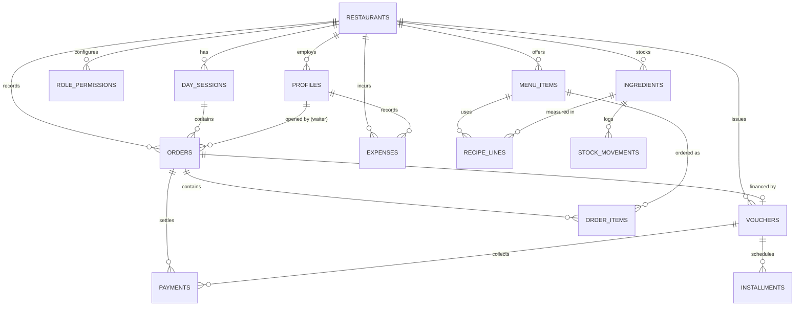
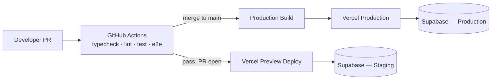

# CafeOS — Multi-Tenant Restaurant Management Platform
## Development Roadmap & Technical Specification
### Migrating a single-file HTML prototype (formerly "Central Cafe") to React 18 + TypeScript + Vite 5 + Tailwind CSS + shadcn/ui + TanStack Query + Supabase + Framer Motion + Recharts

> **Companion document:** the multi-tenancy architecture decision, full SaaS system design, and tenant-branding design-system extension referenced throughout this doc now live in *`CafeOS-Multi-Tenant-SaaS-Architecture.md`* — read that alongside §3–§7 below, which this document keeps in place as the single-restaurant module baseline the multi-tenant layer is built on top of.

> **Two portals (non-negotiable, owner decision 2026-10-08; execution prompt §34A, Phase 3B).** CafeOS has a **Platform Admin Portal** (`/platform/*`, actor "Super Admin" = `platform_super_admin`: tenants, subscriptions/plans, Tenant Admin invitation, usage/quota, system health, backups, platform audit) and a **Tenant Portal** (`/r/<slug>/*`, actor "Tenant Admin" = `tenant_admin`: restaurant, users, roles, permission matrix, role assignment, plus all operational modules). The Super Admin never sees tenant operational screens or data (dashboard, POS, station boards, cashier, …) and tenant users never see the platform portal. Support impersonation / "log in as tenant" is **not** built. Where this document says otherwise, §34A wins.

| | |
|---|---|
| **Source reviewed** | `final.html` — 1,590 lines, ~123 KB, single file (CDN Tailwind + CDN Chart.js + inline vanilla JS) |
| **Domain** | Ethiopian restaurant floor operations (order → station prep → serve → cashier → EOD close), currency ETB |
| **Document type** | Engineering roadmap + functional/technical specification |
| **Audience** | Engineering team, tech lead, QA, and stakeholders sizing the rebuild |

### Document control

| Version | Contents |
|---|---|
| 1.0 | Audit, target architecture, schema, module specs, hooks catalog, phased plan |
| 1.1 (current) | + architecture/ER diagrams, full RLS matrix & function signatures, complete domain types, sample component code, local dev setup, CI/CD, deployment architecture, migration success criteria |

### Table of contents

1. [Executive Summary](#1-executive-summary)
2. [Current State Audit](#2-current-state-audit)
3. [Target Architecture](#3-target-architecture)
4. [Database Design](#4-database-design-supabase--postgresql)
5. [Project Structure & Tooling](#5-project-structure--tooling)
6. [Application Architecture](#6-application-architecture)
7. [Design System](#7-design-system)
8. [Module-by-Module Functional Specification](#8-module-by-module-functional-specification)
9. [Domain Types & Business Logic](#9-domain-types--business-logic-typescript)
10. [Custom Hooks Catalog](#10-custom-hooks-catalog)
11. [Testing Strategy](#11-testing-strategy)
12. [Non-Functional Requirements](#12-non-functional-requirements)
13. [Phased Delivery Roadmap](#13-phased-delivery-roadmap)
14. [Risk Register & Open Decisions](#14-risk-register--open-decisions)
15. [Sample Component Implementations](#15-sample-component-implementations)
16. [Local Development & Environment Setup](#16-local-development--environment-setup)
17. [CI/CD Pipeline](#17-cicd-pipeline)
18. [Deployment Architecture](#18-deployment-architecture)
19. [Migration Success Criteria](#19-migration-success-criteria)
- [Appendix A — Legacy → Rebuild mapping](#appendix-a--legacy--rebuild-mapping-quick-reference)
- [Appendix B — Glossary](#appendix-b--glossary)

---

## 1. Executive Summary

CafeOS — originally prototyped under the working name "Central Cafe" — is currently a fully client-side prototype: one HTML file, Tailwind loaded from a CDN, Chart.js from a CDN, and ~950 lines of vanilla JS mutating a single global object (`S`) that is serialized to `localStorage` under the key `cc_rms_v10`. It already encodes a complete, well-thought-out restaurant workflow — waiter POS → direct-to-station ticket routing (Kitchen / Pastry / Bar) → cashier payment or installment voucher → recipe-driven stock consumption → end-of-day cash & stock reconciliation. The product thinking is sound; the implementation ceiling is the problem.

This document defines how to rebuild that same product surface — same screens, same flows, same domain rules — on a stack that can actually run a live restaurant: **React 18 + TypeScript + Vite 5 + Tailwind CSS + shadcn/ui + TanStack Query + Supabase (Postgres/Auth/Realtime/Storage) + Framer Motion + Recharts**.

The single biggest functional upgrade is not visual — it's architectural: the current app *requires every role (waiter, kitchen, cashier, manager) to share one browser tab*, because state lives only in that tab's `localStorage`. The rebuild moves state into Supabase Postgres with Realtime subscriptions, so a waiter's tablet, the kitchen's KDS screen, the cashier's terminal, and the manager's laptop are all independent, authenticated clients watching the same live data. Everything else in this document — schema, hooks, components, phasing — exists in service of that one change plus type-safety, auth, and testability.

---

## 2. Current State Audit

### 2.1 Architecture as-is

- **Delivery:** one `.html` file. `<script src="cdn.tailwindcss.com">` (JIT-in-browser, no purge, no build step) and `<script src="cdn.jsdelivr.net/npm/chart.js">`.
- **State:** a single mutable object `S` (`defaultState()`), created on load, mutated in place by ~90 top-level functions, and persisted wholesale via `localStorage.setItem('cc_rms_v10', JSON.stringify(S))` after every action.
- **Rendering:** manual DOM string-templating — every `render*()` function rebuilds an element's `innerHTML` from scratch and re-attaches inline `onclick="…"` handlers. There is no virtual DOM, no diffing, no component boundary.
- **Navigation:** a single-page "section switcher" (`showSection`) toggles `.active` on twelve `<section id="sec-*">` blocks; there is no router and no deep-linkable URLs.
- **Persistence:** `localStorage` only. No network calls anywhere in the file. Menu photos are captured, downscaled on a `<canvas>`, and stored as base64 **inside the same localStorage blob**.
- **Identity:** none. There is no login. The active "role" is whatever section you happen to have open; there is no enforcement preventing a waiter's browser from opening Settings or Reports.
- **Documents:** receipts and installment vouchers are HTML strings rendered into a shared modal and printed via `window.print()` against a dedicated `@media print` stylesheet sized for a 76 mm thermal roll.

### 2.2 Feature inventory by module

> **Update (`main.html`):** the prototype now ships two additional modules and a full pre-shell authentication gate. They're folded into the table and limitations below rather than treated as a separate document, since they change the shape of §3.3, §4, §6.5, and §8 throughout.

| Module (legacy section id) | What it does | Core interactions |
|---|---|---|
| **Login gate** (`#loginScreen`, pre-shell) | Full-screen profile picker (avatar + name + role badge per active user) → 4-digit PIN keypad → session | Pick profile, enter PIN, wrong PIN/disabled account rejected with a toast |
| **Dashboard** (`sec-dashboard`) | Service flow banner, 4 KPI tiles (collected today **+ net-after-expenses sub-line**, orders, avg service time, outstanding), 2 Chart.js charts (payment-method doughnut, orders-per-hour bar), low-stock alert list, live order feed | Read-only + "Receive" shortcut into inventory |
| **Waiter POS** (`sec-waiter`) | Category-filterable menu grid, running cart with waiter/table/order-type, VAT-inclusive total, submit | Add to cart, qty ± , submit order (blocked if day is closed) |
| **Kitchen / Pastry / Bar boards** (`sec-kitchen/pastry/bar`) | Per-station ticket board filtered from all open orders | Start (pending→preparing), Mark Ready, Cancel (only if untouched) |
| **Cashier / Payments** (`sec-cashier`) | List of unpaid orders, payment modal (method + optional reference), today's collections by method **+ expenses paid out today**, recent receipts | Pay in full, or hand off to "Generate Installment Voucher" |
| **All Orders** (`sec-orders`) | Searchable/filterable order history table | View detail, jump to receipt/voucher |
| **Menu (CRUD)** (`sec-menu`) | Menu item cards by station filter | Add/edit/delete item incl. image upload + per-station **recipe editor** (ingredient → qty per serving) |
| **Station Inventory** (`sec-inventory`) | Stock table per ingredient (opening/received/consumed/on-hand/status) + movement log | Add/edit/delete ingredient, Receive stock, Adjust (+/−) |
| **Expenses** (`sec-expenses`) — *new* | 4 KPI tiles (today/month/cash-paid-out/net position), category doughnut + breakdown list, filterable/searchable expense table | Add/edit/delete an expense (category, amount, paid-via, date, description) |
| **Installments / Vouchers** (`sec-vouchers`) | Voucher list with progress bar, receivable/collected KPIs | View voucher document, receive next installment payment |
| **Users & Roles** (`sec-users`) — *new* | Per-role headcount cards, staff account table, live **permission matrix** (role × module checkboxes) | Add/edit/deactivate/delete a staff account; toggle a role's access to any module (Super Admin/Manager rows locked to full access) |
| **Reports & Day Close** (`sec-reports`) | Collections-by-method, **expenses-by-category, net profit**, sales-by-category, waiter performance, consumption tables + EOD balance sheet flow | Generate Balance Sheet → count cash & each station's stock → Confirm & Close Day → Open New Day |
| **Settings** (`sec-settings`) | Restaurant identity (name/phone/address/TIN), VAT %, opening float, auto-consume toggle, payment gateway toggles, waiter roster, demo data reset | Save settings, add waiter, reset all data |

Fourteen modals now implement the transactional flows (payment, receipt/voucher document viewer, new installment voucher, installment payment, order detail, menu item editor, ingredient editor, receive-stock, adjust-stock, close-day, **add/edit expense, add/edit user**).

### 2.3 Current data model (as implemented in JS, not a real schema)

```text
S = {
  dayOpen, dayNo, openingFloat, vat, autoConsume,
  name, phone, addr, tin,
  waiters: string[],
  gateways: { cash, cbe, telebirr, card }: boolean,
  users:   User[]         { id, name, username, pin (plaintext 4-digit!), role, active }
  permissions: { [role]: { [moduleKey]: boolean } }   -- the live, editable matrix
  currentUser: userId | null                          -- the logged-in session, stored in the SAME blob
  menu:   MenuItem[]     { id, name, cat, station, price, e(mote), bg, img }
  ing:    Ingredient[]   { id, name, station, unit, stock, min, cost, opening, received, consumed }
  recipes: { [menuItemId]: { [ingredientId]: qtyPerServing } }
  orders: Order[]        { id, waiter, table, type, items[], subtotal, total, status,
                            consumed, createdAt, readyAt, servedAt,
                            payment: { method, status, time, ref, receipt, voucher? } }
    items[]:             { id, name, station, price, qty, status }
  vouchers: Voucher[]    { id, orderId, customer, phone, total, downPayment, downMethod,
                            createdAt, installments[] }
    installments[]:      { no, due, amount, paid, paidAt, method, ref }
  expenses: Expense[]    { id, cat, amount, method, desc, t }
  log: StockMovement[]   { t, station, item, qty, reason }
  cart: CartLine[]
  nextOrder, nextMenu, nextIng, nextReceipt, nextVoucher, nextUserId, nextExpense
}
```

This is a genuinely complete domain model — the rebuild's schema in §4 is a normalized, relational translation of exactly these entities, not a redesign of the business logic. That now explicitly includes the RBAC and Expenses additions, not just the original twelve modules.

### 2.4 Structural limitations driving this migration

1. **No real multi-user support.** Every role must physically share one browser/tab. A kitchen screen and a cashier terminal cannot both be "live" against the same order today — this is the primary business blocker.
2. **`localStorage` ceiling.** Typical quota is 5–10 MB; base64 menu photos are stored inline in the *same* JSON blob as orders and inventory, so a handful of photographed dishes can push the app into `try { } catch(e){ toast('Storage full…') }`.
3. **Authorization is real but client-side-only, which is not security.** `main.html` now has a genuinely well-designed role/permission model (§3.3) — but `can(mod)`, the permission matrix, and even the PIN itself all live in the same JavaScript the browser fully controls. Anyone with devtools can read `S.users[i].pin` in plaintext, call `S.currentUser = 1` directly, or flip `S.permissions.waiter.settings = true` — the UI would honor it instantly. This is a UX pattern worth keeping, not a security boundary worth trusting; §4.3/§6.5 carry it forward as the *design*, enforced for real by Postgres RLS.
4. **No durable audit trail.** The stock movement `log` and order history live only in that one browser's `localStorage`; "Reset Demo Data" or a cleared cache erases the restaurant's day.
5. **CDN-loaded runtime dependencies.** Tailwind's browser-JIT and Chart.js are fetched at request time with no version pinning, no purge, and no offline resilience.
6. **String-built DOM.** `innerHTML = \`…${userInput}…\`` patterns throughout (menu names, table/customer names, voucher customer name) are an unaddressed XSS surface once this is multi-tenant and network-facing.
7. **No types, no tests.** ~100 loosely-related global functions sharing one mutable object; a typo in a field name fails silently at runtime.
8. **Print-only documents.** Receipts/vouchers exist only as an on-screen HTML fragment plus `window.print()`; there is no durable PDF artifact and no path to real POS/ESC-POS printer integration.
9. **Day-close is a local session boundary, not a ledger event.** "Close Day" mutates `S` in the current tab; it cannot reconcile activity that happened on a different device.

---


## 3. Target Architecture

### 3.1 Stack rationale

| Concern | Legacy | Target | Why it matters here |
|---|---|---|---|
| UI runtime | Vanilla JS + `innerHTML` | **React 18** | Component boundaries per screen/module; declarative re-render replaces ~40 hand-written `render*()` functions |
| Language | Untyped JS | **TypeScript** | The domain has real invariants (order status machine, payment vs. installment mutual exclusivity, recipe/ingredient units) that a compiler should enforce |
| Build | None (CDN scripts) | **Vite 5** | Fast HMR for a floor-staff-facing app that will be iterated on constantly; tree-shaken, versioned, offline-buildable output |
| Styling | Tailwind CDN + hand CSS | **Tailwind CSS** (build-time, `tailwind.config.ts`) | Same utility vocabulary the current design already uses — direct migration path, now purged and themeable |
| Component kit | None (raw HTML) | **shadcn/ui** | Accessible, unstyled-by-default primitives (Dialog/Drawer, Table, Select, Toast, AlertDialog) that map almost 1:1 onto the legacy's modal/table/chip vocabulary, owned as source, not a black-box dependency |
| Server state | `localStorage`, synchronous | **TanStack Query** | Every `render*()` call in the legacy app is really "refetch and redraw"; Query's cache + invalidation is a structural replacement for the `refresh()` fan-out at the bottom of the file |
| Backend | None | **Supabase** (Postgres + Auth + Realtime + Storage) | Relational integrity for money/stock, row-level security for the new role model, Realtime channels to replace "one shared browser tab", Storage for menu photos instead of base64-in-`localStorage` |
| Motion | CSS `@keyframes` (one: modal slide-up) | **Framer Motion** | Purposeful motion for modals/drawers, station ticket enter/exit, badge-count pulses, voucher progress bars |
| Charts | Chart.js (CDN, imperative) | **Recharts** | Declarative, React-native chart components; same two charts (doughnut→donut Pie, hourly bar) plus headroom for the trend charts the Reports module doesn't have yet |

### 3.2 High-level architecture

```text
┌─────────────────┐   ┌─────────────────┐   ┌─────────────────┐   ┌─────────────────┐
│  Waiter device   │   │  Kitchen KDS     │   │ Cashier terminal │   │ Manager device   │
│  (tablet/phone)  │   │  (Pastry/Bar too)│   │                  │   │  (laptop/tablet) │
│  React SPA       │   │  React SPA       │   │  React SPA       │   │  React SPA       │
└────────┬─────────┘   └────────┬─────────┘   └────────┬─────────┘   └────────┬─────────┘
         │ TanStack Query (cache) + Supabase JS client (auth, REST, Realtime)  │
         └───────────────┬───────────────────────┬───────────────────┬────────┘
                          ▼                       ▼                   ▼
                 ┌─────────────────────────────────────────────────────────┐
                 │                      Supabase project                    │
                 │  Postgres (RLS)  │  Auth (roles)  │  Realtime  │ Storage │
                 └─────────────────────────────────────────────────────────┘
```

Rendered version (GitHub and most Markdown viewers render Mermaid natively — used throughout this document from here on without repeating this note):



Every device is an independent authenticated client. An order submitted from the Waiter POS is written once to Postgres; the Kitchen/Pastry/Bar boards, the Dashboard's live feed, and the Cashier's unpaid-orders list all receive it via a Realtime subscription and re-render through the Query cache — no polling, no shared tab.

### 3.3 Roles & permissions (porting a real design, enforcing it for real)

`main.html` already ships a genuinely well-designed access model — a full-screen profile picker + 4-digit PIN keypad login, seven roles (`super_admin`, `manager`, `cashier`, `waiter`, `kitchen`, `pastry`, `bar`), and a live **permission matrix** (14 modules × role, editable by an admin at runtime, with `super_admin`/`manager` hardcoded to always-full-access). The rebuild's job is **not** to invent this — it's to keep the exact UX and matrix concept, and move the enforcement from a `can(mod)` JS function (client-trusted, defeatable via devtools per §2.4) to Postgres RLS (server-trusted, undefeatable by the client).

This becomes a deliberate two-layer model, carried through §4.3 and §6.5:

- **Layer 1 — the permission matrix** (`role_permissions` table, §4.2) is a *business configuration* a manager edits live, exactly like today's checkbox grid. It drives which nav items/routes a role sees (§6.1) — pure UX, changeable without a deploy.
- **Layer 2 — RLS policies** (§4.3) are the *hard ceiling* the matrix can never exceed: a kitchen role cannot be granted `menu_items` write access by flipping a checkbox, because no RLS policy exists that would honor it. The matrix can only turn off things RLS already allows, never turn on something RLS forbids.

| Role | Dashboard | Waiter POS | Station board (own) | Cashier | Orders (all) | Menu/Inventory CRUD | Expenses | Vouchers | Users & Roles | Reports/Day Close | Settings |
|---|:---:|:---:|:---:|:---:|:---:|:---:|:---:|:---:|:---:|:---:|:---:|
| **Super Admin** | ✅ | ✅ | ✅ (all) | ✅ | ✅ | ✅ | ✅ | ✅ | ✅ | ✅ | ✅ |
| **Manager** | ✅ | ✅ | ✅ (all) | ✅ | ✅ | ✅ | ✅ | ✅ | ✅ | ✅ | ✅ |
| **Cashier** | view | — | — | ✅ | ✅ | — | — | ✅ issue+receive | — | view only | — |
| **Waiter** | view | ✅ | — | — | own orders only | — | — | — | — | — | — |
| **Kitchen** | — | — | ✅ (kitchen) | — | — | — | — | — | — | — | — |
| **Pastry** | — | — | ✅ (pastry) | — | — | — | — | — | — | — | — |
| **Bar** | — | — | ✅ (bar) | — | — | — | — | — | — | — | — |

`Super Admin` and `Manager` are functionally identical in the matrix today (both hardcoded full-access, matching `ADMIN_ROLES` in `main.html`) — kept as two distinct roles anyway because they're the natural seam for a later distinction (e.g., `super_admin` = cross-location/franchise control once the multi-tenant schema in §4 is actually used by a second restaurant; `manager` = single-location operational control). No extra schema work is needed to support that later — it's already two separate enum values.

The cashier/waiter/kitchen/pastry/bar defaults above match `defaultPermissions()` in `main.html` exactly, but — unlike the legacy's hardcoded seed — every non-admin cell in this table is meant to be **editable**, because that's the whole point of shipping a matrix instead of hardcoded role checks (§8.14).

This table is the default seed for the RLS policies in §4.3, the `role_permissions` seed rows, and the route guards in §6.1.

---

## 4. Database Design (Supabase / PostgreSQL)

### 4.1 Entity overview

`restaurants` (tenant root) → `profiles` (staff, 1:1 with `auth.users`) → `role_permissions` (the live matrix, §3.3) · `menu_items` → `recipe_lines` → `ingredients` · `day_sessions` → `orders` → `order_items` · `orders` → `payments` / `vouchers` → `installments` · `ingredients` → `stock_movements` · `restaurants` → `expenses`.

Every operational table carries `restaurant_id` so the same schema supports a second location without redesign, even though v1 ships for one restaurant.



### 4.2 Core schema (DDL)

```sql
-- ── Tenant & identity ────────────────────────────────────────────────
create table restaurants (
  id                uuid primary key default gen_random_uuid(),
  name              text not null default 'My Restaurant',
  phone             text,
  address           text,
  tin               text,
  vat_rate          numeric(5,2) not null default 15.00,
  opening_float     numeric(10,2) not null default 0,
  auto_consume_stock boolean not null default true,
  gateways          jsonb not null default '{"cash":true,"cbe":true,"telebirr":true,"card":true}',
  created_at        timestamptz not null default now()
);

create type staff_role as enum
  ('super_admin','manager','waiter','kitchen','pastry','bar','cashier');

create table profiles (
  id             uuid primary key references auth.users(id) on delete cascade,
  restaurant_id  uuid not null references restaurants(id) on delete cascade,
  full_name      text not null,
  username       text not null,             -- login handle shown on the profile-picker (main.html parity)
  pin_hash       text not null,             -- bcrypt/scrypt — never plaintext, never selected by anon-key reads (§6.5)
  failed_attempts integer not null default 0,
  locked_until   timestamptz,               -- set by pin-login Edge Function after 5 consecutive misses
  role           staff_role not null,
  is_active      boolean not null default true,
  created_at     timestamptz not null default now(),
  unique (restaurant_id, username)
);

-- Fixed catalog of app modules the permission matrix governs (mirrors MODULES in main.html).
create type app_module as enum
  ('dashboard','waiter','kitchen','pastry','bar','cashier','orders',
   'menu','inventory','expenses','vouchers','reports','users','settings');

-- The live, admin-editable permission matrix (§3.3, §8.14). super_admin/manager are
-- never queried here — they're short-circuited to full access in `can()`/RLS, exactly
-- like ADMIN_ROLES in main.html, so there's nothing to seed or accidentally lock out.
create table role_permissions (
  restaurant_id  uuid not null references restaurants(id) on delete cascade,
  role           staff_role not null,
  module         app_module not null,
  allowed        boolean not null default false,
  updated_at     timestamptz not null default now(),
  primary key (restaurant_id, role, module)
);

-- ── Menu & recipes ───────────────────────────────────────────────────
create type station as enum ('kitchen','pastry','bar');
create type menu_category as enum ('breakfast','lunch','fastfood','beverages');
create type stock_unit as enum ('kg','L','pcs');

create table menu_items (
  id            uuid primary key default gen_random_uuid(),
  restaurant_id uuid not null references restaurants(id) on delete cascade,
  name          text not null,
  category      menu_category not null,
  station       station not null,
  price         numeric(10,2) not null check (price >= 0),
  emoji         text not null default '🍽️',
  tile_color    text not null default 'bg-orange-100',
  image_path    text,                       -- Supabase Storage object path
  is_active     boolean not null default true,
  created_at    timestamptz not null default now(),
  updated_at    timestamptz not null default now()
);

create table ingredients (
  id             uuid primary key default gen_random_uuid(),
  restaurant_id  uuid not null references restaurants(id) on delete cascade,
  name           text not null,
  station        station not null,
  unit           stock_unit not null,
  stock          numeric(10,2) not null default 0,
  min_level      numeric(10,2) not null default 0,
  cost_per_unit  numeric(10,2) not null default 0,
  opening_stock  numeric(10,2) not null default 0,   -- reset by fn_open_day
  received_today numeric(10,2) not null default 0,   -- reset by fn_open_day
  consumed_today numeric(10,2) not null default 0,    -- reset by fn_open_day
  created_at     timestamptz not null default now(),
  updated_at     timestamptz not null default now()
);

create table recipe_lines (
  id               uuid primary key default gen_random_uuid(),
  menu_item_id     uuid not null references menu_items(id) on delete cascade,
  ingredient_id    uuid not null references ingredients(id) on delete cascade,
  qty_per_serving  numeric(10,3) not null check (qty_per_serving > 0),
  unique (menu_item_id, ingredient_id)
);

-- ── Day sessions (business day boundary, replaces client-only dayOpen) ─
create table day_sessions (
  id                uuid primary key default gen_random_uuid(),
  restaurant_id     uuid not null references restaurants(id) on delete cascade,
  day_no            integer not null,
  opened_at         timestamptz not null default now(),
  closed_at         timestamptz,
  opening_float     numeric(10,2) not null,
  cash_collected    numeric(10,2),
  cash_expected     numeric(10,2),
  cash_counted      numeric(10,2),
  cash_variance     numeric(10,2),
  gross_collected   numeric(10,2),
  expenses_total    numeric(10,2),     -- sum of the day's `expenses` rows
  cash_expenses     numeric(10,2),     -- of which paid via cash — reduces the expected drawer amount
  net_profit        numeric(10,2),     -- gross_collected - expenses_total
  station_snapshot  jsonb,             -- { kitchen: {expected, counted, variance, items:[...]}, pastry:{...}, bar:{...} }
  expense_snapshot  jsonb,             -- { purchases: {amount, count}, utilities: {...}, ... } — by category, at close
  closed_by         uuid references profiles(id),
  unique (restaurant_id, day_no)
);

-- ── Orders ───────────────────────────────────────────────────────────
create type order_type as enum ('dine-in','takeaway','delivery');
create type order_status as enum ('submitted','preparing','ready','served','cancelled');
create type item_status as enum ('pending','preparing','ready','served');
create type pay_method as enum ('cash','cbe','telebirr','card');
create type pay_status as enum ('unpaid','paid','installment');

create table orders (
  id              uuid primary key default gen_random_uuid(),
  restaurant_id   uuid not null references restaurants(id) on delete cascade,
  day_session_id  uuid not null references day_sessions(id),
  order_no        text not null,                       -- 'ORD-0109', trigger-generated
  waiter_id       uuid not null references profiles(id),
  table_ref       text not null default '—',
  order_type      order_type not null default 'dine-in',
  status          order_status not null default 'submitted',
  subtotal        numeric(10,2) not null,
  vat_amount      numeric(10,2) not null,
  total           numeric(10,2) not null,
  stock_consumed  boolean not null default false,
  payment_status  pay_status not null default 'unpaid',
  created_at      timestamptz not null default now(),
  ready_at        timestamptz,
  served_at       timestamptz,
  cancelled_at    timestamptz,
  unique (restaurant_id, order_no)
);

create table order_items (
  id             uuid primary key default gen_random_uuid(),
  order_id       uuid not null references orders(id) on delete cascade,
  menu_item_id   uuid references menu_items(id),        -- nullable: survives menu item deletion
  name_snapshot  text not null,
  station        station not null,
  price_snapshot numeric(10,2) not null,
  qty            integer not null check (qty > 0),
  item_status    item_status not null default 'pending'
);

-- ── Payments (order payments AND installment collections) ──────────────
create table payments (
  id             uuid primary key default gen_random_uuid(),
  restaurant_id  uuid not null references restaurants(id) on delete cascade,
  order_id       uuid references orders(id),
  voucher_id     uuid references vouchers(id),
  installment_no integer,
  kind           text not null check (kind in ('order_payment','down_payment','installment_payment')),
  amount         numeric(10,2) not null check (amount > 0),
  method         pay_method not null,
  reference      text,
  receipt_no     text not null,
  created_by     uuid references profiles(id),
  created_at     timestamptz not null default now(),
  unique (restaurant_id, receipt_no)
);

-- ── Installment vouchers ────────────────────────────────────────────
create table vouchers (
  id             uuid primary key default gen_random_uuid(),
  restaurant_id  uuid not null references restaurants(id) on delete cascade,
  voucher_no     text not null,                          -- 'INST-0001', trigger-generated
  order_id       uuid not null references orders(id),
  customer_name  text not null,
  customer_phone text,
  total          numeric(10,2) not null,
  down_payment   numeric(10,2) not null default 0,
  down_method    pay_method not null,
  created_by     uuid references profiles(id),
  created_at     timestamptz not null default now(),
  unique (restaurant_id, voucher_no)
);

create table installments (
  id          uuid primary key default gen_random_uuid(),
  voucher_id  uuid not null references vouchers(id) on delete cascade,
  no          integer not null,
  due_date    date not null,
  amount      numeric(10,2) not null,
  paid        boolean not null default false,
  paid_at     timestamptz,
  method      pay_method,
  reference   text,
  unique (voucher_id, no)
);

-- ── Stock ledger ─────────────────────────────────────────────────────
create table stock_movements (
  id             uuid primary key default gen_random_uuid(),
  restaurant_id  uuid not null references restaurants(id) on delete cascade,
  ingredient_id  uuid not null references ingredients(id),
  station        station not null,
  qty_delta      numeric(10,2) not null,   -- negative = consumption/waste, positive = received/correction
  reason         text not null,            -- order_no | 'Received stock' | 'Manual adjustment' | 'Revert ORD-xxx' | 'Update / correction'
  created_by     uuid references profiles(id),
  created_at     timestamptz not null default now()
);

-- ── Expenses (new module, main.html) ────────────────────────────────
create type expense_category as enum
  ('purchases','utilities','rent','salaries','maintenance','transport','marketing','other');

create table expenses (
  id             uuid primary key default gen_random_uuid(),
  restaurant_id  uuid not null references restaurants(id) on delete cascade,
  category       expense_category not null,
  amount         numeric(10,2) not null check (amount > 0),
  method         pay_method not null,       -- reuses the payment-method enum: cash reduces the drawer at close
  description    text,
  expense_date   date not null default current_date,
  created_by     uuid references profiles(id),
  created_at     timestamptz not null default now()
);
```

> `vouchers.status` and `installments`-derived state (active / settled / overdue) are **not stored** — they are computed, exactly as in the legacy `vStatus()` — either client-side in the domain layer (§9.2) or via a Postgres view (`voucher_status_v`) if the manager's Reports queries need to filter/sort by status server-side.

### 4.3 Row-Level Security plan

Every table is scoped by `restaurant_id = auth.jwt() ->> 'restaurant_id'` (set via a custom claim on `profiles`, refreshed on login) as the baseline `USING` clause. On top of that baseline, per-table policies enforce the role matrix from §3.3:

| Table | Read | Write |
|---|---|---|
| `menu_items`, `ingredients`, `recipe_lines` | any authenticated staff (needed for POS/board rendering) | `super_admin`, `manager` only |
| `orders`, `order_items` (insert) | staff in same restaurant | `waiter`, `manager`, `super_admin` may insert; **station role may update `order_items.item_status` only for rows matching their own `station`** |
| `payments`, `vouchers`, `installments` | `super_admin`, `manager`, `cashier` | `super_admin`, `manager`, `cashier` |
| `stock_movements` | `super_admin`, `manager`; station role sees only their own station's rows | inserted only by the `fn_consume_stock` / `fn_receive_stock` / `fn_adjust_stock` functions (`security definer`), never directly by clients |
| `expenses` | `super_admin`, `manager`; matrix-grantable to other roles (§8.14) | `super_admin`, `manager`; matrix-grantable |
| `role_permissions` | any authenticated staff (needed to drive nav visibility client-side) | `super_admin`, `manager` **only**, never matrix-editable itself — see note below |
| `day_sessions` | `super_admin`, `manager`, `cashier` (read) | `super_admin`, `manager` only |
| `restaurants`, `profiles` | own restaurant only | `super_admin`, `manager` only for other rows (a user may always read/update their own `profiles` row, minus `role`/`pin_hash`) |

> `role_permissions` is deliberately **not** itself a module in the matrix it controls — a role can never grant itself broader access by editing the table that governs access, mirroring `main.html`'s hardcoded lock on the Super Admin/Manager columns in the matrix UI (§8.14).

**Full per-role capability matrix** (the effective result of the policies above, cross-referenced against §3.3):

| Table | Super Admin/Manager | Waiter | Kitchen/Pastry/Bar | Cashier |
|---|---|---|---|---|
| `restaurants` | read/write | read | read | read |
| `profiles` | read/write, all rows | read own row | read own row | read own row |
| `role_permissions` | read/write | read (drives own nav) | read (drives own nav) | read (drives own nav) |
| `menu_items`, `ingredients`, `recipe_lines` | read/write | read | read (ingredients: own station) | read |
| `day_sessions` | read/write | read (current only) | — | read |
| `orders` | read/write | insert; read own | read own-station orders only | read all; payment status via RPC |
| `order_items` | read/write | read own orders | read/write `item_status`, own station only | read |
| `payments` | read/write | — | — | read/write |
| `vouchers`, `installments` | read/write | — | — | read/write |
| `expenses` | read/write | — by default (matrix-grantable) | — by default (matrix-grantable) | — by default (matrix-grantable) |
| `stock_movements` | read/write | — | read, own station only | — |

> In practice, every "write" on the operational money/stock tables (`orders` firing, `payments`, `vouchers`, `stock_movements`) routes through the `security definer` RPCs in §4.4 rather than a bare table `insert`/`update` grant — the matrix above describes each role's *effective* capability, not a literal 1:1 SQL `GRANT` per row.

Example policies (representative, not exhaustive):

```sql
alter table order_items enable row level security;

create policy "station role updates own-station item status"
on order_items for update
using (
  station::text = (auth.jwt() ->> 'role')
  and exists (
    select 1 from orders o
    where o.id = order_items.order_id
      and o.restaurant_id = (auth.jwt() ->> 'restaurant_id')::uuid
  )
)
with check (station::text = (auth.jwt() ->> 'role'));

alter table menu_items enable row level security;

create policy "staff read menu, managers write"
on menu_items for select
using (restaurant_id = (auth.jwt() ->> 'restaurant_id')::uuid);

create policy "managers manage menu"
on menu_items for all
using (
  restaurant_id = (auth.jwt() ->> 'restaurant_id')::uuid
  and (auth.jwt() ->> 'role') in ('super_admin','manager')
)
with check (
  restaurant_id = (auth.jwt() ->> 'restaurant_id')::uuid
  and (auth.jwt() ->> 'role') in ('super_admin','manager')
);

alter table orders enable row level security;

create policy "staff read orders in their restaurant"
on orders for select
using (restaurant_id = (auth.jwt() ->> 'restaurant_id')::uuid);

create policy "waiter or manager can open an order"
on orders for insert
with check (
  restaurant_id = (auth.jwt() ->> 'restaurant_id')::uuid
  and (auth.jwt() ->> 'role') in ('waiter','manager','super_admin')
);

alter table vouchers enable row level security;
alter table installments enable row level security;

create policy "cashier/manager manage vouchers"
on vouchers for all
using (
  restaurant_id = (auth.jwt() ->> 'restaurant_id')::uuid
  and (auth.jwt() ->> 'role') in ('super_admin','manager','cashier')
)
with check (
  restaurant_id = (auth.jwt() ->> 'restaurant_id')::uuid
  and (auth.jwt() ->> 'role') in ('super_admin','manager','cashier')
);

alter table role_permissions enable row level security;

create policy "staff read the matrix that drives their own nav"
on role_permissions for select
using (restaurant_id = (auth.jwt() ->> 'restaurant_id')::uuid);

create policy "only admins edit the matrix"
on role_permissions for insert with check (
  restaurant_id = (auth.jwt() ->> 'restaurant_id')::uuid
  and (auth.jwt() ->> 'role') in ('super_admin','manager')
);
create policy "only admins update the matrix"
on role_permissions for update using (
  restaurant_id = (auth.jwt() ->> 'restaurant_id')::uuid
  and (auth.jwt() ->> 'role') in ('super_admin','manager')
);

alter table expenses enable row level security;

create policy "admins and matrix-granted roles read expenses"
on expenses for select
using (
  restaurant_id = (auth.jwt() ->> 'restaurant_id')::uuid
  and (
    (auth.jwt() ->> 'role') in ('super_admin','manager')
    or exists (
      select 1 from role_permissions rp
      where rp.restaurant_id = expenses.restaurant_id
        and rp.role::text = (auth.jwt() ->> 'role')
        and rp.module = 'expenses' and rp.allowed
    )
  )
);
-- insert/update/delete policies mirror the select policy's condition exactly —
-- the matrix is the single source of truth for both visibility and write access here,
-- since (unlike orders/stock) recording an expense has no atomicity requirement
-- that would otherwise force it through a security-definer RPC.
```

### 4.4 Database functions (business logic that must be atomic)

These replace the legacy `consumeOrder()` / `reverseOrder()` / `openCloseDay()` / `startNewDay()` JS functions with `security definer` Postgres functions called via `supabase.rpc(...)`, guaranteeing stock math can never race between two waiters submitting orders at once.

| Function | Replaces | Responsibility |
|---|---|---|
| `fn_submit_order(order jsonb, items jsonb, auto_consume boolean)` | `submitOrder()` | Insert order + order_items in one transaction, assign `order_no`, optionally call `fn_consume_stock` |
| `fn_consume_stock(order_id uuid)` | `consumeOrder()` | For each order item, look up `recipe_lines`, decrement `ingredients.stock`, increment `consumed_today`, insert one `stock_movements` row per ingredient, flag low-stock |
| `fn_reverse_stock(order_id uuid)` | `reverseOrder()` | Inverse of the above, used by `fn_cancel_order` |
| `fn_cancel_order(order_id uuid)` | `cancelOrder()` | Guard: only if every item is still `pending`; reverse stock if consumed; set status `cancelled` |
| `fn_receive_stock(ingredient_id uuid, qty numeric)` | `doReceive()` | Increment `stock` + `received_today`, log movement |
| `fn_adjust_stock(ingredient_id uuid, qty numeric, direction text)` | `doAdjust()` | Signed increment (floor at 0), log movement `'Manual adjustment'` |
| `fn_confirm_payment(order_id uuid, method pay_method, reference text)` | `confirmPayment()` | Insert `payments` row (`kind='order_payment'`), generate `receipt_no`, set `orders.payment_status='paid'` |
| `fn_generate_voucher(order_id uuid, customer jsonb, down jsonb, schedule jsonb)` | `generateVoucher()` | Insert `vouchers` + `installments`, insert down-payment `payments` row, set `orders.payment_status='installment'` |
| `fn_confirm_installment(voucher_id uuid, method pay_method, reference text)` | `confirmInstPayment()` | Mark next unpaid `installments` row paid, insert `payments` row (`kind='installment_payment'`), generate `receipt_no` |
| `fn_open_day(restaurant_id uuid)` | `startNewDay()` | Create new `day_sessions` row (`day_no + 1`), reset each ingredient's `opening_stock/received_today/consumed_today`, clear the prior day's `expenses` from the "today" view (they remain in the ledger, scoped by `expense_date`) |
| `fn_close_day(restaurant_id uuid, counted jsonb)` | `confirmCloseDay()` | Snapshot totals + station counts **+ today's expense totals by category, cash-paid-out** into the current `day_sessions` row, set `closed_at`, freeze the session |
| `pin-login(username text, pin text)` *(Edge Function, not SQL)* | `attemptLogin()` | Verifies `pin_hash`, enforces the lockout in §6.5, mints a session — see that section for the full flow |

**Representative signatures** (bodies are implemented during Phase 1, §13 — shown here to pin down parameter/return contracts so the API layer in §10 can be built against them immediately):

```sql
create or replace function fn_submit_order(
  p_restaurant_id uuid,
  p_waiter_id     uuid,
  p_table_ref     text,
  p_order_type    order_type,
  p_items         jsonb,        -- [{ menu_item_id, qty }]
  p_auto_consume  boolean
) returns orders
language plpgsql security definer as $$ ... $$;

create or replace function fn_cancel_order(p_order_id uuid)
returns orders
language plpgsql security definer as $$ ... $$;
-- raises exception 'order_not_cancellable' if any item has left `pending`

create or replace function fn_confirm_payment(
  p_order_id uuid, p_method pay_method, p_reference text default null
) returns payments
language plpgsql security definer as $$ ... $$;

create or replace function fn_generate_voucher(
  p_order_id       uuid,
  p_customer_name  text,
  p_customer_phone text,
  p_down_payment   numeric,
  p_down_method    pay_method,
  p_schedule       jsonb         -- [{ no, due_date, amount }] from buildSchedule(), §9.2
) returns vouchers
language plpgsql security definer as $$ ... $$;

create or replace function fn_confirm_installment(
  p_voucher_id uuid, p_method pay_method, p_reference text default null
) returns installments
language plpgsql security definer as $$ ... $$;
-- always settles the lowest-`no` unpaid installment; raises 'voucher_already_settled' if none remain

create or replace function fn_close_day(
  p_restaurant_id uuid, p_cash_counted numeric, p_station_counts jsonb
) returns day_sessions
language plpgsql security definer as $$ ... $$;
```

### 4.5 Realtime channels

| Channel (Postgres changes on…) | Consumers |
|---|---|
| `orders`, `order_items` filtered by `restaurant_id` | Kitchen/Pastry/Bar boards (filtered further by `station` client-side or via a view), Dashboard live feed, Cashier unpaid list, Waiter's "My Active Orders" |
| `ingredients` | Inventory table, Dashboard low-stock alerts |
| `vouchers`, `installments` | Vouchers module, Reports |
| `expenses` | Expenses module, Dashboard net-position KPI, Cashier summary |
| `role_permissions` | Every client — a matrix change must re-gate nav immediately, without a re-login |
| `day_sessions` | Reports/Day-Close banner, Dashboard "Day Open/Closed" badge |

Each hook in §10 that needs live data subscribes via `supabase.channel(...).on('postgres_changes', …)` and calls `queryClient.invalidateQueries` (or a targeted `setQueryData` for high-frequency updates like station tickets) — see the pattern in §6.4.

---

## 5. Project Structure & Tooling

### 5.1 Repository layout

```text
cafeos/
├─ src/
│  ├─ app/                     # routing shell, providers, layout
│  │  ├─ routes.tsx
│  │  ├─ providers.tsx         # QueryClientProvider, AuthProvider, TooltipProvider…
│  │  └─ layout/               # AppShell, Sidebar, Header, BottomNav
│  ├─ features/
│  │  ├─ dashboard/
│  │  ├─ waiter-pos/
│  │  ├─ stations/             # kitchen/pastry/bar boards share components
│  │  ├─ cashier/
│  │  ├─ orders/
│  │  ├─ menu/                 # CRUD + recipe editor
│  │  ├─ inventory/
│  │  ├─ vouchers/
│  │  ├─ reports/
│  │  ├─ settings/
│  │  └─ documents/            # receipt/voucher print & share
│  ├─ components/ui/           # shadcn/ui primitives (owned source)
│  ├─ components/shared/       # StatusBadge, StationBadge, MoneyText, EmptyState…
│  ├─ lib/
│  │  ├─ supabase/             # client.ts, types.ts (generated), rpc.ts wrappers
│  │  ├─ domain/               # pure business logic ported from legacy (§9)
│  │  └─ utils/                # fmt(), money(), date helpers
│  ├─ hooks/                   # cross-feature hooks (useAuth, useRealtimeChannel)
│  ├─ stores/                  # Zustand slices: cart, ui (modals/filters)
│  ├─ types/                   # shared TS types / zod schemas
│  └─ main.tsx
├─ supabase/
│  ├─ migrations/              # numbered SQL migrations (schema in §4)
│  ├─ functions/               # fn_* RPCs, edge functions (future: PDF/print)
│  └─ seed.sql                 # ports seedMenu/seedIng/seedRecipes/seedOrders
├─ tests/
│  ├─ unit/                    # domain logic (Vitest)
│  └─ e2e/                     # Playwright critical flows
├─ tailwind.config.ts
├─ components.json             # shadcn/ui config
├─ vite.config.ts
├─ tsconfig.json
└─ package.json
```

Feature folders keep the same mental map as the legacy `<section id="sec-*">` blocks, so anyone who knows today's app can find the equivalent code immediately.

### 5.2 Key dependencies

```jsonc
{
  "dependencies": {
    "react": "^18.3", "react-dom": "^18.3",
    "react-router-dom": "^6",
    "@tanstack/react-query": "^5",
    "@supabase/supabase-js": "^2",
    "zustand": "^4",
    "react-hook-form": "^7", "zod": "^3", "@hookform/resolvers": "^3",
    "framer-motion": "^11",
    "recharts": "^2",
    "date-fns": "^3",
    "lucide-react": "^0.4",
    "sonner": "^1",
    "class-variance-authority": "^0.7", "clsx": "^2", "tailwind-merge": "^2"
    // shadcn/ui primitives are generated into src/components/ui, not a runtime dep
  },
  "devDependencies": {
    "vite": "^5", "@vitejs/plugin-react": "^4", "typescript": "^5",
    "tailwindcss": "^3", "postcss": "^8", "autoprefixer": "^10",
    "vitest": "^1", "@testing-library/react": "^15", "@testing-library/jest-dom": "^6",
    "@playwright/test": "^1",
    "eslint": "^9", "typescript-eslint": "^7", "prettier": "^3",
    "husky": "^9", "lint-staged": "^15",
    "supabase": "^1"          // CLI for local dev + migrations + typegen
  }
}
```

### 5.3 Configuration highlights

- **`tsconfig.json`** — `strict: true`, `noUncheckedIndexedAccess: true` (the legacy code's biggest bug class was assuming array/object lookups always succeed — `S.menu.find(x=>x.id===id)` used unguarded); path alias `@/*` → `src/*`.
- **`tailwind.config.ts`** — theme tokens ported 1:1 from the legacy `:root` block so the visual language doesn't drift on day one:

  ```ts
  theme: {
    extend: {
      colors: {
        primary: { DEFAULT: '#dc2626', dark: '#b91c1c' },
        ink: '#1e293b', line: '#e2e8f0', bg: '#f8fafc',
      },
      borderRadius: { card: '14px', pill: '20px' },
    },
  }
  ```
- **`components.json`** (shadcn/ui) — style `default`, base color mapped to the token set above, `cssVariables: true` so dark-mode / future theming stays possible without a rewrite.
- **Environment** — `VITE_SUPABASE_URL`, `VITE_SUPABASE_ANON_KEY` only on the client; `service_role` key never ships to the browser (only used by Supabase Edge Functions / CI seeding).

### 5.4 Quality tooling

| Tool | Purpose |
|---|---|
| ESLint (`typescript-eslint`, `eslint-plugin-react-hooks`) + Prettier | Style/consistency; `react-hooks/exhaustive-deps` matters a lot once Realtime subscriptions are in play |
| Vitest + Testing Library | Unit tests for `lib/domain/*` (VAT math, stock consumption, installment scheduling — see §9) and component tests |
| Playwright | E2E for the critical path in §11 |
| Husky + lint-staged | Pre-commit: type-check + lint + unit tests on changed files |
| `supabase gen types typescript` | Generates `lib/supabase/types.ts` from the live schema — the single source of truth for row types, feeding straight into the domain types in §9.1 |

---

## 6. Application Architecture

### 6.1 Routing map

React Router v6, nested under an `AppShell` layout (sidebar + header + bottom nav — see §8.1). Each route is wrapped in a `<RequireRole roles={[...]}>` guard driven by the table in §3.3.

| Path | Component | Roles | Replaces |
|---|---|---|---|
| `/login` | `LoginPage` | public | `#loginScreen` |
| `/` | `DashboardPage` | all (read) | `sec-dashboard` |
| `/pos` | `WaiterPosPage` | waiter, manager, super_admin | `sec-waiter` |
| `/stations/kitchen` | `StationBoardPage` (station="kitchen") | kitchen, manager, super_admin | `sec-kitchen` |
| `/stations/pastry` | `StationBoardPage` (station="pastry") | pastry, manager, super_admin | `sec-pastry` |
| `/stations/bar` | `StationBoardPage` (station="bar") | bar, manager, super_admin | `sec-bar` |
| `/cashier` | `CashierPage` | cashier, manager, super_admin | `sec-cashier` |
| `/orders` | `OrdersPage` | cashier, manager, super_admin (waiter: own only) | `sec-orders` |
| `/menu` | `MenuManagementPage` | manager, super_admin | `sec-menu` |
| `/inventory` | `InventoryPage` | manager, super_admin | `sec-inventory` |
| `/expenses` | `ExpensesPage` | manager, super_admin (matrix-editable) | `sec-expenses` |
| `/vouchers` | `VouchersPage` | cashier, manager, super_admin | `sec-vouchers` |
| `/users` | `UsersRolesPage` | manager, super_admin only (never matrix-editable — see §8.14) | `sec-users` |
| `/reports` | `ReportsPage` | manager, super_admin | `sec-reports` |
| `/settings` | `SettingsPage` | manager, super_admin | `sec-settings` |

Every non-admin row above is a *default*, not a hardcoded guard — `RequireRole` reads the live `role_permissions` matrix (§4.2, §8.14) rather than a compiled-in role list, so a manager can open `/expenses` to `waiter` from the Users & Roles screen without a redeploy. `/users` is the one screen intentionally exempt from the matrix (§4.3) — a role can never grant itself administration rights.

`StationBoardPage` is one component parameterized by `station`, not three copies — the legacy already had this insight (`renderStation(st, elId)` is generic), the rebuild just makes it a proper reusable component + route.

### 6.2 State management strategy

Three clearly separated kinds of state, matching what the legacy conflated into one `S` object:

1. **Server state** (orders, menu, inventory, vouchers, settings, day session) → **TanStack Query**. Every legacy `render*()` becomes a `useQuery`; every legacy mutating function (`submitOrder`, `confirmPayment`, `doReceive`, …) becomes a `useMutation` calling a Supabase RPC, with `onSuccess` invalidating the relevant query keys.
2. **Ephemeral / local UI state** (the waiter's in-progress cart, which modal is open, active filter chips, sidebar open/closed) → **Zustand**, split into small slices (`useCartStore`, `useUiStore`) — this state has no business being in the database and shouldn't round-trip through Supabase.
3. **Form state** (menu item editor, ingredient editor, settings form, new-voucher form) → **react-hook-form + zod**, validated against the same zod schemas used for the domain types (§9.1), giving inline validation the legacy app never had (e.g. `saveMenuItem()` only checked `name && price` with a toast after the fact).

### 6.3 Data-fetching & mutation pattern

```ts
// features/stations/hooks/useStationTickets.ts
export function useStationTickets(station: Station) {
  return useQuery({
    queryKey: ['orders', 'station', station],
    queryFn: () => fetchStationTickets(station),   // orders where status in (submitted,preparing)
                                                     // and has an item at this station not yet ready
    staleTime: 0,                                   // realtime keeps this fresh; no polling needed
  });
}

// features/stations/hooks/useStartStation.ts
export function useStartStation() {
  const qc = useQueryClient();
  return useMutation({
    mutationFn: ({ orderId, station }: { orderId: string; station: Station }) =>
      supabase.rpc('fn_start_station_items', { p_order_id: orderId, p_station: station }),
    onSuccess: (_data, { station }) => {
      qc.invalidateQueries({ queryKey: ['orders', 'station', station] });
    },
  });
}
```

Query keys follow a `[entity, ...filters]` convention throughout (catalogued in full in §10) so invalidation after a mutation is always a targeted, predictable prefix match — the direct structural replacement for the legacy's blunt `refresh()` that re-rendered all twelve sections on every single action.

### 6.4 Realtime sync pattern

```ts
// hooks/useRealtimeInvalidate.ts
export function useRealtimeInvalidate(table: string, queryKeyPrefix: unknown[]) {
  const qc = useQueryClient();
  useEffect(() => {
    const channel = supabase
      .channel(`${table}-changes`)
      .on('postgres_changes', { event: '*', schema: 'public', table }, () => {
        qc.invalidateQueries({ queryKey: queryKeyPrefix });
      })
      .subscribe();
    return () => { supabase.removeChannel(channel); };
  }, [table, qc]);
}

// used once per board, e.g. in StationBoardPage:
useRealtimeInvalidate('order_items', ['orders', 'station']);
```

For very high-frequency screens (station boards during a rush) this can be upgraded from blunt invalidation to a targeted `setQueryData` patch using the Realtime payload's `new`/`old` row — flagged as a Phase 5 performance refinement in §13, not a v1 requirement.

### 6.5 Authentication flow

`main.html`'s login screen — pick a profile card, then enter a 4-digit PIN on a keypad — is genuinely the right UX for a shared floor tablet and should be kept pixel-for-pixel. What has to change is everything *behind* it: today the PIN is a plaintext field compared in the browser (`u.pin===pinBuffer`); every login is really just `S.currentUser = id` written to the same `localStorage` blob anyone can edit.

**Rebuild flow:**

1. `GET /rest/v1/profiles?restaurant_id=eq.<slug-resolved-id>&is_active=eq.true` (anon-key, a narrow public-read RLS policy scoped to `full_name`/`username`/`role`/avatar-derivable fields only, no PIN hash exposed) populates the profile-picker grid — same visual component as today, real data instead of `S.users`.
2. Picking a profile + entering 4 digits calls a Supabase **Edge Function** `pin-login(username, pin)` — never a direct table query — which looks up the stored `pin_hash` (bcrypt/scrypt, never plaintext), verifies it, and on success mints a Supabase session (`signInWithPassword` against a synthetic per-user email, or a custom-JWT flow via `auth.admin` — either works; pick one in Phase 1 and keep it consistent) carrying `role` and `restaurant_id` as custom claims.
3. A wrong PIN increments a `failed_attempts` counter (server-side, not client `pinBuffer` state) and the account **locks for a cooldown window** after 5 consecutive misses — the legacy has no such limit, and a 4-digit space (10,000 combinations) is trivially brute-forceable over a real network API the way it never was as a local click target.
4. `logout()` keeps its exact current behavior (confirm → clear session → return to the picker) — it just clears a Supabase session instead of `S.currentUser`.

| Legacy (client-trusted) | Rebuild (server-enforced) |
|---|---|
| `S.users[i].pin` — plaintext, in the same JSON blob as orders | `pin_hash` column, bcrypt/scrypt, never sent to the client |
| `u.pin === pinBuffer` compared in the browser | `pin-login` Edge Function compares server-side, rate-limited |
| Unlimited PIN attempts | Lockout after 5 failed attempts, cooldown enforced server-side |
| `S.currentUser = id` — a plain field an editor can overwrite | A real Supabase session/JWT, RLS-verified on every request |

This is the one screen with no direct Supabase Auth "batteries-included" equivalent (Supabase Auth is built around email/OAuth, not profile-picker-plus-PIN), so it's called out explicitly here rather than left implicit — budget real Phase 1 time for the Edge Function, not just the schema.

---

## 7. Design System

### 7.1 Design tokens (ported from the legacy `:root`)

| Token | Legacy value | Tailwind/shadcn mapping |
|---|---|---|
| Primary | `#dc2626` → `#b91c1c` gradient | `primary` / `primary-dark`, used for `btn-primary`, active nav, KPI accents |
| Ink | `#1e293b` | `foreground` |
| Line | `#e2e8f0` | `border` |
| Background | `#f8fafc` | `background` |
| Card radius | `14px` | `--radius: 0.875rem` (shadcn `Card`) |
| Pill radius | `20px`/`22px` | `rounded-full` (status badges, filter chips) |
| Font | Inter | `font-sans` via `@fontsource/inter` bundled, not CDN |

### 7.2 shadcn/ui component mapping

| Legacy CSS/pattern | shadcn/ui component | Notes |
|---|---|---|
| `.card` / `.card-p` | `Card`, `CardContent` | Direct equivalent |
| `.btn-primary/ghost/green/amber/blue/violet` | `Button` with `variant`/custom `cva` variants | Keep the same semantic palette (green=confirm, amber=start/warn, violet=installment, blue=info) as variant names, not ad-hoc classes |
| `.status-badge` + `.st-*` `.pay-*` `.v-*` `.inv-*` `.stn-*` | `Badge` with a `<StatusBadge status="…">` wrapper component | One shared component maps every legacy status string → color, single source of truth instead of 20+ scattered CSS classes |
| `.modal-overlay` / `.modal-content` (bottom-sheet on mobile, centered dialog on desktop) | **`Drawer`** (vaul-based) on mobile, **`Dialog`** on desktop via a shared `<ResponsiveModal>` wrapper | This is an exact behavioral match — shadcn's Drawer is literally built for the "slides up from bottom on small screens" pattern the legacy hand-rolled with `@keyframes up` |
| `.sidebar` + `.sidebar-overlay` (mobile) | `Sheet` (side="left") on mobile; static flex column on `lg:` | |
| native `confirm(...)` (cancel order, delete ingredient/menu item) | `AlertDialog` | Real upgrade — the legacy's blocking `window.confirm` is replaced with an accessible, styleable, non-blocking confirmation |
| `.toast` | `sonner` `<Toaster />` + `toast.success/error/warning(...)` | Same three semantic variants (`success`/`error`/`warn`) the legacy already uses |
| tables (`.table-wrap`, `<table>`) | `Table`, `TableHeader`, `TableRow`, `TableCell` | Orders, Inventory, Vouchers, Reports sub-tables |
| `<select>` | `Select` | Waiter picker, order type, category, station, unit, payment method |
| `.filter-chip` | custom `ToggleGroup`-based `<FilterChips>` | Category/station filters on POS, Menu, Inventory |
| `.progress` (voucher %) | `Progress` | |
| checkboxes (auto-consume, gateway toggles) | `Switch` | |
| `.login-card` (profile picker) | `Card` in a `RadioGroup` (one selectable card per profile) | Keeps the exact "tap your face, then your name" interaction; `RadioGroup` gives it keyboard nav for free |
| `.pin-dot` + `.keypad-btn` (PIN entry) | Custom `<PinPad>` built from `Button` (3×4 grid) + a small dot-row — no shadcn primitive covers a numeric keypad directly | One of the few genuinely custom components in this rebuild; keep the legacy's exact 3-column layout and haptic-feeling `:active` scale |
| `.matrix-cb` (permission matrix checkboxes) | `Checkbox` inside `Table` cells, admin-role columns rendered as a locked `🔒 All` `Badge` instead of a control | Direct port of `renderMatrix()` — same grid shape, real accessible checkboxes instead of raw `<input type=checkbox>` |
| `.avatar` (initials circle) | Custom `<Avatar>` (shadcn `Avatar` primitive, `AvatarFallback` = initials) with role color from `ROLE_META` | Used in the profile picker, header, sidebar, and Users & Roles table — one component, four call sites |
| N/A (new) | `Skeleton` | Loading states — the legacy never needed these because localStorage reads are synchronous; Supabase queries are not |

### 7.3 Framer Motion spec

| Interaction | Legacy | Motion treatment |
|---|---|---|
| Modal/drawer open | `@keyframes up` (translateY 60px→0) | `<Drawer>`/`<Dialog>` default transitions are sufficient; wrap custom content with `motion.div` only where a specific `initial/animate` is needed (e.g. the close-day sheet) |
| Station ticket appears/clears | Full-board `innerHTML` replace (no transition) | `AnimatePresence` + `layout` on ticket `Card`s so a new ticket slides in and a cleared one collapses out, instead of the whole board flashing |
| Nav badge count changes (`navKitchenBadge`, etc.) | Instant text swap | Small `motion.span` scale-pulse (`scale: [1, 1.3, 1]`) on value change — meaningful for a KDS screen where staff need a peripheral cue |
| Cart line add/remove | Instant reflow | `layout` on cart list + fade/slide for entering/leaving lines |
| Voucher progress bar | Instant width | `motion.div` animate `width` on `%` change |
| Route/section switch | Instant `.active` toggle | Optional subtle fade on the page container; kept minimal since floor staff prioritize speed over polish |

### 7.4 Iconography

Keep **emoji** for menu/category/station identity (🍳🍲🍔🥤 / 👨🍳🥐🍹) — it's part of the product's voice and needs zero design work to extend (a manager adding "Kitfo" just types 🥩). Introduce **lucide-react** for all *functional* chrome the legacy expressed as emoji-as-button (✏️ edit, 🗑️ delete, 👁️ view, 🖨️ print, 📤 share, ✕ close, ± qty) — these get real `aria-label`s, consistent stroke weight, and hover/focus states that emoji-as-button can't provide.

---

## 8. Module-by-Module Functional Specification

Each module below states its purpose, the primary components, the data hooks it consumes, the business rules it must enforce, and the legacy function(s) it replaces — this section is the actual "build spec" a developer should work from ticket-by-ticket.

### 8.1 App Shell (Sidebar / Header / Bottom Nav / Login Gate)

- **Components:** `AppShell` (renders nothing but `<LoginPage>` until a session exists — the direct equivalent of `#loginScreen` sitting in front of everything), `Sidebar` (desktop static / mobile `Sheet`), `Header` (page title/subtitle from a route-driven `TITLES` map, live clock, day badge, signed-in user's avatar + name + role + `Sign out`), `BottomNav` (mobile, ≤5 primary destinations mirroring the legacy `.bottom-nav`).
- **Data:** `useSession()` gates the whole shell; `useDaySession()` for the "Day Open / Day Closed" badge; `usePermissions()` (§10) for nav visibility, replacing `applyPermissions()`; `useStationBadgeCounts()` for the Kitchen/Pastry/Bar/Cashier/Inventory/Vouchers nav badges (realtime-driven, replacing `badges()`).
- **Rules:** nav items render conditionally per the **live** `role_permissions` matrix (§3.3, §4.2, §8.14), not a compiled role list — a kitchen-role session should never even fetch manager-only queries, and a permission change from another device updates this session's nav within the Realtime latency window, no re-login required, exactly like `renderHeaderUser()`/`applyPermissions()` re-running on every `refresh()` today.
- **Replaces:** `toggleSidebar`, `showSection` (now also enforcing `can()` server-side, not just hiding the button), `TITLES`, `tick()`, `badges()`, `renderHeaderUser()`, `logout()`.

### 8.2 Dashboard

- **Components:** `KpiCard` ×4 (Collected Today now shows a **net-after-expenses sub-line**, matching `kpiNetSub`), `CollectionsByMethodChart` (Recharts `PieChart`, donut), `OrdersPerHourChart` (Recharts `BarChart`), `LowStockAlerts`, `LiveOrderFeed`, service-flow banner (static, now reading "🧾 → stations → 🤝 → 💵/📆 → 💸 → 📋" to match the updated flow strip).
- **Data:** `useDashboardStats()` (aggregated collected-today, order counts, avg service time, outstanding = unpaid + receivable, **net position = collected − `useExpensesToday()`**), `useLowStockIngredients()`, `useRecentOrders(6)` — all realtime-invalidated.
- **Rules:** avg service time = mean of `served_at - created_at` over today's served orders (matches legacy exactly); "Outstanding" = unpaid order totals + voucher receivable (`fn`/view, not recomputed ad hoc client-side — see §9.2 `receivable()`); net position uses the same sign/color convention as the legacy (`green` ≥ 0, `red` < 0).
- **Replaces:** `renderDashboard()`, `makeChart('chartMethod'/'chartHourly', …)`.

### 8.3 Waiter POS

- **Components:** `MenuGrid` (category `FilterChips` + `MenuCard`), `CartPanel` (sticky on desktop `xl:`, stacked on mobile, exactly matching the legacy `.pos-layout` breakpoint at 1280px), `CartLine` with qty stepper, submit button.
- **State:** cart lives in `useCartStore` (Zustand) — **not** server state, mirroring the legacy's `S.cart` being wiped on submit, not persisted as an order until then.
- **Data:** `useMenuItems()` (active items only), `useSubmitOrder()` mutation → `fn_submit_order` RPC.
- **Rules:** submit is disabled and shows the closed-day banner when `day_sessions` has no open row for the restaurant (replaces `posClosedBanner` + `submitOrderBtn.disabled`); VAT computed as `subtotal * (1 + vat_rate/100)`, rounded the same way (`Math.round`) as the legacy for currency display parity.
- **Replaces:** `renderPos`, `addToCart`, `cartQty`, `renderCart`, `submitOrder`, `renderMyOrders`, `serveOrder` (the "Serve" action on a waiter's own ready orders lives here too).

### 8.4 Station Boards (Kitchen / Pastry / Bar) — realtime KDS

- **Components:** `StationBoardPage(station)`, `TicketCard` (per order, showing only that station's items), `TicketActions` (Start / Mark Ready / Cancel).
- **Data:** `useStationTickets(station)` — orders with status in (`submitted`,`preparing`) that still have a non-`ready` item at this station; realtime-subscribed per §6.4.
- **Rules (unchanged from legacy):**
  - "Start" transitions that station's `pending` items to `preparing`, and the parent order to `preparing` if it was `submitted`.
  - "Mark Ready" transitions that station's items to `ready`; when **every** item on the order (across all stations) is `ready`, the order itself flips to `ready` and the waiter is notified (toast today → also a targeted Realtime event to the waiter's own device in the rebuild, a genuine upgrade since today's "notification" only works because everyone shares one tab).
  - "Cancel" is only offered while every item at this station is still `pending`; if stock was already auto-consumed, cancelling calls `fn_cancel_order` which reverses it.
- **Replaces:** `stationTickets`, `renderStation`, `startStation`, `readyStation`, `cancelOrder`.

### 8.5 Cashier & Payments

- **Components:** `UnpaidOrdersList`, `PaymentDialog` (method chips from enabled `gateways`, optional reference field), `TodaysCollectionsSummary`, `RecentReceiptsList`.
- **Data:** `useUnpaidOrders()`, `useConfirmPayment()` → `fn_confirm_payment`, `useMethodTotals()` (today's collections by method, including voucher down-payments/installments per legacy `methodTotals()`).
- **Rules:** paying in full and issuing an installment voucher are mutually exclusive terminal states for an order's `payment_status`; both entry points originate from the same unpaid-order row (`💳 Pay` / `📆 Installment`), matching the legacy exactly.
- **Replaces:** `renderCashier`, `openPayment`, `pickPay`, `confirmPayment`.

### 8.6 Orders (history)

- **Components:** `OrdersTable` (search + status filter), `OrderDetailSheet`.
- **Data:** `useOrders({ search, status })` server-side filtered (legacy filtered client-side over the full in-memory array — with a real backend this becomes a proper `ilike`/`eq` query, which also scales past the "everything since Day 1" problem the legacy has since it never prunes `S.orders`).
- **Rules:** waiters see only their own orders (per §3.3); manager/cashier see all. Row actions jump to `openReceipt`/`openVoucher` equivalents.
- **Replaces:** `renderOrders`, `viewOrder`, `payBadge`.

### 8.7 Menu Management (CRUD + recipe editor + photo upload)

- **Components:** `MenuItemGrid`, `MenuItemFormDialog` (react-hook-form + zod), `ImageUploadField`, `RecipeEditor` (list of the item's station's ingredients with a qty-per-serving input each, exactly mirroring `renderRecipeEditor`).
- **Data:** `useMenuItems()`, `useCreateMenuItem`/`useUpdateMenuItem`/`useDeleteMenuItem`, `useIngredientsByStation(station)` (feeds the recipe editor), `useUploadMenuImage()` → **Supabase Storage** (bucket `menu-images`, resized client-side the same way the legacy already does — canvas downscale to max 420px + JPEG 0.78 quality — but uploaded as a real object instead of a base64 string bloating the row).
- **Rules:** changing `category` still auto-syncs the suggested `station` (`beverages → bar`, else `kitchen`) as a form default, editable, matching `syncStation()`; recipe rows are only saved for lines with a value > 0, matching `saveMenuItem()`'s filter.
- **Replaces:** `renderMenuCRUD`, `syncStation`, `renderRecipeEditor`, `handleMenuImg`, `openMenuModal`, `saveMenuItem`, `deleteMenuItem`.

### 8.8 Inventory Management

- **Components:** `InventoryTable` (station filter + search, stock bar, status badge), `IngredientFormDialog`, `ReceiveStockDialog`, `AdjustStockDialog`, `StockMovementLog`, per-station value KPI cards.
- **Data:** `useIngredients({ station, search })`, `useReceiveStock()` → `fn_receive_stock`, `useAdjustStock()` → `fn_adjust_stock`, `useStockMovements(limit=16)`.
- **Rules:** status derivation unchanged — `stock <= 0` → **out**, `stock <= min_level` → **low**, else **ok**; editing "Current Stock" directly on an existing ingredient logs a `'Update / correction'` movement for the delta, exactly like `saveInvItem()`.
- **Replaces:** `renderInventory`, `openInvModal`, `saveInvItem`, `deleteInv`, `openReceive/doReceive`, `openAdjust/doAdjust`.

### 8.9 Installments / Vouchers

- **Components:** `VouchersTable` (progress bar, status badge), `NewVoucherDialog` (down payment, count, frequency → live `SchedulePreview`), `VoucherDocument` (view/print/share), `InstallmentPaymentDialog`.
- **Data:** `useVouchers()`, `useCreateVoucher()` → `fn_generate_voucher`, `useConfirmInstallment()` → `fn_confirm_installment`, plus the pure `buildSchedule()` (§9.2) driving the live preview before submit.
- **Rules (unchanged):** down payment must be `0 ≤ down < total`; schedule splits the remaining balance into `n` roughly-equal installments (`Math.ceil(balance/n)` per period, remainder absorbed into the final installment) spaced by `weekly=7d / biweekly=14d / monthly=30d`; voucher status is **computed**, never stored: `settled` if every installment paid, else `overdue` if any unpaid installment's due date is in the past, else `active`.
- **Replaces:** `vGet/vPaid/vStatus`, `buildSchedule`, `openInstallmentModal/updateInstPreview/generateVoucher`, `openInstPay/confirmInstPayment`, `renderVouchers`.

### 8.10 Reports & Day Close

- **Components:** `ReportsSummaryCards`, `CollectionsByMethodTable`, `SalesByCategoryTable`, `WaiterPerformanceTable`, `ConsumptionByIngredientTable`, `VouchersSummaryTable`, `CloseDaySheet` (cash count + per-station stock count with live variance), `OpenDayButton`.
- **Data:** `useReportsSummary(daySessionId)`, `useOpenCloseDay()` mutations → `fn_close_day` / `fn_open_day`.
- **Rules:** "Expected Drawer" = `opening_float + cash collected today` (unchanged); cash/station variance = `counted − expected`, colored green/amber/red at the same thresholds as `cashVariance`/`stVariance` (exact match: 0 = balanced, `|v| < 50` ETB amber for cash, `|v| < 10` or `<5%` of expected amber for station stock); closing the day freezes the `day_sessions` row and blocks further order submission until `fn_open_day` runs.
- **Replaces:** `renderReports`, `stationBalance`, `openCloseDay`, `cashVariance`, `stVariance`, `confirmCloseDay`, `startNewDay`, `printSheet`.

### 8.11 Settings

- **Components:** `RestaurantDetailsForm`, `PaymentGatewayToggles`, `WaiterRoster` (add/deactivate — real user records now, not a plain string array), `AutoConsumeToggle`, `DangerZone` (reset demo data — dev/staging only, gated out of production builds).
- **Data:** `useRestaurantSettings()`, `useUpdateSettings()`, `useProfiles({ restaurant })`, `useInviteStaff()` (new — replaces the legacy's bare `addWaiter()` string-push with a real Supabase Auth invite + `profiles` row carrying a role).
- **Replaces:** `renderSettings`, `addWaiter`, `saveSettings`, `resetDemo`.

### 8.12 Documents (Receipts & Installment Vouchers)

- **Components:** `ReceiptView`, `VoucherView` — both rendered as real React components (not `innerHTML` string templates), reusable for on-screen display, `window.print()` (kept — the 76 mm thermal-width `@media print` stylesheet is a legitimate, still-needed pattern, ported via a `react-to-print`-style component), and Web Share API / clipboard fallback exactly as `shareDoc`/`shareVoucher` do today.
- **Rules:** content and layout are a direct port of `receiptHTML`/`voucherDocHTML`/`receiptText`/`voucherText` — no redesign needed, this is one of the few places the legacy's output is the final, correct spec.
- **Future path (flagged, not v1):** generate a durable PDF (`@react-pdf/renderer` or a Supabase Edge Function) so receipts survive beyond the print dialog, and design a Postgres-backed queue for real ESC/POS thermal-printer integration.

---

## 9. Domain Types & Business Logic (TypeScript)

### 9.1 Core types (zod-first; TS types inferred)

```ts
export const StationSchema = z.enum(['kitchen', 'pastry', 'bar']);
export const OrderStatusSchema = z.enum(['submitted','preparing','ready','served','cancelled']);
export const ItemStatusSchema = z.enum(['pending','preparing','ready','served']);
export const PayMethodSchema = z.enum(['cash','cbe','telebirr','card']);

export const OrderItemSchema = z.object({
  id: z.string().uuid(),
  menuItemId: z.string().uuid().nullable(),
  name: z.string(),
  station: StationSchema,
  price: z.number().nonnegative(),
  qty: z.number().int().positive(),
  status: ItemStatusSchema,
});

export const OrderSchema = z.object({
  id: z.string().uuid(),
  orderNo: z.string(),
  waiterId: z.string().uuid(),
  table: z.string(),
  type: z.enum(['dine-in','takeaway','delivery']),
  status: OrderStatusSchema,
  items: z.array(OrderItemSchema),
  subtotal: z.number(),
  vatAmount: z.number(),
  total: z.number(),
  paymentStatus: z.enum(['unpaid','paid','installment']),
  createdAt: z.string().datetime(),
  readyAt: z.string().datetime().nullable(),
  servedAt: z.string().datetime().nullable(),
});
export type Order = z.infer<typeof OrderSchema>;

export const VoucherSchema = z.object({
  id: z.string().uuid(),
  voucherNo: z.string(),
  orderId: z.string().uuid(),
  customerName: z.string(),
  customerPhone: z.string().nullable(),
  total: z.number(),
  downPayment: z.number(),
  downMethod: PayMethodSchema,
  installments: z.array(z.object({
    no: z.number().int(), dueDate: z.string(), amount: z.number(),
    paid: z.boolean(), paidAt: z.string().nullable(),
    method: PayMethodSchema.nullable(), reference: z.string().nullable(),
  })),
});
export type Voucher = z.infer<typeof VoucherSchema>;
```

The remaining entities follow the same pattern:

```ts
export const MenuItemSchema = z.object({
  id: z.string().uuid(),
  name: z.string().min(1),
  category: z.enum(['breakfast','lunch','fastfood','beverages']),
  station: StationSchema,
  price: z.number().nonnegative(),
  emoji: z.string(),
  tileColor: z.string(),
  imagePath: z.string().nullable(),
  isActive: z.boolean(),
});
export type MenuItem = z.infer<typeof MenuItemSchema>;

export const IngredientSchema = z.object({
  id: z.string().uuid(),
  name: z.string().min(1),
  station: StationSchema,
  unit: z.enum(['kg','L','pcs']),
  stock: z.number(),
  minLevel: z.number().nonnegative(),
  costPerUnit: z.number().nonnegative(),
  openingStock: z.number(),
  receivedToday: z.number(),
  consumedToday: z.number(),
});
export type Ingredient = z.infer<typeof IngredientSchema>;

export const RecipeLineSchema = z.object({
  id: z.string().uuid(),
  menuItemId: z.string().uuid(),
  ingredientId: z.string().uuid(),
  qtyPerServing: z.number().positive(),
});
export type RecipeLine = z.infer<typeof RecipeLineSchema>;

export const StockMovementSchema = z.object({
  id: z.string().uuid(),
  ingredientId: z.string().uuid(),
  station: StationSchema,
  qtyDelta: z.number(),
  reason: z.string(),
  createdBy: z.string().uuid().nullable(),
  createdAt: z.string().datetime(),
});
export type StockMovement = z.infer<typeof StockMovementSchema>;

export const DaySessionSchema = z.object({
  id: z.string().uuid(),
  dayNo: z.number().int(),
  openedAt: z.string().datetime(),
  closedAt: z.string().datetime().nullable(),
  openingFloat: z.number(),
  cashCollected: z.number().nullable(),
  cashExpected: z.number().nullable(),
  cashCounted: z.number().nullable(),
  cashVariance: z.number().nullable(),
  stationSnapshot: z.record(z.object({
    expected: z.number(), counted: z.number(), variance: z.number(),
  })).nullable(),
});
export type DaySession = z.infer<typeof DaySessionSchema>;

export const RestaurantSettingsSchema = z.object({
  id: z.string().uuid(),
  name: z.string(),
  phone: z.string().nullable(),
  address: z.string().nullable(),
  tin: z.string().nullable(),
  vatRate: z.number(),
  openingFloat: z.number(),
  autoConsumeStock: z.boolean(),
  gateways: z.object({
    cash: z.boolean(), cbe: z.boolean(), telebirr: z.boolean(), card: z.boolean(),
  }),
});
export type RestaurantSettings = z.infer<typeof RestaurantSettingsSchema>;

export const ProfileSchema = z.object({
  id: z.string().uuid(),
  restaurantId: z.string().uuid(),
  fullName: z.string(),
  role: z.enum(['super_admin','manager','waiter','kitchen','pastry','bar','cashier']),
  isActive: z.boolean(),
});
export type Profile = z.infer<typeof ProfileSchema>;
```

Every schema above is generated to line up field-for-field with `lib/supabase/types.ts` (auto-generated via `supabase gen types typescript`) so a schema drift fails type-checking immediately rather than at runtime.

### 9.2 Ported pure domain functions

These are direct, typed ports of the legacy's pure helper functions — they must remain **pure and unit-tested** (§11), independent of React/Query/Supabase, exactly as they were free-floating functions in the legacy file:

```ts
export const calcVat = (subtotal: number, vatRate: number) => subtotal * (vatRate / 100);
export const calcTotal = (subtotal: number, vatRate: number) =>
  Math.round(subtotal * (1 + vatRate / 100));

export const invStatus = (ing: Pick<Ingredient,'stock'|'min'>): 'ok'|'low'|'out' =>
  ing.stock <= 0 ? 'out' : ing.stock <= ing.min ? 'low' : 'ok';

export const vPaid = (v: Voucher) =>
  v.downPayment + v.installments.filter(i => i.paid).reduce((s,i) => s + i.amount, 0);

export const vStatus = (v: Voucher, today = new Date()): 'active'|'settled'|'overdue' => {
  if (v.installments.every(i => i.paid)) return 'settled';
  if (v.installments.some(i => !i.paid && new Date(i.dueDate) < today)) return 'overdue';
  return 'active';
};

export const buildSchedule = (
  balance: number, n: number, freqDays: number, startDate = new Date()
) => {
  const per = Math.ceil(balance / n);
  let remaining = balance;
  return Array.from({ length: n }, (_, k) => {
    const no = k + 1;
    const amount = no < n ? Math.min(per, remaining) : remaining;
    remaining -= amount;
    const due = new Date(startDate);
    due.setDate(due.getDate() + freqDays * no);
    return { no, dueDate: due.toISOString(), amount, paid: false, paidAt: null, method: null, reference: null };
  });
};

export const receivable = (vouchers: Voucher[]) =>
  vouchers.filter(v => vStatus(v) !== 'settled')
          .reduce((s, v) => s + (v.total - vPaid(v)), 0);
```

Server-mutating counterparts (`consumeOrder`, `reverseOrder`, day open/close) move into the Postgres functions in §4.4 — they were only client-side in the legacy because there was no server; in the rebuild anything that must be atomic and race-free belongs in the database, not in a hook.

---

## 10. Custom Hooks Catalog

| Hook | Query key | Purpose | Realtime |
|---|---|---|---|
| `useSession` / `useProfile` | `['session']` | Current auth user + role + restaurant | auth state change |
| `useMenuItems(filters?)` | `['menu-items', filters]` | POS grid, Menu CRUD grid | `menu_items` |
| `useMenuItem(id)` | `['menu-items', id]` | Edit form prefill | — |
| `useCreateMenuItem` / `useUpdateMenuItem` / `useDeleteMenuItem` | invalidates `['menu-items']` | Menu CRUD | — |
| `useUploadMenuImage` | — | Storage upload, returns `image_path` | — |
| `useIngredients(filters?)` | `['ingredients', filters]` | Inventory table, dashboard alerts | `ingredients` |
| `useIngredientsByStation(station)` | `['ingredients', { station }]` | Recipe editor | `ingredients` |
| `useCreateIngredient` / `useUpdateIngredient` / `useDeleteIngredient` | invalidates `['ingredients']` | Inventory CRUD | — |
| `useReceiveStock` / `useAdjustStock` | invalidates `['ingredients']`, `['stock-movements']` | Inventory actions | — |
| `useRecipe(menuItemId)` | `['recipe-lines', menuItemId]` | Recipe editor prefill | — |
| `useSaveRecipe(menuItemId)` | invalidates `['recipe-lines', menuItemId]` | Recipe editor save | — |
| `useStockMovements(limit)` | `['stock-movements', limit]` | Inventory log | `stock_movements` |
| `useOrders(filters)` | `['orders', filters]` | Orders table | `orders` |
| `useOrder(id)` | `['orders', id]` | Order detail | `orders` |
| `useSubmitOrder` | invalidates `['orders']`, `['ingredients']` | Waiter POS submit | — |
| `useStationTickets(station)` | `['orders','station',station]` | KDS boards | `orders`, `order_items` |
| `useStartStationItems` / `useReadyStationItems` / `useCancelOrder` | invalidates `['orders','station',station]` | KDS actions | — |
| `useServeOrder` | invalidates `['orders']` | Waiter "Serve" action | — |
| `useUnpaidOrders` | `['orders', { paymentStatus: 'unpaid' }]` | Cashier list | `orders` |
| `useConfirmPayment` | invalidates `['orders']`, `['payments']` | Cashier pay | — |
| `useMethodTotals(daySessionId)` | `['payments','totals',daySessionId]` | Cashier summary, Reports, Close-Day sheet | `payments` |
| `useVouchers` / `useVoucher(id)` | `['vouchers']` / `['vouchers', id]` | Vouchers module | `vouchers`, `installments` |
| `useCreateVoucher` / `useConfirmInstallment` | invalidates `['vouchers']`, `['orders']`, `['payments']` | Voucher issue/collect | — |
| `useDaySession` | `['day-session','current']` | Day badge, POS lock, Reports | `day_sessions` |
| `useOpenDay` / `useCloseDay` | invalidates `['day-session']`, `['ingredients']`, `['orders']` | Reports EOD flow | — |
| `useDashboardStats` | `['dashboard-stats']` | Dashboard KPIs | `orders`, `payments` |
| `useReportsSummary(daySessionId)` | `['reports', daySessionId]` | Reports tables | `orders`, `payments`, `stock_movements` |
| `useRestaurantSettings` / `useUpdateSettings` | `['restaurant']` | Settings | `restaurants` |
| `useProfiles(filters)` / `useInviteStaff` | `['profiles', filters]` | Settings roster | `profiles` |

---

## 11. Testing Strategy

| Layer | Tooling | Coverage target |
|---|---|---|
| **Domain unit tests** | Vitest | Every function in §9.2 (`calcVat`, `calcTotal`, `invStatus`, `vPaid`, `vStatus`, `buildSchedule`, `receivable`) — pure functions, 100% branch coverage is realistic and cheap |
| **DB function tests** | `supabase test db` (pgTAP) or integration tests against a local Supabase instance | `fn_consume_stock`/`fn_reverse_stock` round-trip to zero, `fn_close_day` snapshot correctness, RLS policies actually deny cross-role/cross-restaurant access |
| **Component tests** | Vitest + Testing Library | Form validation (menu item, ingredient, new voucher), `StatusBadge` mapping table, cart line math |
| **E2E critical path** | Playwright, one spec per flow | (1) Waiter submits order → appears on Kitchen board; (2) Kitchen Start→Ready → order flips ready, waiter sees it; (3) Waiter serves → Cashier sees it unpaid; (4) Cashier collects payment → receipt generated, order disappears from unpaid list; (5) Cashier issues installment voucher → schedule matches preview → collecting an installment updates remaining balance; (6) Manager closes the day → cash/station variance computed correctly → new day opens with ingredients reset |
| **Access control tests** | Playwright, per-role sessions | A `kitchen`-role session cannot load `/menu`, `/settings`, or another station's board; a `waiter` cannot see another waiter's orders in `/orders` |

The E2E list above **is** the acceptance criteria for "the rebuild behaves like the prototype" — every step is a direct trace through the legacy's own flow banner (`🧾 Waiter → 👨🍳/🥐/🍹 → 🤝 Served → 💵 Cashier → 📋 EOD`).

---

## 12. Non-Functional Requirements

- **Performance:** route-level code-splitting (`React.lazy`) per feature folder; station boards and POS are the highest-traffic screens and should be in the initial bundle, Reports/Settings can lazy-load. Recharts and Framer Motion are both tree-shakeable — import only what's used.
- **Accessibility:** shadcn/ui primitives are Radix-based and keyboard/focus-trap correct out of the box — a genuine upgrade over the legacy's raw `<div onclick>` cards and emoji-as-button pattern, which has no keyboard affordance today. All functional icons (§7.4) get `aria-label`s.
- **Security:** RLS is the enforcement boundary, not the UI — every role guard in the React router (§6.1) must have a matching RLS policy (§4.3), because a client-side-only guard is not security. Zod validation on every form closes the XSS-via-`innerHTML` class of bug entirely (React escapes by default; there is no `dangerouslySetInnerHTML` anywhere in this spec).
- **Offline resilience:** out of scope for v1 but explicitly designed for — TanStack Query's cache + Supabase's client-side queueing make a future PWA/offline-order-queue for the Waiter POS (the single highest-value offline case, for weak floor wifi) a additive feature, not a rearchitecture.
- **Currency/locale:** ETB formatting (`fmt()`/`money()` equivalents) and Amharic-readiness (the UI text is currently English-only; component copy should route through a lightweight i18n key layer even if only one locale ships in v1, to avoid a second rewrite later).
- **Auditability:** every money- or stock-affecting mutation is now a row in `payments` or `stock_movements` with `created_by`, permanently — replacing the legacy's in-memory `log` array that a page refresh or "Reset Demo Data" could erase.

---

## 13. Phased Delivery Roadmap

| Phase | Scope | Key deliverables | Depends on |
|---|---|---|---|
| **0 — Foundations** | Repo, tooling, CI | Vite+TS+Tailwind scaffold, shadcn/ui init, ESLint/Prettier/Husky, Supabase project + local CLI, CI pipeline (typecheck+lint+unit) | — |
| **1 — Schema & Auth** | Supabase | Full schema migration (§4.2), RLS policies (§4.3), `fn_*` functions (§4.4), seed script (ports `seedMenu/seedIng/seedRecipes/seedOrders/seedVouchers`), Auth + role claims, `useSession` | Phase 0 |
| **2 — App Shell & Design System** | Layout | `AppShell`, `Sidebar`/`Sheet`, `Header`, `BottomNav`, route table + `RequireRole`, `StatusBadge`, `ResponsiveModal`, theme tokens, Sonner toaster wired | Phase 1 |
| **3 — Menu & Inventory** | Management CRUD | Menu grid + item form + recipe editor + image upload to Storage; Inventory table + receive/adjust + movement log | Phase 2 |
| **4 — Waiter POS** | Ordering | Menu grid + cart (Zustand) + submit → `fn_submit_order`; day-closed lock | Phase 3 (needs menu/recipes) |
| **5 — Station Boards** | Realtime KDS | Kitchen/Pastry/Bar boards, Start/Ready/Cancel, realtime subscriptions, ticket enter/exit motion | Phase 4 |
| **6 — Cashier & Documents** | Payments | Unpaid list, payment dialog, receipt component (view/print/share) | Phase 5 |
| **7 — Installments** | Vouchers | New-voucher flow + schedule preview, voucher document, installment collection | Phase 6 |
| **8 — Dashboard & Reports** | Analytics | KPI cards, Recharts donut + bar, low-stock alerts, live feed; Reports tables (method/category/waiter/consumption) | Phase 5–7 (aggregates their data) |
| **9 — Day Close** | EOD | Close-day sheet with cash+station variance, `fn_close_day`/`fn_open_day`, print balance sheet | Phase 8 |
| **10 — Settings & Roster** | Admin | Restaurant details form, gateway toggles, staff invite/roster (replacing the plain waiter-name array) | Phase 2 (parallelizable earlier) |
| **11 — Hardening** | Quality | Full Playwright E2E suite (§11), accessibility pass, RLS penetration pass (cross-role/cross-tenant access attempts), performance pass (code-splitting, bundle audit) | Phases 3–10 |
| **12 — Cutover** | Launch | Staff training on multi-device model (this is a genuine workflow change, not just a re-skin), production Supabase project, environment secrets, soft-launch alongside legacy app, then retire `final.html` | Phase 11 |

Phases 3, 4, and 10 can run partly in parallel once Phase 2 lands, since Menu/Inventory, POS, and Settings don't block each other structurally — only the Station Boards (5) genuinely need Menu+Recipes (3) and Orders (4) finished first, and Dashboard/Reports (8) genuinely need the operational modules (5–7) producing real data to aggregate.

### 13.1 Definition of "Done" per phase

A phase is not complete until its own deliverables **and** its own slice of §11's testing strategy pass — not just "the UI looks right":

| Phase | Definition of Done |
|---|---|
| 0 — Foundations | `pnpm dev` runs; CI is green on an empty commit; local Supabase stack (`supabase start`) boots cleanly |
| 1 — Schema & Auth | All migrations apply to a fresh DB; seed script populates a working demo restaurant; RLS pgTAP tests pass for every table in §4.3; a test user of each role logs in with the correct JWT claims |
| 2 — Shell & Design System | Every route in §6.1 renders behind its `RequireRole` guard; `StatusBadge`/`ResponsiveModal` component tests pass; all shadcn primitives are themed to §7.1's tokens |
| 3 — Menu & Inventory | A manager can create a menu item with a recipe end-to-end and see it reflected in stock math on a test order; image upload round-trips through Storage |
| 4 — Waiter POS | A submitted order lands in Postgres with correct subtotal/VAT/total and, if `auto_consume` is on, correct `stock_movements` rows |
| 5 — Station Boards | Two live sessions (waiter + kitchen) show an order reaching the KDS within the 2-second target via Realtime, no polling |
| 6 — Cashier & Documents | The full order→pay→receipt E2E (§11, flow 1–4) passes in Playwright |
| 7 — Installments | The full voucher issue→collect E2E (§11, flow 5) passes; schedule preview matches `buildSchedule()` unit-test output exactly |
| 8 — Dashboard & Reports | KPI figures match a hand-computed fixture dataset; both charts render from live Supabase data, not mocks |
| 9 — Day Close | The full close→reopen E2E (§11, flow 6) passes, including a forced cash-variance case |
| 10 — Settings & Roster | An invited staff member logs in with only their assigned role's access, verified by an access-control test (§11) |
| 11 — Hardening | Full Playwright suite green; accessibility pass on the five highest-traffic screens; RLS penetration checklist (§11) has zero findings |
| 12 — Cutover | Staff trained; production Supabase project provisioned with rotated secrets; legacy `final.html` archived, not deleted |

---

## 14. Risk Register & Open Decisions

| Risk / decision | Why it matters | Recommendation |
|---|---|---|
| **Floor-staff login UX** | Typing an email/password on a shared kitchen tablet mid-rush is friction the legacy never had (it had *no* login) | Build the short-PIN + restaurant-slug login path (§6.5) before Phase 12 cutover, not as a v2 nice-to-have — this directly affects daily adoption |
| **Realtime cost/scale at rush hour** | Every station board, the dashboard, and the cashier screen all subscribe to `orders`/`order_items` changes | Start with table-level `postgres_changes` (simple, in §6.4); if a single busy restaurant's connection count/broadcast volume becomes a concern, narrow to per-station Realtime broadcast channels populated by a trigger, not a schema change |
| **Image storage migration** | Legacy menu photos are base64 strings already sitting in whatever `localStorage` blob a restaurant has today | Write a one-time migration script: decode existing base64 images (if any real deployments exist), upload to Supabase Storage, backfill `menu_items.image_path` |
| **Printing / ESC-POS hardware** | `window.print()` works for now but is not how most POS thermal printers are actually driven in production kitchens | Explicitly out of scope for v1 (§8.12); track as a fast-follow once the core multi-device flow is validated |
| **Multi-restaurant/tenant ambition** | Schema is tenant-ready (`restaurant_id` everywhere) even though v1 ships one restaurant | No extra work required to *support* a second restaurant later; just don't hardcode a single restaurant ID anywhere in the client |
| **Voucher/installment overdue notifications** | Legacy has no reminders — overdue status is only visible when someone opens the Vouchers screen | Not in scope for parity, but flagged as a natural Phase 13 addition once Supabase Edge Functions + a cron/schedule are in place (SMS/WhatsApp reminder via TeleBirr-adjacent channels is a plausible local-market feature) |
| **`day_no` uniqueness under multi-device close** | Two managers on two devices both opening the Close-Day sheet at once | `fn_close_day`/`fn_open_day` must be written as single-statement, transactional RPCs (not multi-step client orchestration) precisely to make this race-safe — called out explicitly so it isn't lost in implementation |

---

## 15. Sample Component Implementations

Concrete starter code for three components referenced throughout §7–§8, showing exactly how the design-system mapping becomes real, typed React — not just a description of intent.

**`components/shared/status-badge.tsx`** — the single source of truth replacing the legacy's 20+ scattered `.st-*` / `.pay-*` / `.v-*` / `.inv-*` CSS classes (§7.2):

```tsx
import { Badge } from '@/components/ui/badge';
import { cn } from '@/lib/utils';

type StatusKind = 'order' | 'item' | 'payment' | 'voucher' | 'inventory';

const STATUS_STYLES: Record<StatusKind, Record<string, string>> = {
  order:     { submitted: 'bg-slate-100 text-slate-700', preparing: 'bg-amber-100 text-amber-700',
               ready: 'bg-emerald-100 text-emerald-700', served: 'bg-blue-100 text-blue-700',
               cancelled: 'bg-red-100 text-red-700' },
  item:      { pending: 'bg-slate-100 text-slate-700', preparing: 'bg-amber-100 text-amber-700',
               ready: 'bg-emerald-100 text-emerald-700', served: 'bg-blue-100 text-blue-700' },
  payment:   { unpaid: 'bg-red-100 text-red-700', paid: 'bg-emerald-100 text-emerald-700',
               installment: 'bg-violet-100 text-violet-700' },
  voucher:   { active: 'bg-amber-100 text-amber-700', settled: 'bg-emerald-100 text-emerald-700',
               overdue: 'bg-red-100 text-red-700' },
  inventory: { ok: 'bg-emerald-100 text-emerald-700', low: 'bg-amber-100 text-amber-700',
               out: 'bg-red-100 text-red-700' },
};

export function StatusBadge({ kind, status }: { kind: StatusKind; status: string }) {
  const style = STATUS_STYLES[kind][status] ?? 'bg-slate-100 text-slate-700';
  return (
    <Badge variant="outline" className={cn('rounded-full font-medium capitalize border-0', style)}>
      {status}
    </Badge>
  );
}
```

**`components/shared/responsive-modal.tsx`** — bottom sheet on mobile, centered dialog on desktop, replacing the legacy's hand-rolled `.modal-content` + `@keyframes up` (§7.2):

```tsx
import { Dialog, DialogContent } from '@/components/ui/dialog';
import { Drawer, DrawerContent } from '@/components/ui/drawer';
import { useMediaQuery } from '@/hooks/use-media-query';

interface ResponsiveModalProps {
  open: boolean;
  onOpenChange: (open: boolean) => void;
  children: React.ReactNode;
}

export function ResponsiveModal({ open, onOpenChange, children }: ResponsiveModalProps) {
  const isDesktop = useMediaQuery('(min-width: 768px)');

  if (isDesktop) {
    return (
      <Dialog open={open} onOpenChange={onOpenChange}>
        <DialogContent className="max-w-lg">{children}</DialogContent>
      </Dialog>
    );
  }
  return (
    <Drawer open={open} onOpenChange={onOpenChange}>
      <DrawerContent>{children}</DrawerContent>
    </Drawer>
  );
}
```

**`features/stations/components/ticket-card.tsx`** — station board ticket with Framer Motion enter/exit (§7.3, §8.4):

```tsx
import { motion } from 'framer-motion';
import { Card, CardContent, CardHeader } from '@/components/ui/card';
import { Button } from '@/components/ui/button';
import { StatusBadge } from '@/components/shared/status-badge';
import type { Order, Station } from '@/types';

interface TicketCardProps {
  order: Order;
  station: Station;
  onStart: (orderId: string) => void;
  onReady: (orderId: string) => void;
  onCancel: (orderId: string) => void;
}

export function TicketCard({ order, station, onStart, onReady, onCancel }: TicketCardProps) {
  const stationItems = order.items.filter((i) => i.station === station);
  const allPending = stationItems.every((i) => i.status === 'pending');
  const allReady = stationItems.every((i) => i.status === 'ready');

  return (
    <motion.div layout initial={{ opacity: 0, y: 12 }} animate={{ opacity: 1, y: 0 }}
                exit={{ opacity: 0, scale: 0.96 }} transition={{ duration: 0.2 }}>
      <Card>
        <CardHeader className="flex flex-row items-center justify-between">
          <div>
            <p className="font-semibold">{order.orderNo} · Table {order.table}</p>
            <p className="text-xs text-muted-foreground">
              Fired {new Date(order.createdAt).toLocaleTimeString()}
            </p>
          </div>
          <StatusBadge kind="order" status={order.status} />
        </CardHeader>
        <CardContent className="space-y-2">
          {stationItems.map((item) => (
            <div key={item.id} className="flex items-center justify-between text-sm">
              <span className={item.status === 'ready' ? 'text-muted-foreground line-through' : ''}>
                {item.qty}× {item.name}
              </span>
              <StatusBadge kind="item" status={item.status} />
            </div>
          ))}
          <div className="flex gap-2 pt-2">
            {allPending && <Button size="sm" variant="secondary" onClick={() => onStart(order.id)}>Start</Button>}
            {!allReady && <Button size="sm" onClick={() => onReady(order.id)}>Mark Ready</Button>}
            {allPending && <Button size="sm" variant="ghost" onClick={() => onCancel(order.id)}>Cancel</Button>}
          </div>
        </CardContent>
      </Card>
    </motion.div>
  );
}
```

---

## 16. Local Development & Environment Setup

```bash
# 1. Clone and install
git clone <repo-url> cafeos && cd cafeos
pnpm install

# 2. Start Supabase locally (requires Docker)
pnpm dlx supabase start          # local Postgres, Auth, Realtime, Storage, Studio
pnpm dlx supabase db reset       # applies supabase/migrations/*.sql + supabase/seed.sql

# 3. Configure environment
cp .env.example .env.local
# fill VITE_SUPABASE_URL and VITE_SUPABASE_ANON_KEY from the `supabase start` output

# 4. Generate types from the local schema (re-run after every migration)
pnpm dlx supabase gen types typescript --local > src/lib/supabase/types.ts

# 5. Run the app
pnpm dev                          # Vite dev server → http://localhost:5173

# 6. Run tests
pnpm test                         # Vitest — unit + component
pnpm test:e2e                     # Playwright — against the local Supabase stack
```

| Variable | Local value | Production |
|---|---|---|
| `VITE_SUPABASE_URL` | `http://localhost:54321` | Supabase project URL |
| `VITE_SUPABASE_ANON_KEY` | printed by `supabase start` | Project anon key (public — safe under RLS) |
| `SUPABASE_SERVICE_ROLE_KEY` | local seed scripts only | CI / Edge Functions only — **never shipped to the client** |

---

## 17. CI/CD Pipeline

```yaml
# .github/workflows/ci.yml
name: CI
on:
  pull_request:
  push:
    branches: [main]

jobs:
  quality:
    runs-on: ubuntu-latest
    steps:
      - uses: actions/checkout@v4
      - uses: pnpm/action-setup@v3
      - uses: actions/setup-node@v4
        with: { node-version: 20, cache: 'pnpm' }
      - run: pnpm install --frozen-lockfile
      - run: pnpm typecheck
      - run: pnpm lint
      - run: pnpm test -- --run
      - run: pnpm build

  e2e:
    runs-on: ubuntu-latest
    needs: quality
    steps:
      - uses: actions/checkout@v4
      - uses: supabase/setup-cli@v1
      - run: supabase start
      - run: supabase db reset
      - uses: pnpm/action-setup@v3
      - run: pnpm install --frozen-lockfile
      - run: pnpm exec playwright install --with-deps
      - run: pnpm test:e2e
```

Every PR gets `quality` + `e2e` as required checks; `main` is protected and only merges green. A PR opened against a schema migration should be reviewed with the same rigor as application code — this is the layer that guarantees stock and money math (§4.4).

---

## 18. Deployment Architecture

- **Frontend** — Vercel or Netlify serving the static Vite build from a global CDN. Vercel is the marginally better fit here for its native per-PR preview deployments.
- **Backend** — one Supabase managed project per environment (dev / staging / prod). Migrations are promoted via the Supabase CLI in CI (`supabase db push`), never hand-edited in the dashboard outside an emergency hotfix.
- **Secrets** — `VITE_*` values are public by design (the anon key is safe precisely because RLS, §4.3, is the real boundary); `SUPABASE_SERVICE_ROLE_KEY` and any future payment-gateway credentials live only in CI/Edge Function secrets, never in the client bundle.
- **Rollback** — frontend builds are immutable per deploy and instantly re-promotable; database changes roll back via migration (`supabase migration down`) only in emergencies — once real order/payment data exists, forward-fixing is preferred over schema rollback.



---

## 19. Migration Success Criteria

The concrete checklist for "the rebuild is done and it's safe to retire `final.html`":

- [ ] Every flow in §11's E2E list passes against the **production** Supabase project, not just local/staging
- [ ] Every domain rule across §8.1–§8.12 has a corresponding passing test, not just a visual match to the legacy screen
- [ ] Kitchen, pastry, bar, cashier, waiter, and manager sessions have run **simultaneously on separate physical devices** for at least one full mock service — validating the core architectural upgrade from §1
- [ ] The RLS penetration checklist (§11) shows zero findings across all seven roles
- [ ] A full day-close → day-open cycle has run against production data with cash/stock variance matching a hand-reconciled control
- [ ] All floor staff have completed training on the new login/PIN flow (§14, "Floor-staff login UX")
- [ ] `final.html` is archived — not deleted — with a dated note of its last day of production use

---

## Appendix A — Legacy → Rebuild mapping (quick reference)

| Legacy artifact | Rebuild equivalent |
|---|---|
| `S` global object | Postgres tables (§4.2) + TanStack Query cache |
| `localStorage.setItem('cc_rms_v10', …)` | Supabase Postgres, RLS-scoped per restaurant |
| `save()` / `load()` | Automatic — mutations write directly via RPC; reads via `useQuery` |
| `refresh()` (re-renders all 12 sections) | Targeted `queryClient.invalidateQueries` per mutation + Realtime subscriptions |
| `showSection` / `.section-content.active` | React Router routes (§6.1) |
| `S.dayOpen` / `S.dayNo` | `day_sessions` table, `useDaySession()` |
| `S.gateways` | `restaurants.gateways` jsonb, `useRestaurantSettings()` |
| `seedMenu/seedIng/seedRecipes/seedOrders/seedVouchers` | `supabase/seed.sql` |
| `consumeOrder` / `reverseOrder` | `fn_consume_stock` / `fn_reverse_stock` (§4.4) |
| `vStatus` / `vPaid` / `buildSchedule` / `receivable` | `lib/domain/*` pure functions (§9.2), unit-tested |
| `window.confirm(...)` | shadcn `AlertDialog` |
| `toast(msg, type)` | `sonner` `toast.success/error/warning` |
| `window.print()` + `@media print` | Retained, wrapped as `<PrintableDocument>` (§8.12) |
| emoji-as-button (`✏️ 🗑️ 👁️`) | `lucide-react` icons with `aria-label` |
| Base64 image in `S.menu[].img` | Supabase Storage object, `menu_items.image_path` |
| No auth | Supabase Auth + `profiles.role` + RLS (§4.3, §6.5) |

## Appendix B — Glossary

- **Station** — one of `kitchen`, `pastry`, `bar`; both an ingredient's home and a menu item's prep location.
- **Ticket** — an order's line items filtered down to a single station's view on a station board.
- **Voucher** — an installment payment plan issued against an order whose customer isn't paying in full immediately.
- **Day session** — the operational business-day boundary; orders belong to exactly one open day session; closing one requires a cash + station-stock count.
- **RLS** — Postgres Row-Level Security; the mechanism enforcing the role matrix (§3.3) at the database layer, independent of and in addition to UI-level route guards.
