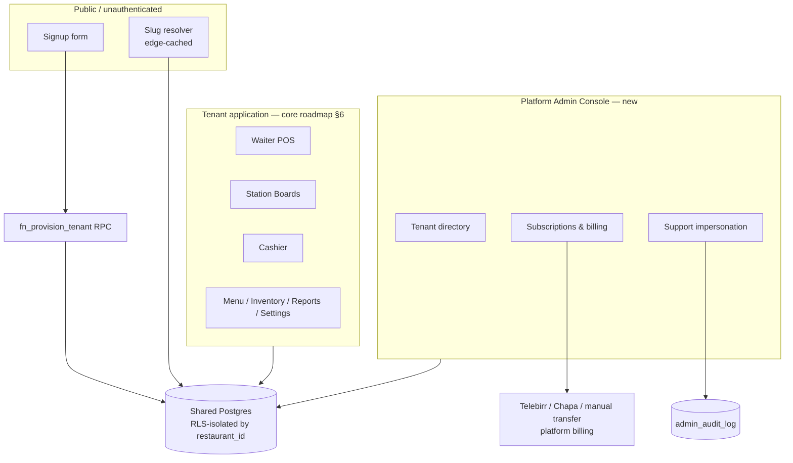

# CafeOS — Multi-Tenant SaaS Architecture

**Produced via:** `/design:design-system extend` · `/engineering:architecture` · `/engineering:system-design`
**Companion to:** `CafeOS-Development-Roadmap.md` (the single-restaurant application spec — §3–§12 of that document are the module this architecture layer sits on top of; nothing in this doc changes that module's own behavior)
**Date:** 2026-08-27

This document covers the one thing the core roadmap deliberately left as a forward-looking note rather than a resolved design: turning CafeOS from *"a rebuild that happens to have a `restaurant_id` column on every table"* into an actual multi-tenant SaaS product — self-serve tenant signup, tenant branding, subscription billing, and a platform admin console that CafeOS's own team uses to run the business, on top of the same Supabase project.

---

## Part 1 — Architecture Decision Records

### ADR-001: Multi-Tenant Data Isolation Strategy

**Status:** Proposed
**Date:** 2026-08-27
**Deciders:** CafeOS engineering lead, founding team

#### Context

The core roadmap already scoped every operational table with a `restaurant_id` foreign key "so the same schema supports a second location without redesign" (roadmap §4.1, §14) — but that was a tenant-*ready* schema serving one paying customer, not a tenant-*isolated* platform serving many independent restaurant businesses who must never see each other's orders, menus, staff, or revenue. Turning that readiness into an actual SaaS platform requires picking, deliberately, how tenant data is isolated at the database layer — the single decision everything else in this document (routing, billing, the admin console) is built on top of.

Three standard options exist for multi-tenant Postgres, and Supabase's own architecture (one project = one Postgres instance + PgBouncer pooling + Auth + Realtime + Storage, billed per project) makes some of them meaningfully more expensive than others here.

#### Decision

**Adopt Option A: a shared database, shared schema, with Postgres Row-Level Security as the sole tenant-isolation boundary** — i.e., keep exactly the pattern the core roadmap's §4.3 already established, and treat it as the permanent v1–v2 architecture rather than a placeholder.

#### Options Considered

##### Option A: Shared database, shared schema, RLS-enforced

| Dimension | Assessment |
|---|---|
| Complexity | Low–Medium — one schema, one migration path, RLS policies already designed in the core roadmap §4.3 |
| Cost | Low — one Supabase project serves every tenant; cost grows with usage, not with tenant count |
| Scalability | Strong for hundreds to low thousands of small/medium tenants on Supabase's managed Postgres + PgBouncer; revisit only at very high tenant/connection counts |
| Team familiarity | High — this is the Supabase-idiomatic pattern; no bespoke tooling needed |

**Pros:** cheapest to run at this customer segment's price point; single migration to maintain; Realtime/Storage already work per-project, not per-schema, so this is the only option that doesn't fight the platform; fastest to ship.
**Cons:** the entire tenant-isolation guarantee rests on RLS policy correctness — a single missed `USING` clause is a cross-tenant data leak, not a performance bug; noisy-neighbor tenants share the same connection pool and Realtime capacity.

##### Option B: Schema-per-tenant (one Postgres schema per restaurant, one database)

| Dimension | Assessment |
|---|---|
| Complexity | High — every migration must fan out across N schemas; Supabase's client libraries and connection pooling assume a fixed `public` schema, so this fights the platform rather than using it |
| Cost | Medium — still one Postgres instance, but migration tooling and catalog bloat add real operational overhead as N grows |
| Scalability | Degrades past a few hundred schemas — `pg_catalog` bloat and per-schema migration time both grow linearly with tenant count |
| Team familiarity | Low — no first-class Supabase support; would require hand-rolled schema-routing middleware |

**Pros:** stronger blast-radius containment than Option A without full infrastructure duplication.
**Cons:** works against Supabase's own tooling at every layer (Auth, Realtime, generated types, migrations); the complexity cost is paid on day one, for a benefit (marginally better isolation than well-tested RLS) that mostly matters at a scale this platform isn't at yet.

##### Option C: Database-per-tenant (separate Supabase project per restaurant)

| Dimension | Assessment |
|---|---|
| Complexity | Medium — provisioning is scriptable via the Supabase Management API, but N databases means N things to migrate, monitor, and back up |
| Cost | High — Supabase bills per project; cost scales **linearly with tenant count**, which is the wrong shape for a low-ARPU SMB Ethiopian restaurant market |
| Scalability | Excellent isolation, but operationally the worst option for a platform aiming at hundreds of small independent restaurants |
| Team familiarity | Low–Medium |

**Pros:** the strongest possible isolation and the easiest story for an enterprise customer demanding dedicated infrastructure or data residency guarantees.
**Cons:** cost structure is fundamentally mismatched to the target customer (an independent restaurant paying a modest monthly SaaS fee should not carry the cost of a dedicated Postgres instance); N databases to keep in migration-lockstep is a real operational burden at any meaningful tenant count.

#### Trade-off Analysis

The deciding factors are **cost shape** and **platform fit**, not raw isolation strength. CafeOS's target customer is an independent or small-chain Ethiopian restaurant on a modest subscription — Option C's linear per-tenant infrastructure cost doesn't work at that price point, and Option B pays Option C's complexity cost without buying back its isolation benefit. Option A is the only option that lets tenant count scale without a matching scale in infrastructure spend, and it's the only one that uses Supabase's Auth/Realtime/Storage exactly as designed rather than around them. The real cost of Option A — RLS becomes the *entire* security boundary — is manageable: it's the same boundary the core roadmap already committed to testing via pgTAP (roadmap §11), and this ADR just formalizes that as the permanent model rather than a v1 shortcut.

#### Consequences

- **Easier:** tenant count scales with near-zero marginal infrastructure cost; one migration path, one connection pool, one Realtime deployment; onboarding a new restaurant is a data-only operation (a few `INSERT`s via `fn_provision_tenant`, §2 below), not an infrastructure operation.
- **Harder:** RLS policies are now security-critical code, not convenience code — every new table needs a policy *and* a pgTAP test proving cross-tenant access is denied before it ships (formalized as an action item below); a compromised or over-privileged service-role key is a platform-wide, not tenant-wide, incident, so service-role usage must stay confined to a small, audited set of Edge Functions.
- **Revisit when:** CafeOS lands an enterprise multi-location chain customer with contractual data-residency or dedicated-infrastructure requirements — at that point, offer Option C as a paid "Enterprise" tier for that one tenant rather than migrating the whole platform. This is a hybrid escape hatch, not a sign Option A was wrong for the SMB base.

#### Action Items

1. [ ] Extend `restaurants` and add `plans`/`subscriptions`/`platform_admins`/`platform_invoices`/`admin_audit_log` per §2.3 below
2. [ ] Write a pgTAP test per table proving a session JWT for tenant X cannot read/write a row belonging to tenant Y — required before Phase 1 sign-off (ties into the core roadmap's own Phase 1 Definition of Done, roadmap §13.1)
3. [ ] Restrict every `security definer` function's `search_path` explicitly (a well-known RLS-bypass vector if left default) — add as a standing code-review checklist item
4. [ ] Confine all `SUPABASE_SERVICE_ROLE_KEY` usage to the small set of Edge Functions listed in §2.3 (provisioning, billing webhook, impersonation) and audit that list quarterly

---

### ADR-002: Tenant Routing Scheme

**Status:** Proposed
**Date:** 2026-08-27
**Deciders:** CafeOS engineering lead, founding team

#### Context

Staff-facing routes are already resolved via the JWT's `restaurant_id` claim (core roadmap §6.5) — a logged-in waiter never needs a URL to tell the app which restaurant they belong to. But a multi-tenant SaaS platform also needs a **pre-authentication** way to identify which restaurant a visitor means: a public signup/pricing page, a tenant's own login page reached from a bookmark or a receipt QR code, and — per the core roadmap's own flagged future work — a customer-facing ordering page if QR ordering ever ships. Something has to resolve "which restaurant" before any RLS policy can even apply.

#### Decision

Ship **path/slug-based routing** (`app.cafeos.net/r/<slug>/login`) for v1, with the data model (`restaurants.slug`, `restaurants.custom_domain`) already shaped to add **subdomain routing** (`<slug>.cafeos.net`) as a fast-follow without a schema change. The concrete per-environment domain plan (which base URL each of Preview/Staging/Production actually resolves this pattern against) is formalized separately in ADR-003, immediately below.

#### Options Considered

| Dimension | Subdomain (`<slug>.cafeos.net`) | Path (`app.cafeos.net/r/<slug>`) |
|---|---|---|
| Complexity | Higher — wildcard DNS + wildcard TLS cert, host-based routing at the CDN/edge | Lower — ordinary routing inside the existing React Router setup (roadmap §6.1) |
| Perceived "SaaS-native" feel | Stronger — each tenant feels like its own product surface | Weaker, but perfectly normal for B2B floor-staff tools that aren't marketing-facing |
| Custom domain fast-follow | Natural next step (`orders.customerrestaurant.com` via CNAME) | Also possible later, just a bit less conceptually direct |
| Time to ship | Slower — DNS/cert automation is real infra work | Fast — no infra changes beyond the app itself |

#### Trade-off Analysis

CafeOS's primary surfaces (POS, KDS, cashier, reports) are internal staff tools opened from a bookmarked/PIN-remembered URL on a fixed tablet, not a public storefront where subdomain polish drives conversion — the audience that actually benefits most from subdomain routing (a public, branded, customer-facing page) doesn't exist yet in this scope (QR ordering is explicitly out of scope, roadmap §8 module list). Shipping path-based routing now avoids taking on wildcard-DNS/cert infrastructure before there's a page that needs it, while `slug`/`custom_domain` columns being in the schema from day one (§2.3) means subdomain routing is a routing-layer change later, not a data migration.

#### Consequences

- **Easier now:** zero new infrastructure; ships in the same phase as the rest of the app shell.
- **Revisit when:** a customer-facing surface (QR ordering, a public menu page, or a marketing site) actually exists — that's the point at which subdomain/custom-domain routing starts paying for itself.

---

## Part 2 — System Design: CafeOS Multi-Tenant SaaS Platform

### 2.1 Requirements Gathering

**Functional**
- Self-serve tenant signup: restaurant name, owner contact, chosen slug → a working, isolated CafeOS instance with no manual provisioning step
- Tenant branding: logo + primary/accent color reflected across the app and printed receipts (Part 3 below)
- Subscription billing: plan tiers, trial period, CafeOS charging the *restaurant owner* — distinct from the restaurant charging *its own customers* via Telebirr/CBE/Chapa/cash, which is unchanged, existing functionality from the core roadmap §8.5/§8.7/§8.8
- Platform Admin Console: CafeOS's own team can see every tenant, its subscription/billing status, suspend/reactivate a tenant, and get support access to a tenant's data with a mandatory audit trail
- Plan-based feature/limits enforcement (e.g., a "Starter" plan capped at N staff seats or without installment vouchers)

**Non-functional**
- Zero cross-tenant data leakage — this is the platform's core trust guarantee, not a nice-to-have (see ADR-001)
- Low marginal cost per additional tenant (ADR-001's deciding factor)
- Onboarding a new restaurant completes in under a few seconds of provisioning time, not a deploy or migration
- Every platform-admin support action against a tenant's data is attributable and auditable

**Constraints / assumptions to validate with the business**
- Stack is fixed to the core roadmap's choices (React/Vite/Supabase/etc.) — this design works within that, not around it
- Illustrative v1 planning scale: tens of pilot restaurants growing toward a few hundred within the first year, each doing tens to low hundreds of orders/day — these are **assumptions for capacity planning in §2.4, not confirmed targets**, and should be replaced with real numbers as soon as the business has them
- Platform subscription billing in the Ethiopian market likely mirrors the payment rails the product already integrates with for tenants' own customers (Telebirr/Chapa), plus a manual bank-transfer path — treated as a v1 "semi-automated, human-confirmed" flow rather than a second fully automated billing engine (see §2.3)

### 2.2 High-Level Design



The tenant application box is unchanged from the core roadmap — every component, hook, and route in roadmap §6–§10 keeps working exactly as designed. This system design only adds the public/signup layer and the platform-admin layer around it.

### 2.3 Deep Dive

#### Data model additions

```sql
-- Extend the existing tenant root table (core roadmap §4.2) rather than replacing it —
-- `restaurants` was already the tenant table, it just needed SaaS-facing columns.
alter table restaurants
  add column slug          text unique,
  add column custom_domain text unique,
  add column branding      jsonb not null default
    '{"logo_url": null, "primary_color": "#dc2626", "accent_color": "#b91c1c"}',
  add column status        text not null default 'trialing'
    check (status in ('trialing','active','past_due','suspended','cancelled')),
  add column onboarded_at  timestamptz;

-- Platform-level plans — owned by CafeOS, not tenant-scoped, hence no restaurant_id
create table plans (
  id                 uuid primary key default gen_random_uuid(),
  name               text not null,                 -- 'Starter' | 'Growth' | 'Pro'
  price_etb_monthly  numeric(10,2) not null,
  max_staff          integer,
  max_menu_items     integer,
  features           jsonb not null default '{}',   -- { installments: true, multi_station: true }
  is_active          boolean not null default true
);

-- One subscription per tenant
create table subscriptions (
  id                    uuid primary key default gen_random_uuid(),
  restaurant_id         uuid not null references restaurants(id) on delete cascade,
  plan_id               uuid not null references plans(id),
  status                text not null check (status in ('trialing','active','past_due','suspended','cancelled')),
  trial_ends_at         timestamptz,
  current_period_start  timestamptz not null default now(),
  current_period_end    timestamptz not null,
  cancel_at_period_end  boolean not null default false,
  created_at            timestamptz not null default now(),
  unique (restaurant_id)
);

-- CafeOS's own staff — deliberately a separate table from tenant `profiles` (core
-- roadmap §4.2), not another `staff_role` enum value, so a tenant admin can never
-- accidentally be granted platform-wide access by a role-string typo.
create type platform_role as enum ('super_admin','support');

create table platform_admins (
  id          uuid primary key references auth.users(id) on delete cascade,
  full_name   text not null,
  role        platform_role not null,
  created_at  timestamptz not null default now()
);

-- CafeOS billing the restaurant owner — distinct from `payments` (core roadmap §4.2),
-- which is the restaurant billing its own customers. Do not conflate the two ledgers.
create table platform_invoices (
  id               uuid primary key default gen_random_uuid(),
  restaurant_id    uuid not null references restaurants(id),
  subscription_id  uuid not null references subscriptions(id),
  amount           numeric(10,2) not null,
  period_start     date not null,
  period_end       date not null,
  status           text not null check (status in ('pending','paid','overdue','void')),
  method           text check (method in ('telebirr','chapa','manual_bank_transfer')),
  reference        text,
  paid_at          timestamptz,
  created_at       timestamptz not null default now()
);

-- Mandatory audit trail for any platform-admin action against tenant data
create table admin_audit_log (
  id                 uuid primary key default gen_random_uuid(),
  platform_admin_id  uuid not null references platform_admins(id),
  restaurant_id      uuid references restaurants(id),
  action             text not null,   -- 'impersonate' | 'suspend_tenant' | 'reactivate_tenant' | 'view_billing'
  detail             jsonb,
  created_at         timestamptz not null default now()
);
```

**RLS additions** (same pattern and rigor as core roadmap §4.3):

```sql
alter table plans enable row level security;
create policy "plans are publicly readable" on plans for select using (true);
create policy "only platform admins manage plans" on plans for all
  using (auth.uid() in (select id from platform_admins))
  with check (auth.uid() in (select id from platform_admins));

alter table subscriptions enable row level security;
create policy "tenant owner or platform admin reads subscription" on subscriptions for select
  using (
    restaurant_id = (auth.jwt() ->> 'restaurant_id')::uuid
    or auth.uid() in (select id from platform_admins)
  );
create policy "only platform admins write subscriptions" on subscriptions for all
  using (auth.uid() in (select id from platform_admins))
  with check (auth.uid() in (select id from platform_admins));

alter table admin_audit_log enable row level security;
create policy "only platform admins read the audit log" on admin_audit_log for select
  using (auth.uid() in (select id from platform_admins));
-- inserts happen only via security-definer functions (impersonation, suspend, etc.),
-- never a direct client insert — the audit log must not be self-editable by its own actors.
```

**Tenant provisioning** — one atomic RPC, mirroring the pattern already established for `fn_submit_order` etc. (core roadmap §4.4):

```sql
create or replace function fn_provision_tenant(
  p_restaurant_name text,
  p_slug            text,
  p_owner_user_id   uuid,
  p_owner_name      text,
  p_plan_id         uuid
) returns restaurants
language plpgsql security definer as $$ ... $$;
-- creates the `restaurants` row (status='trialing'), a `profiles` row (role='owner'),
-- a 14-day-trial `subscriptions` row, and an initial `day_sessions` row (day_no=1)
-- so the new tenant can submit orders immediately — no separate "day 1 setup" step.
```

**New API surface** (platform-level, sitting alongside the tenant-scoped endpoints in core roadmap §6):

| Endpoint | Method | Purpose | Role |
|---|---|---|---|
| `/platform/signup` | `POST` | Public self-signup → `fn_provision_tenant` | public |
| `/platform/plans` | `GET` | Public pricing | public |
| `/platform/tenants` | `GET` | List/search/filter all tenants | `platform_admin` |
| `/platform/tenants/:id/suspend` | `POST` | Suspend a tenant | `platform_admin` |
| `/platform/tenants/:id/reactivate` | `POST` | Reactivate | `platform_admin` |
| `/platform/tenants/:id/impersonate` | `POST` | Issue a scoped support session; writes `admin_audit_log` | `platform_admin` |
| `/platform/subscriptions/:id/change-plan` | `POST` | Upgrade/downgrade | tenant owner, `platform_admin` |
| `/platform/billing/webhook/:gateway` | `POST` | Telebirr/Chapa platform-billing callback | public (signature-verified) |

**Caching** — staff routes never need a slug lookup (the JWT already carries `restaurant_id`, core roadmap §6.5). Only the pre-auth slug/domain resolver (`RESOLVER` in §2.2's diagram) needs one, and it's read-heavy, rarely-changing data — cache the `slug → restaurant_id` mapping at the edge (Vercel Edge Config or an equivalent KV) rather than hitting Postgres on every unauthenticated page load.

**Async work** — provisioning (`fn_provision_tenant`) is synchronous and fast enough to run inline on signup for v1's expected volume; welcome emails and any future onboarding drip sequence run as a fire-and-forget Edge Function call rather than blocking the signup response.

**Error handling / lifecycle** — a `past_due` subscription puts the tenant into a read-only grace period (staff can still view data, but new orders/mutations are blocked with a clear "subscription past due, contact your manager" message) rather than an abrupt lockout mid-service; `suspended` (platform-admin action, e.g., ToS violation) blocks all access including read; both states are enforced the same way authorization already is — server-side, via a check inside the mutating RPCs, not a client-side gate.

### 2.4 Scale and Reliability

Using the illustrative planning assumptions from §2.1 (a few hundred tenants within year one, each doing tens to low hundreds of orders/day): total platform load lands around low-single-digit orders/second at peak, heavily clustered around meal times. That is comfortably within a single well-indexed Postgres instance's capacity, and Supabase's built-in PgBouncer pooling is the relevant scaling lever long before read replicas or sharding would be — this is squarely why ADR-001 didn't need to over-engineer for scale that doesn't exist yet.

- **Vertical first:** scale the single Postgres instance's compute tier as tenant count grows; this is the cheapest lever and the one Supabase's own dashboard makes trivial.
- **Horizontal, later:** if the Platform Admin Console's cross-tenant analytics queries start contending with live floor-operations traffic, split them onto a read replica before considering anything more invasive.
- **Failover/redundancy:** Supabase's managed Postgres handles backups/HA; the one trade-off worth stating plainly (per ADR-001) is that a shared-database outage is a platform-wide outage, not a single-tenant one — this is the direct cost of the cost-efficiency Option A buys, and should be communicated in CafeOS's own SLA rather than discovered by a customer during an incident.
- **Noisy-neighbor protection:** apply per-tenant Realtime subscription and RPC rate limits (Supabase supports this at the project/API level) so one very busy restaurant can't degrade another's KDS latency.
- **Monitoring:** add per-tenant usage metrics (orders/day, staff seats used, storage) to the Platform Admin Console — this doubles as capacity-planning input and as the data plan-limit enforcement (§2.1) reads from.

### 2.5 Trade-off Analysis — what this design revisits, and when

This section intentionally restates ADR-001/002's "revisit when" triggers in one place, since they're the two decisions most likely to be second-guessed as the business grows:

- **Shared-schema RLS (ADR-001)** gets revisited only if a large multi-location enterprise customer needs dedicated infrastructure — solved with a hybrid Option-C tier for that one account, not a platform-wide migration.
- **Slug/path routing (ADR-002)** gets revisited as soon as a customer-facing surface (QR ordering, a public menu) exists — the schema (`slug`, `custom_domain`) already supports the upgrade without a migration.
- **Synchronous, human-confirmed platform billing (§2.3)** is a deliberate v1 simplification matching the same "manual verification is an acceptable gate" philosophy the core roadmap already applies to Manual CBE Transfer for tenants' own customers (roadmap §8.5/§8.8-adjacent payment flows) — revisit once transaction volume makes manual confirmation a support bottleneck, at which point Chapa's recurring-billing API is the natural automation path.

---

## Part 3 — Design System Extension: Tenant Branding & White-Label Theming

### Problem

CafeOS is now multi-tenant, and every restaurant needs the app — and printed receipts — to feel like *their* system, not a visibly shared platform, without forking the codebase per tenant. The core roadmap's design system (§7.1) already defines a `primary`/`accent` token pair, but as a **compile-time** Tailwind value (`#dc2626`) baked into one build — there's no way for 300 different tenants to each see their own color from that single compiled bundle.

### Existing Patterns

| Related pattern | Similarity | Why it's not enough |
|---|---|---|
| Tailwind `primary`/`accent` tokens (core roadmap §7.1) | Same semantic token names, same usage sites (buttons, active nav, KPI accents) | Resolved at build time, not runtime — one compiled bundle can't serve N tenant colors |
| shadcn/ui `cssVariables: true` config (core roadmap §5.3) | Already routes every primitive's color through a CSS custom property, not a hardcoded class | Was adopted for future dark-mode support, not tenant theming — but it's exactly the mechanism tenant theming needs, just not yet driven by tenant data |

### Proposed Design

A `TenantThemeProvider` that reads the current tenant's `restaurants.branding` (§2.3) once at app load and writes it into CSS custom properties on `<html>` — everything downstream (every shadcn primitive, per the existing `cssVariables: true` setup) already resolves color through those variables, so no component changes are needed, only this one provider.

```tsx
// app/providers/tenant-theme-provider.tsx
import { useEffect } from 'react';
import { useRestaurantSettings } from '@/features/settings/hooks';

const FALLBACK_BRANDING = { logoUrl: null, primaryColor: '#dc2626', accentColor: '#b91c1c' };

export function TenantThemeProvider({ children }: { children: React.ReactNode }) {
  const { data: settings, isLoading } = useRestaurantSettings();
  const branding = settings?.branding ?? FALLBACK_BRANDING;

  useEffect(() => {
    const root = document.documentElement;
    root.style.setProperty('--primary', toHsl(branding.primaryColor));
    root.style.setProperty('--accent', toHsl(branding.accentColor));
  }, [branding.primaryColor, branding.accentColor]);

  if (isLoading) return <ThemeLoadingSkeleton />;
  return <>{children}</>;
}
```

#### API / Props

| Property | Type | Default | Description |
|---|---|---|---|
| `children` | `React.ReactNode` | — | App tree to theme |

*(Deliberately no other props — the provider reads the current tenant from the already-authenticated session via `useRestaurantSettings()`, the same hook the core roadmap's Settings module already exposes, §10.)*

#### Variants

| Variant | Use when |
|---|---|
| Platform default | Marketing/signup pages, the Platform Admin Console — always CafeOS's own brand, never a tenant's |
| Tenant theme | Every authenticated tenant-scoped route (POS, KDS, Cashier, Reports, etc.) |

#### States

| State | Behavior | Notes |
|---|---|---|
| Loading | Skeleton, platform-default colors shown briefly | Avoids a flash of the wrong tenant's colors on load |
| Loaded, custom branding set | Tenant's `primary_color`/`accent_color` applied | — |
| Loaded, no custom branding | Falls back to `FALLBACK_BRANDING` (the same red the app already ships with) | A tenant who never opens the branding picker gets a good-looking default, not a broken one |

#### Tokens Used

- Colors: `--primary`, `--accent` (existing shadcn/ui CSS-variable slots, core roadmap §5.3/§7.1) — no new token *names*, only a runtime source for their values
- New, tenant-scoped only: `logo_url` (rendered in the `Header`/`Sidebar` brand slot and on printed receipts/vouchers, core roadmap §8.12)

### Accessibility

- **Contrast enforcement:** the branding picker (a new field group in the existing Settings module, core roadmap §8.11) computes the WCAG contrast ratio of the chosen `primary_color` against white text and warns — not silently blocks — below AA (4.5:1), since a restaurant owner picking their own brand color should be informed, not overridden.
- **Logo alt text:** `logo_url` renders with `alt="{restaurant.name} logo"`, never a decorative empty `alt`, since it doubles as the primary wayfinding cue in the sidebar for staff working across multiple properties in a future multi-location scenario.
- **No color-only meaning:** tenant color customization only ever touches brand/accent slots — it must never be allowed to override the `StatusBadge` semantic palette (core roadmap §7.2/§15), which stays fixed platform-wide so "red = cancelled/overdue" means the same thing in every tenant, regardless of their brand color.

### Open Questions

- Should the branding picker allow a full custom font, or stay Inter-only platform-wide? (Leaning: Inter-only for v1 — matches ADR-002's "don't build infrastructure before a real need" logic.)
- Does a tenant's chosen `primary_color` ever need to survive onto the *printed* thermal receipt, or should receipts stay platform-standard black-on-white for print-legibility regardless of on-screen branding? (Leaning: logo yes, color no — thermal printers render color unreliably.)
- At what plan tier (§2.3 `plans.features`) does custom branding unlock, versus being a "Growth"/"Pro"-only feature? (Business decision, not an engineering one — flagged here so it isn't silently decided by default.)

---

## Sequencing relative to the core roadmap's 12 phases

This doesn't renumber the core roadmap's phased plan (roadmap §13) — it slots in as follows:

| New workstream | Slots into | Rationale |
|---|---|---|
| `restaurants` schema extensions + new tables + RLS (§2.3) | Core roadmap **Phase 1 — Schema & Auth** | Multi-tenancy must be foundational, not retrofitted after modules are built on a single-tenant assumption |
| `fn_provision_tenant` + signup flow | Core roadmap **Phase 1–2** | Needed before any tenant-scoped screen can be meaningfully demoed end-to-end |
| `TenantThemeProvider` + branding picker (Part 3) | Core roadmap **Phase 2 — Shell & Design System** | Same phase already owns theming/tokens |
| `plans` / `subscriptions` / billing enforcement | New — lands before core roadmap **Phase 12 — Cutover** | Required for real self-serve signups to be viable; can stay stubbed/single-tenant through the earlier functional phases |
| Platform Admin Console | Runs parallel to core roadmap **Phase 10 — Settings** | Both are admin-facing and lower urgency than the floor-operations phases (3–9) |
| Subdomain/custom-domain routing (ADR-002 fast-follow) | Runs parallel to core roadmap **Phase 11 — Hardening** | Pure infrastructure work; not blocking functional development, and only worth doing once a customer-facing surface exists to justify it |

The RLS pgTAP requirement from ADR-001's action items should be added explicitly to the core roadmap's own **§13.1 Phase 1 Definition of Done** — cross-tenant isolation is the one piece of this document that has no acceptable "ship now, harden later" version.
